**Chapitre 10 : Théorie des graphes**
===
# 1. Introduction
## 1.1. Les origines
### 1.1.1. Le problème fondateur : les 7 points de Königsberg
**Énoncé :**
Peut-on effectuer une promenade à Königsberg passant exactement une fois par chacun des ponts .

**Variante :**
Peut-on le faire en revenant à son point de départ ?

<p align="center">
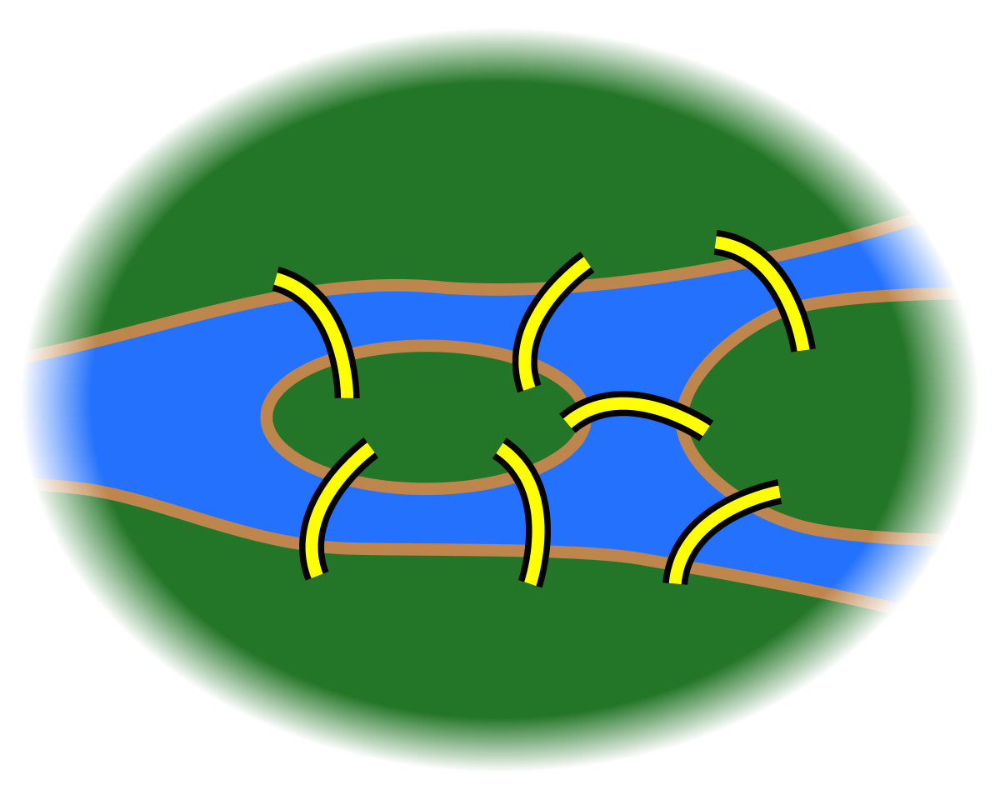
</p>

---

### 1.1.2. Une solution formelle
Présentée par Euler en 1735, avec 3 étapes :
1. Nommage des zones et représentation abstraite ;
2. Formalisation de la notion de chemin ;
3. Démonstration d'impossibilité : il n'existe pas de chemin / circuit eulérien dans ce graphe.

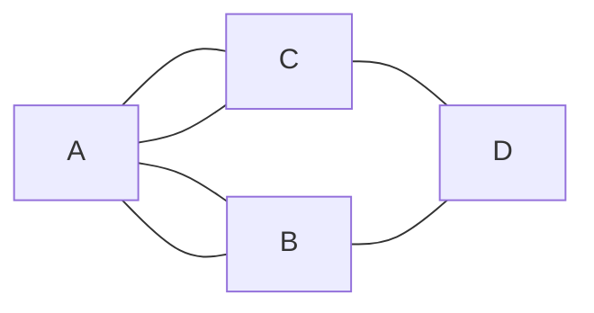

---

### 1.1.3. Remarque
Les points 1. et 2. sont les étapes fondatrices de la théorie des graphes vue comme une théorie mathématique.

Cette théorie a pris une grande ampleur car elle permet de modéliser de nombreux problèmes.

---

## 1.2. De nombreuses applications

---
### 1.2.1. Compilation
- Modélisation : on représente le graphe de dépendance entre fichiers

  ```mermaid
  flowchart LR
      subgraph Foo.ml
      id1[open Bar]
      end
      subgraph Bar.ml
      id2[open Foo]
      end
      id1 --> id2
      id2 --> id1
  ```

- Problème : faisabilité : c'est un problème de détecton de cycle.
  - ordre de compilation : choisir un ordre, c'est effectuer un tri topologique du graphe

---

### 1.2.2. Transport
- Modélisation : on représente un réseau de transports en commmun en représentant les stations liées par les lignes qui y passent ;
- Problème : recherche de chemin le plus court en terme de distance / temps (nécessité d'annotation) / nombre de station.

---

### 1.2.3. Ordonnancement de tâches
- Problème : représention d'un ensemble de tâches sur un nombre minimal d'unité de calcul ;
- Modélisation : on utilise un graphe d'incompatibilité : on lie les tâches incompatibles entre elles. On veut attribuer une couleur (une unité de calcul) à chaque sommet de sorte qu'aucun sommet ne soit de la même couleur que l'un de ces voisins. Le nombre minimal de couleurs est le nombre chromatique du graphe.

---

### 1.2.4. Construction d'un réseau électrique
- Problème : on veut raccorder un certain nombre de villes en utilisant le moins de cable possible ;
- Modélisation : on utilise un graphe qui représente les villes liées par des axes annotés par leur longueur. On veut sélectionner des axes pour lier toutes les villes entre elles en utilisant le moins de longueur possible. C'est la recherche d'un arbre couvrant, de poids minimal.

---

# 2. Bases des graphes
## 2.1. Vocabulaire
### 2.1.1. Définition : graphe
Un graphe est un couple $G=(S,A)$ où :
- $S$ est un ensemble fini de sommets ou de noeuds ;
- $A$ est un ensemble d'associations entre 2 sommets, qui peut prendre plusieurs formes :
  - Si $A$ est un ensemble de paires de sommets, on dit que $G$ est non orienté
  
    Si $a=\{s,s'\}\in A$, on dit que $a$ est une arrête d'extrémité $s$ et $s'$, que $a$ est incidente à $s$ et $s'$ et que $s$ et $s'$ sont adjacents ou voisins
  - Si $A$ est un ensemble de couples de sommets, on dit que $G$ est orienté
  
    Si $a=\{s,s'\}\in A$, on dit que $a$ est un arc, que s'est un successeur de $s$, que $a$ est un arc sortant pour $s$ et entrant pour $s'$.

---

### 2.1.2. Représentation graphique
On place un points pour chaque sommet et on relie les extrémités d'une même arête (avec une flèche dans le cas orienté)

**Exemple :**
$G=(\{A;B;C;D\};\{\{A;B\};\{B;C\};\{C;A\}\})$ est un graphe non orienté (`GNO`)

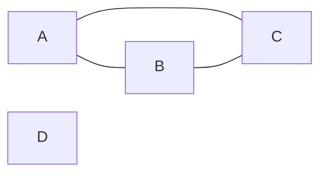

Autre exemple :

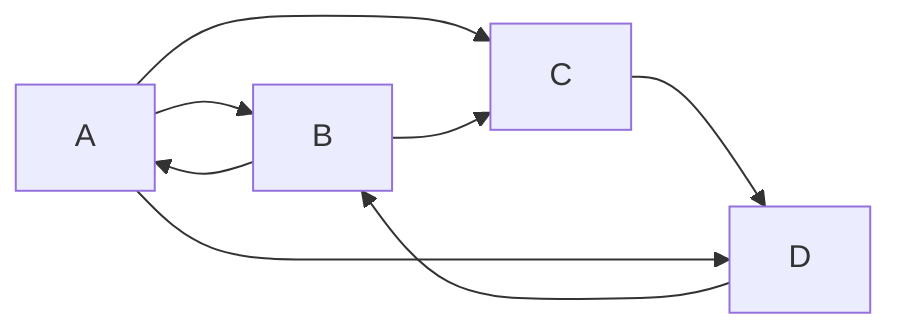
est la représentation du graphe orienté (`GO`) :
$$G=(\{A;B;C;D\};\{(A;B);(B;A);(B;C);(D;B);(A;D);(A;C);(C;D)\})$$

---

### 2.1.3. Boucles
**Définition :**
Une boucle dans un graphe est une arête / arc dont les extrémités sont égales

**Remarque :**
La définition 2.1.1 empêche la présence de boucles dans les GNO. On peut les autoriser en considérant non pas des paires de sommets, mais des multi-ensembles de cardinal 2.

On pourrait aussi utiliser les multi-ensembles pour autoriser les multi-arêtes / plusieurs arêtes entre 2 sommets données, comme en 1.1.1.) mais c'est `H.P.` : $A$ sera toujours un ensemble.

---

### 2.1.4. Degré
- **Définition (degré) :** Soit $G=(S,A)$ un GNO et $s\in S$.

  Le degré de $s$, noté $d(s)$ est le nombre de voisins de $s$.
  $$d(s)=|\{a\in A,s\in a\}|$$

- **Définition (degré entrant / sortant) :** Soit $G=(S,A)$ un GO et $s\in S$.

  Le degré entrant (resp. sortant) de $s$, noté $d_-(s)$ (resp. $d_+(s)$), est le nombre d'arcs entrants (resp. sortants) pour $s$.
  $$d_-(s)=|\{a\in A,\exists s'\in S,a=(s',s)\}|$$
  $$d_+(s)=|\{a\in A,\exists s'\in S,a=(s,s')\}|$$

- **Propriété (formules de la somme des degrés) :** Soit $G=(S,A)$ un graphe :

  1. Si $G$ est un GNO, $\displaystyle\sum_{s\in S}d(s)=2|A|$ si $G$ est sans boucle ;
  2. Si $G$ est un GO $\displaystyle\sum_{s\in S}d_-(s)=\sum_{s\in S}d_+(s)=|A|$.

  **Démonstration :**
  1. On compte les extrémités d'arêtes
   
     - on arête compte pour 2 extrémités car ce n'est pas une boucle donc il y en a $2|A|$
     - $\forall s\in S$, $s$ est extrémité de $d(s)$ arêtes donc il y en a $\displaystyle\sum_{s\in S}d(s)$.
  
  2. Par récurrence sur |A| : 
   
     - si $|A|=0,\forall s\in S, d_+(s)=d_-(s)=0\rightarrow$ Ok
     - Hérédité : si $|A|>0$, alors $\exists(s,s')\in A$

     On note $G'=(S,A\setminus\{s,s'\})$.

     Par hypothèse de récurrence : 
     $$|A|-1=|A\setminus\{s,s'\}|=\sum_{v\in S\setminus\{s'\}}d_-(v)+\underbrace{d_-(s)-1}_{\text{degré sortant de }s\text{ dans }G'}$$
     donc $|A|=\displaystyle\sum_{v\in S}d_-(v)$ de même pour les degrés entrants, en considérant $s'$ plutôt que $s$.

- **Corollare (hondshaking lemma) :** Tout GNO sans boucle possède un nombre pair de sommets de degré impair.

  **Démonstration :** 
  $$2\N \ni 2|A| = \sum_{s \in S} d(s) = \underbrace{\sum_{\substack{s \in S \\ d(s) \in 2\N}} d(s)}_{\in 2\N} + \underbrace{\sum_{\substack{s \in S \\ d(s) \in 2\N + 1}} d(s)}_{\substack{\text{de la parité du nombre} \\ \text{de sommets de degré impair}}}$$

  **Contre-exemple en cas de boucle :**

  ```mermaid
  flowchart
      id((A))
      id --- id
  ```

---

### 2.1.5. Graphes étiquetés
**Définition (graphe étiqueté / pondéré) :**
Soit $G=(S,A)$ un graphe.

On dit que $G$ est :
- étiqueté s'il est muni d'une fonction $f:A\rightarrow V$ où $V$ est un ensemble de valeurs appelées les étiquettes ;
- pondéré s'il est étiqueté par des nombres (entiers / réels) : on parle de poids plutôt que d'étiquette.

**Exemple :**
1.1.2., 1.2.4.,
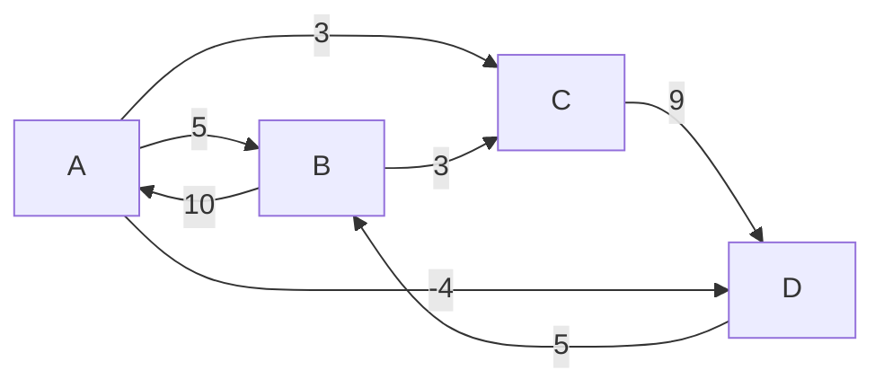

En MPI : les automates finis :

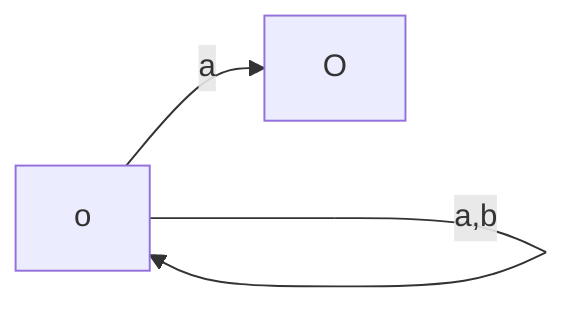

---

### 2.1.6. Graphes bipartis
- Définition (graphes bipartis) : Soit $G=(S,A)$ un graphe.

  On dit que $G$ est `biparti` s'il existe une partition de $S$ $(U, V)$ telle que pour toute arête $a$, une extrémité de $a$ appartienne à $U$ et l'autre à $V$.

- Exemple $({\color{red}{U}},V)$ :

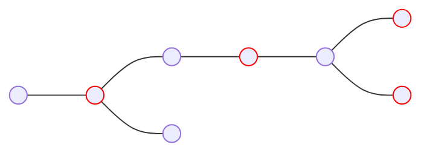

Peut aussi se représenter :
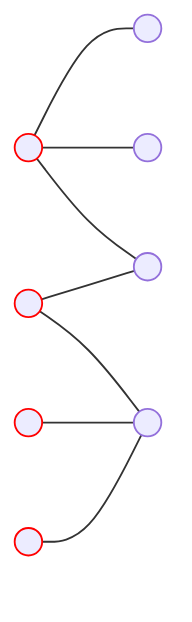

**Remarque :**
Un graphe biparti est 2-colorable.

---

## 2.2. Connexité
### 2.2.1. Définition : chemin
Soit $G=(S,A)$ un graphe.

Un chemin dans $G$ est une suite finie de sommets $s_0,\dots,s_n\in S$ tq $\forall i\in [\![0;n-1]\!], \{s_i;s_{i+1}\}\in A$ (resp. $(s_i+s_{i+1})\in A$ dans le cas orienté).

La longueur du chemin est le nombre d'arêtes / d'arcs parcourus, ici $n$.

---

### 2.2.2. Définition : cas particuliers des chemins
Soit $G=(S,A)$ un graphe et $p=s_0,\dots,s_n$ un chemin dans $G$ :
- $p$ est `fermé` ssi $s_0=s_n$
- $p$ est `élémentaire` ssi $p$ passe au plus une fois par chaque arête / arc, i.e. $\forall i\not ={j}\in[\![0;n-1]\!],\{s_i;s_{i+1}\}\not ={\{s_j;s_{j+1}\}}$ (resp. $\{s_i;s_{i+1}\}\not ={\{s_j;s_{j+1}\}}$)

 ```mermaid
 graph LR
   id1(( )) --> id2(( ))
   id2(( )) --> id1(( ))
  
 ```

 ```mermaid
 graph LR
   id3(( )) --- id4(( ))
 ```

- $p$ est simple ssi $\forall i\not ={j}\in[\![0;n]\!],s_i\not ={s_j}$, sauf éventuellement $s_0=s_n$ uniquement si $n\not = 2$ dans le cas non-orienté

**Attention :**
Vocabulaire différent selon les auteurs.

---

### 2.2.3. Vrai / Faux
1. $p$ élémentaire $\Rightarrow p$ simple
2. $p$ simple $\Rightarrow p$ élémentaire
   ```mermaid
   graph LR
     id1((4)) --- id2((0,3))
     id2 --- id3((1))
     id3 --- id4((2))
     id2 --- id4
   ```

3. $\exists$ des chemins simples / fermés de longueur non-nulle
   ```mermaid
   graph LR
     id1((O,2)) --- id2((1))
     id3(( )) --- id4(( ))

---

### 2.2.4. Définition : circuit / cycles / chemin eulériens
Soit $G=(S,A)$ un graphe, $p=s_0,\dots,s_n$ un chemin dans $G$
- $p$ est un circuit ssi $p$ est un chemin fermé de longueur non-nulle
- $p$ est un cycle ssi $p$ est un circuit élémentaire
- $G$ acyclique s'il ne contient aucun cycle
- $p$ est un chemin eulérien ssi $p$ passe exactement une fois par chaque arête / arc, i.e. si $\{\{s_i;s_{i+1}\},i\in [\![0;n-1]\!]\}=A$ et $|A|=n$ (resp. $(s_i;s_{i+1})$)
- $G$ est eulérien ssi $G$ contient un chemin fermé eulérien

---

### 2.2.5. Remarque
- un chemin est élémentaire
- on parle souvent de circuit / cycle eulérien dans la définition du graphe eulérien même si c'est une erreur de langage pour le graphe sans arête
- une branche est un cycle simple de longueur 1
- on peut toujours rendre simple un chemin / cycle en coupant les circuits intermédiaires
 ```mermaid
 graph LR
   id0((0)) --- id1((1)) --- id2((2,5))
   id2 --- id3((3))
   id2 --- id4((4))
   id3 --- id4
   id2 --- id6((6))
 ```

Cela n'est pas toujours possible pour les circuits : le circuit $s_0,s_1,s_0$ dans un graphe non-orienté contenant une arête $\{s_0;s_1\}$ ne peut pas être rendu simple (couper le circuit le rend de longueur nulle : ce n'est plus un circuit).

---

### 2.2.6. Proposition
Soit $G=(S,A)$ un graphe.

Si $G$ est biparti alors $G$ ne contient aucun cycle de longueur impaire.

**Démonstration :**
On note $(U,V)$ une partition de $S$ convenable.

Soit $c=s_0,\dots,s_n$ un cycle dans $G$. On suppose sans perte de généralité que $s_0\in U$.

On montre alors par récurrence finie que  $\left\{\begin{array}{ll}
 \forall i\in \mathcal{U}N\cap[\![0;n]\!], s_i\in U
 \\
 \forall j\in \mathcal{U}N+1\cap[\![0;n]\!], s_j\in V
\end{array}\right.$

Alors $s_n=s_0\in U$ donc $n\in\mathcal{U}N$

---

### 2.2.7. Remarque
C'est une caractérisation des graphes bipartis (réciproque en 4.1.8.).

---

### 2.2.8. Définition : connexité
Soit $G=(S,A)$ un GNO et $s,s'\in S$.
- On dit que $s$ et $s'$ sont connectés dans $G$, noté $s\sim_G s'$, s'il existe un chemin reliant $s$ ou $s'$ dans $G$
- $G$ est connexe ssi $\forall s,s'\in S, s\sim s'$
---

### 2.2.9. Proposition
Soit $G=(S,A)$ un GNO. Alors $\sim_G$ est une relation d'équivalence.

**Démonstration :**
En exercice.

---

### 2.2.10 Définition : composante connexes
Soit $G=(S,A)$ un GNO et $s\in S$.

La composante connexe de $G$ contenant $s$ est la classe d'équivalence de $s$ par $\sim_G$.

---

### 2.2.11. Lemme
Soit $G=(S,A)$ un GNO et $s_1,s_2\in A$.

On note $G'=(S,A\setminus \{\{s_1;s_2\}\})$, $C la composante connexe de $G$ contenant $s_1$ et $s_2$ et $\forall i\in [\![1;2]\!]$, $C_i$ la composante connexe de $G'$ contenant $s_i$.

Alors il existe un cycle dans $G$ passant pas $\{s_1:s_2\}$, alors $C_1=C_2=C$.

Sinon, $C_1\cap C_2=\empty$ et $C_1\cup C_2=C$

**Démonstration :**
- $C_1\cup C_2=C$ :
  $\subseteq$ : vrai car un chemin dans $G'$ est un chemin dans $G$
  $\supseteq$ : Soit $s\in C$

Il existe un chemin, $n_0,\dots,n_k$ de $s$ à $s_1$ dans $G$ (avec $n_0=s$ et $n_k=s_1$)

On considère $i=\min\{i\in[\![0;k]\!],n_i,s_1$ ou $n_i=s_2$ (existe car $n_k=s_1$)

Alors $n_0\dots n_i$ est une chemin dans $G'$ de $s$ à $s_1$ ou $s_2$ donc $s\in C_1$ ou $s\in C_2$

- Soit $C_1=C_2$, soit $C_1\cap C_2=\empty$ car $C_1$ et $C_2$ sont des clauses d'équivalence pour $\sim_{G'}$
- $C_1=C_2$ ssi $\{s_1;s_2\}$ appartient à un cycle de $G$

$\Rightarrow s_1\in C_2$ donc il existe un chemin $s_2 s_3\dots s_n s_1$ dans $G'$, que l'on suppose élémentaire (on peut toujours rendre simple un chemin).

Alors en ajoutant l'arête $\{s_1,s_2\}$ à ce chemin, on obtient $s_1 s_2\dots s_n s_1$, qui est un chemin fermé, de longueur non nulle et élémentaire car le chemin initial ne contenait pas $\{s1;s_2\}$ et était élémentaire. C'est donc un cycle contenant $\{s1;s_2\}$.

$\Leftarrow$ Quitte à réordonner les sommets, on peut supposer qu'il existe un cycle $s_2 s_3\dots s_n s_1$.

Comme il est élémentaire, le chemin $s_2 s_3\dots s_n s_1$ es un chemin de $s_2$ à $s_1$ **dans $G'$** donc $s_2\sim_{G'}s_1$ donc $C_1=c_2$.

---

### 2.2.12. Proposition
Soit $G=(S,A)$ un GNO avec $|S|=n$ et $|A|=m$
1. $G$ a au moins $n-m$ composantes connexes
2. $G$ a exactement $n-m$ composantes connexes ssi $G$ est acyclique

**Démonstration :**
Par l'absurde, considérons $G$ un contre-exemple avec $m$ minimal.
- Si $m=0$ : $G$ n'a pas d'arête donc $G$ est acyclique et a $n=n-0=n-m$ composantes connexes donc $G$ n'est pas un contre-exemple : absurde.
- donc $m>0$ : on peut essayer de supprimer une arête de $G$.

S'il existe un cycle dans $G$, on choisit une arête de ce cycle, d'après 2.2.11, on obtient $G'$ avec les mêmes composantes connexes que $G$.

Par minimalité de $m$, $G'$ n'est pas un contre-exemple donc a au moins $n-(m-1)$ composantes connexes donc $G$ a au moins $n-n+1>n-m$ composantes connexes donc $G$ n'est pas un contre-exemple : absurde.

- Donc $G$ est acyclique.

Donc d'après 2.2.11, supprimer une arête de $G$ donne $G'$ avec exactement une composante connexe de plus que $G$.

$G'$ est acyclique et n'est pas un contre-exemple par minimalité de $m$, donc $G'$ a exactement $n - (m - 1)$ composantes connexes.

Donc $G$ a exactement $n - m + 1 - 1 = n - m$ composantes connexes.

Donc $G$ n'est pas un contre-exemple : absurde.

---

### 2.2.13. Définition : arbre
Un arbre est un graphe non orienté connexe et acyclique.

---

### 2.2.14. Proposition
Soit $G=(S,A)$ un GNO avec $|S|=n$ et $|A|=m$.

Les assertions suivantes sont équivalentes :
1. $G$ est un arbre
2. $G$ est connexe avec $m$ minimal, i.e. si on retire une arête de $G$, on perd la connexité
3. $G$ est acyclique avec $m$ minimal, i.e. si on retire une arête de $G$, on perd l'acyclité
4. $G$ est connexe avec $m=n-1$
5. $G$ est acyclique avec $m=n-1$

**Démonstration :**
(1) $\Rightarrow$ (4) et (5) : $G$ est connexe donc a exactement une nouvelle composante connexe.

$G$ est acyclique donc a exactement $n-m$ composantes connexes d'après 2.2.12 donc $1=n-m$, i.e. $m=n-1$

(4) ou (5) $\Rightarrow$ (1) : d'après 2.2.12., $G$ a au moins $n-m=1$ composantes connexes, exactement ssi $G$ est acyclique donc $G$ est connexe ssi $G$ est acyclique donc (4) ou (5) $\Rightarrow$ (1).

(1) $\Rightarrow$ (2) : c'est 2.2.11. dans le cas acyclique

(2) $\Rightarrow$ (1) : si $G$ n'était pas acyclique, on pourrait supprimer une arête d'un cycle, ce qui contredit la minimalité de $m$ d'après 2.2.11.

(1) $\Rightarrow$ (3) : Si $m$ n'était pas maximal, on pourrait ajouter une arête à $G$ et obtenir $G'$ acyclique et toujours connexe

$G'$ serait un arbre donc par (2), retirer l'arête que l'on vient d'ajouter donnerait un graphe non connexe. Or, c'est $G$, qui est un arbre : absurde.

(3) $\Rightarrow$ (1) : Si $G$ n'est pas connexe, on peut ajouter une arête entre 2 sommets de 2 composantes connexes distinctes sans créer de cycle (d'après 2.2.11) donc $m$ n'est pas maximal : absurde.

---

### Définition : forêt
Une forêt est un GNO acyclique.

---

### 2.2.16. Remarque
- les composantes connexes d'une forêt dont des arbres
- la relation de connexité n'est pas une relation d'équivalence dans les graphes orientés, on perd la symétrie :

 ```mermaid
 graph LR
   id1(( )) --> id2(( ))
 ```

> New

---

### 2.2.17. Définition : connexité forte
Soit $G = (S, A)$ un GO, et $s, s' \in S$.

- On dit de $s$ et $s'$ sont \textit{fortement connectés}, noté $s \sim_G s$ si il existe un chemin de $s$ à $s'$ et un chemin de $s'$ à $s$ dans $G$.

- On dit que $G$ est `fortement connexe` ssi $\forall s, s'\ s \sim_G s'$.

---

### 2.2.18. Proposition
Soit $G = (S, A)$ un GO.

Alors $\sim_G$ est une relation d'équivalence.

**Remarque :** 
Si $G$ est un GNO, $\sim_G = \sim_G$.

---

### 2.2.19. Définition : composantes fortement connexes
Soit $G = (S, A)$ un GO, et $s \in S$.

La `composante fortement connexe `de $G$ contenant $s$ est la clause d'équivalence de $s$ pour $\sim_G$.

---

### 2.2.20. Exemple

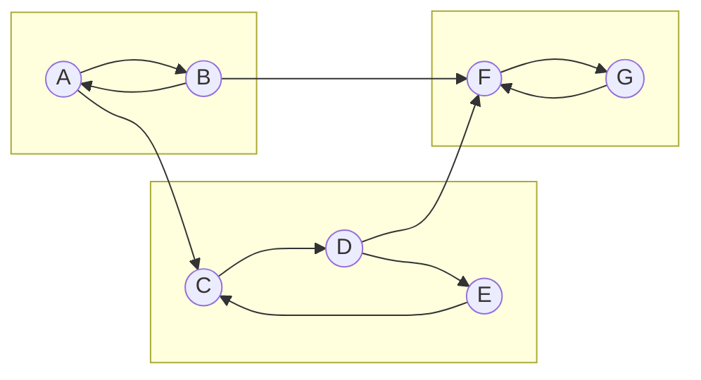

**Remarque :** 
Le graphe des composantes fortement connexes est un graphe orienté acyclique.
Dans un tel graphe, on définit naturellement une relation d'ordre entre sommets : $s \le s'$ ssi il existe un chemin de $s$ à $s'$ (on dit que $s'$ est accessible à partir de $s$).

Dans le cas général, cet ordre n'est pas total :

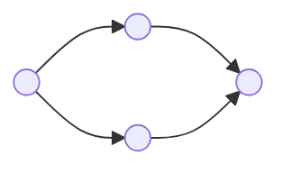

On peut choisir un ordre total compatible avec cet ordre partiel en effectuant un tri topologique du graphe (cf. TD 30)).

---

# 3. Représentation des graphes

## 3.0 Remarque
Il s'agit d'étudier des implémentations effectives des graphes. On suppose dans la suite qu'une numérotation des sommets a été choisie, donc que $S =\llbracket 0;n-1\rrbracket$.

## 3.1. Matrice d'adjacence

### 3.1.1. Définition matrice d'adjacence
Soit $G=\llbracket 0;A\rrbracket,A$ un graphe.

La `matrice d'adjacence entière` (resp. booléenne) de $G$ est la matrice $A_G = (a_{i,j})_{i, j \llbracket 0;n-1\rrbracket}$ définie par 
$$\forall i, j \in\llbracket 0;n-1\rrbracket,a_{i,j} =\left\{\begin{array}{ll}
  1\ (\text{resp. V})\ \text{si}\ \{i, j\} \in A\ \text{(resp. $(i, j) \in A$ dans le cas orienté)}
  \\
  0\ (\text{resp. F})\ \text{sinon}
\end{array}\right.$$

---

### 3.1.2. Exemples

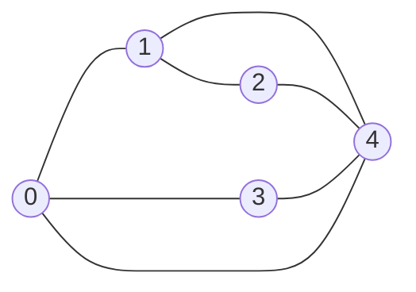

> À compléter

---

### 3.1.3. Proposition
Soit $G = (S, A)$ un GNO.

Alors $A_G$ est symétrique.

**Démonstration :**
$\forall i, j \in\llbracket 0;n-1\rrbracket,$
$$
  \begin{array}{rcl}
      a_{i, j} = 1\ \text{(resp. V)}
      &\Leftrightarrow & \{i, j\} \in A
      \\
      &\Leftrightarrow & \{j, i\} \in A
      \\
      &\Leftrightarrow & a_{j, i} = 1\ \text{(resp. V)}\
  \end{array}
$$

---

### 3.1.4. Proposition
Soit $G = (\llbracket 0;n-1\rrbracket, A)$ un graphe, et $A_G$ sa matrice d'adjacence entière.

Alors, $\forall (i, j) \in \llbracket 0;n - 1\rrbracket^2$, en notant $\forall k \in \N,\ a_{i, j}^{(k)}$ le coefficient $(i, j)$ de $A_G^{(k)}$, $a_{i, j}^{(k)}$ est le nombre de chemins de longueur $k$ de $i$ à $j$.

**Démonstration :**
Par récurrence sur $k$

- $k = 0$ : $A_G^k = I_n$
  
  $\forall i, j \in \llbracket0;n - 1\rrbracket$, il existe un chemin de longueur nulle de $i$ à $j$ sii $ i = j$ : ok.

**Hérédité :** 
$A_G^{k + 1} = A_G^k A_G$

Donc
&&
  \forall i, j \in \llbracket 0;n - 1\rrbraket,a_{i,j}^{(k + 1)}
  = \sum_{l = 0}^{n - 1} a_{i,l}^{(k)} a_{l,j}^{(k)}
  = \sum_{\substack{l \in \nset0 {n - 1} \\ \set{l, i} \in A}} a_{i,l}^{(k)}
&&

Or tout chemin de longueur $k + 1$ de $i$ à $j$ se décompose de manière unique en un chemin de $i$ à un sommet $l$ de longueur $k$ suivit  de l'arc / arête de $l$ à $j$.

Donc l'hypothèse de récurrence conclut.


---

### 3.1.5. Définition : matrice d'adjacence pondérée
Soit $G = (S, A, w)$ un graphe pondéré.

La `matrice d'adjacence pondérée` de $G$ est la matrice
$A_G = (a_{i,j})_{i,j \in \llbracket0;n - 1\rrbracket}$ définie par
$$
  \forall i, j \in \rrbracket0;n - 1\rrbracket,\
  \left\{\!\!
  \begin{array}{ll}
      w(\{i, j\})
      &\text{si}\ \{i, j\} \in A
      \\
      +\infty
      & \text{sinon}
  \end{array}
  \right.
$$


---

### 3.1.6. Implémentation
On utilise un tableau à deux dimensions.

- En OCaml :
  ```ocaml
  type graphe = int array array
  ```

- En C : d'après le programme, on n'utilise que des tableaux de taille statiquement connue.

  **Exemple :**
  ```c
  typedef int graphe[10][20];
  graphe g;
  g[0][0] = 1;
  ```

Dans le cas général, on devrait utiliser des pointeurs :
```ocaml
typedef int** graphe;
```
mais cela nécessiterait d'utiliser $n + 1$ fois la fonction `malloc`.

On préférera linéariser le tableau :

\begin{lstlisting}[language=C, xleftmargin=100pt]
typedef int* graphe;
graphe g = (graphe) malloc(n*n*sizeof(int));
//la case i, j est g[i*n + j]
free(g);\end{lstlisting}

Avantage : 1 \texttt{malloc}, 1 \texttt{free}.

Inconvénient : risque de se tromper dans les accès.
\end{indt}

\vspace{12pt}

\begin{indt}{\subsubsection{Complexité}}
$\bullet$ Complexité spatiale : $\mathcal O(n^2)$

\begin{indt}{$\bullet$ Complexité temporelle des opérations usuelles :}
  $-$ Création du graphe : $\mathcal O(n^2)$ ;

  $-$ Test de l'existence  d'une arête / d'un arc de $i$ à $j$ : $\mathcal O(1)$ (un accès dans la matrice) ;

  $-$ Calcul du nombre d'arêtes / d'arcs : $\mathcal O(n^2)$ ;

  $-$ Calcul de la liste des voisins / successeurs d'un sommet : $\mathcal O(n)$ (parcours de la ligne) ;

  $-$ Ajout / suppression d'une arête / d'un arc : $\mathcal O(1)$ (Attention au cas non orienté) ;

  $-$ Ajout / suppression de sommet : $\mathcal O(n^2)$ (reconstruire la matrice).

  \boxed{\rm Exo} : code.
\end{indt}
\end{indt}
\end{indt}

\vspace{12pt}

\begin{indt}{\subsection{Listes d'adjacences}}
\begin{indt}{\subsubsection{Définition (\textit{listes d'adjacence})}}
Soit $G = (\nset 0 {n - 1})$ un graphe.

On peut représenter $G$ à l'aide d'un tableau de listes d'adjacence :
$\forall i \in \nset 0 {n - 1}$, la case d'indice $i$ contient la liste des voisins / successeurs de $i$.
\end{indt}

\vspace{12pt}

\begin{indt}{\subsubsection{Exemple}}
\begin{center}
  \begin{tabular}{ccp{143pt}}
      \begin{tikzpicture}[scale=1.5]
          \node (0) [circle, draw] {0};
          \node (1) at (1, 0) [circle, draw] {1};
          \node (2) at (2, 0) [circle, draw] {2};
          \node (3) at (0, -1) [circle, draw] {3};
          \node (4) at (1, -1) [circle, draw] {4};

          \draw (0) -- (1) -- (2) -- (4) -- (0) -- (3) -- (4) -- (1);
      \end{tikzpicture}
      &
      \vline
      &
      \vspace{-60pt}
      \begin{tabular}{ccccccccccc}
          0 & \fbox{$\phantom x$} & $\rightarrow$ & 1 & $\rightarrow$ & 3 & $\rightarrow$ & 4 & $\rightarrow$ 
          \\
          1 & \fbox{$\phantom x$} & $\rightarrow$ & 0 & $\rightarrow$ & 2 & $\rightarrow$ & 4 & $\rightarrow$
          \\
          2 & \fbox{$\phantom x$} & $\rightarrow$ & 1 & $\rightarrow$ & 4 & $\rightarrow$
          \\
          3 & \fbox{$\phantom x$} & $\rightarrow$ & 0 & $\rightarrow$ & 4 & $\rightarrow$
          \\
          4 & \fbox{$\phantom x$} & $\rightarrow$ & 0 & $\rightarrow$ & 1 & $\rightarrow$ & 2 & $\rightarrow$ & 3 & $\rightarrow$
      \end{tabular}
  \end{tabular}
\end{center}

\begin{center}
  \begin{tabular}{ccp{100pt}}
      \begin{tikzpicture}[scale=1.5]
          \node (0) at (0, 0) [circle, draw] {0};
          \node (1) at (1, 0) [circle, draw] {1};
          \node (2) at (0, -1) [circle, draw] {2};
          \node (3) at (1, -1) [circle, draw] {3};

          \draw[->] (1) to (0);
          \draw[->] (0) to (2);
          \draw[->] (2) to [out=10, in=170] (3);
          \draw[->] (3) to [out=-170, in=-10] (2);
          \draw[->] (2) to (1);
          \draw[->] (1) to (3);
      \end{tikzpicture}
      &
      \vline
      &
      \vspace{-60pt}
      \begin{tabular}{ccccccc}
          0 & \fbox{$\phantom x$} & $\rightarrow$ & 2 & $\rightarrow$
          \\
          1 & \fbox{$\phantom x$} & $\rightarrow$ & 0 & $\rightarrow$ & 3 & $\rightarrow$
          \\
          2 & \fbox{$\phantom x$} & $\rightarrow$ & 1 & $\rightarrow$ & 3 & $\rightarrow$
          \\
          3 & \fbox{$\phantom x$} & $\rightarrow$ & 2 & $\rightarrow$
      \end{tabular}
  \end{tabular}
\end{center}
\end{indt}

\vspace{12pt}

\begin{indt}{\subsubsection{Cas des graphes pondérés}}
On peut utiliser des listes d'adjacence pondérées : chaque liste contient des couples (voisin, poids).
\end{indt}

\vspace{12pt}

\begin{indt}{\subsubsection{Implémentation}}
On utilise un tableau de listes chaînées.

$\bullet$ En OCaml :

\begin{lstlisting}[language=Caml, xleftmargin=100pt]
type graphe = int list array\end{lstlisting}

$\bullet$ En C :

\begin{lstlisting}[language=C, xleftmargin=100pt]
struct elem {
int val;
struct elem* next;
};
typedef struct elem* liste;

typedef liste* graphe;\end{lstlisting}

\vspace{6pt}

Remarque : on peut se passer des listes en utilisant des tableaux : on peut par exemple utiliser une matrice dont les lignes ne sont pas toutes de même longueur en plaçant dans la première case de chaque ligne ne nombre de voisins (\texttt{g[i][0]} est le nombre de voisins de $i$ et les voisins sont \texttt{g[i][1],$\ldots$, g[i[g[i][0]]]})

Problème : la linéarisation de cette matrice n'est pas pratique à manipuler.

Solution : on utilise un tableau \texttt{voisins} qui contient dans l'ordre les voisins des différents sommets et deux tableaux \texttt{debut} et \texttt{fin} tel que les voisins de $i$ sont stockés entre les indices \texttt{debut[i]} (inclus) et \texttt{fin[i]} (exclu).
\end{indt}

\vspace{12pt}

\begin{indt}{\subsubsection{Complexité}}
On utilise un tableau de listes chaînées.

On note $n = \abs S$, $m = \abs A$.

$\bullet$ Complexité spatiale : $\mathcal O(n + m)$ ;

\begin{indt}{$\bullet$ Complexité temporelle des opérations usuelles :}
  $-$ Création de graphe (sans arêtes) : $\mathcal O(n)$ ;

  $-$ Test d'existence de l'arête $\set{i, j}$ / de l'arc $(i, j)$ : $\mathcal O\!\lr{d_{(+)}(i)}$ (parcours de la liste d'adjacence de $i$) ;

  $-$ Calcul du calcul d'arêtes / d'arcs : $\mathcal O(n + m)$ (calcul de la somme des longueurs des listes, divisée par 2 dans le cas non orienté) ;

  $-$ Calcul de la liste des voisins d'un sommet : $\mathcal O(1)$ (accès à la case du sommet) ;

  $-$ Ajout d'une arête / d'un arc : $\mathcal O(1)$ (ajout en tête de liste) ;

  $-$ Suppression d'une arête / d'un arc entre $i$ et $j$ : $\mathcal O\!\lr{d_+(i)}$ dans le cas orienté, $\mathcal O\!\lr{d(i) + d(j)}$ dans le cas non orienté ;

  $-$ Ajout d'un n\oe ud : $\mathcal O(n)$ si tableau statique, $\mathcal O(1)$ amorti si tableau dynamique ;

  $-$ Suppression d'un n\oe ud : $\mathcal O(n + m)$ (création d'un nouveau tableau + renumérotation des n\oe uds).
\end{indt}
\end{indt}
\end{indt}
\end{indt}
\end{indt}


%Add \label{4.1.8}


\end{document}
%--------------------------------------------End
