**Chapitre 10 : Théorie des graphes**
===
# 1. Introduction
## 1.1. Les origines
### 1.1.1. Le problème fondateur : les 7 points de Königsberg
**Énoncé :**
Peut-on effectuer une promenade à Königsberg passant exactement une fois par chacun des ponts .

**Variante :**
Peut-on le faire en revenant à son point de départ ?

<p align="center">

</p>

---

### 1.1.2. Une solution formelle
Présentée par Euler en 1735, avec 3 étapes :
1. Nommage des zones et représentation abstraite ;
2. Formalisation de la notion de chemin ;
3. Démonstration d'impossibilité : il n'existe pas de chemin / circuit eulérien dans ce graphe.

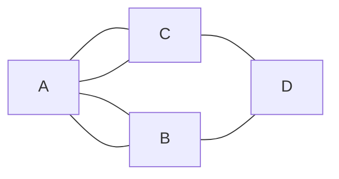

---

### 1.1.3. Remarque
Les points 1. et 2. sont les étapes fondatrices de la théorie des graphes vue comme une théorie mathématique.

Cette théorie a pris une grande ampleur car elle permet de modéliser de nombreux problèmes.

---

## 1.2. De nombreuses applications

---
### 1.2.1. Compilation
- Modélisation : on représente le graphe de dépendance entre fichiers

  ```mermaid
  flowchart LR
      subgraph Foo.ml
      id1[open Bar]
      end
      subgraph Bar.ml
      id2[open Foo]
      end
      id1 --> id2
      id2 --> id1
  ```

- Problème : faisabilité : c'est un problème de détecton de cycle.
  - ordre de compilation : choisir un ordre, c'est effectuer un tri topologique du graphe

---

### 1.2.2. Transport
- Modélisation : on représente un réseau de transports en commmun en représentant les stations liées par les lignes qui y passent ;
- Problème : recherche de chemin le plus court en terme de distance / temps (nécessité d'annotation) / nombre de station.

---

### 1.2.3. Ordonnancement de tâches
- Problème : représention d'un ensemble de tâches sur un nombre minimal d'unité de calcul ;
- Modélisation : on utilise un graphe d'incompatibilité : on lie les tâches incompatibles entre elles. On veut attribuer une couleur (une unité de calcul) à chaque sommet de sorte qu'aucun sommet ne soit de la même couleur que l'un de ces voisins. Le nombre minimal de couleurs est le nombre chromatique du graphe.

---

### 1.2.4. Construction d'un réseau électrique
- Problème : on veut raccorder un certain nombre de villes en utilisant le moins de cable possible ;
- Modélisation : on utilise un graphe qui représente les villes liées par des axes annotés par leur longueur. On veut sélectionner des axes pour lier toutes les villes entre elles en utilisant le moins de longueur possible. C'est la recherche d'un arbre couvrant, de poids minimal.

---

# 2. Bases des graphes
## 2.1. Vocabulaire
### 2.1.1. Définition : graphe
Un graphe est un couple $G=(S,A)$ où :
- $S$ est un ensemble fini de sommets ou de noeuds ;
- $A$ est un ensemble d'associations entre 2 sommets, qui peut prendre plusieurs formes :
  - Si $A$ est un ensemble de paires de sommets, on dit que $G$ est non orienté
  
    Si $a=\{s,s'\}\in A$, on dit que $a$ est une arrête d'extrémité $s$ et $s'$, que $a$ est incidente à $s$ et $s'$ et que $s$ et $s'$ sont adjacents ou voisins
  - Si $A$ est un ensemble de couples de sommets, on dit que $G$ est orienté
  
    Si $a=\{s,s'\}\in A$, on dit que $a$ est un arc, que s'est un successeur de $s$, que $a$ est un arc sortant pour $s$ et entrant pour $s'$.

---

### 2.1.2. Représentation graphique
On place un points pour chaque sommet et on relie les extrémités d'une même arête (avec une flèche dans le cas orienté)

**Exemple :**
$G=(\{A;B;C;D\};\{\{A;B\};\{B;C\};\{C;A\}\})$ est un graphe non orienté (`GNO`)

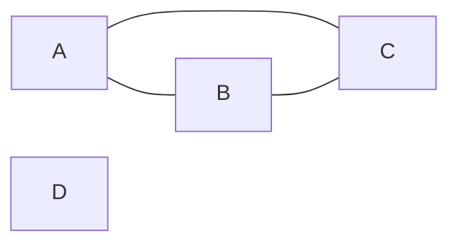

Autre exemple :

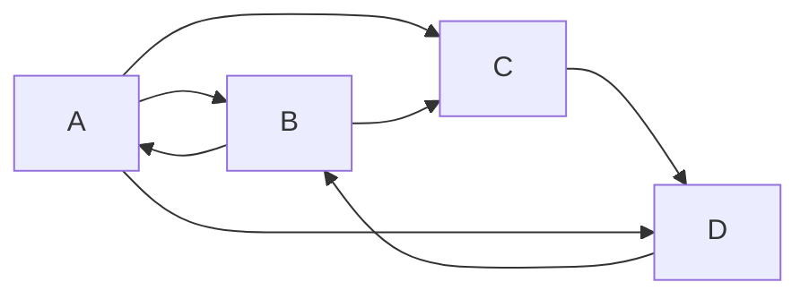
est la représentation du graphe orienté (`GO`) :
$$G=(\{A;B;C;D\};\{(A;B);(B;A);(B;C);(D;B);(A;D);(A;C);(C;D)\})$$

---

### 2.1.3. Boucles
**Définition :**
Une boucle dans un graphe est une arête / arc dont les extrémités sont égales

**Remarque :**
La définition 2.1.1 empêche la présence de boucles dans les GNO. On peut les autoriser en considérant non pas des paires de sommets, mais des multi-ensembles de cardinal 2.

On pourrait aussi utiliser les multi-ensembles pour autoriser les multi-arêtes / plusieurs arêtes entre 2 sommets données, comme en 1.1.1.) mais c'est `H.P.` : $A$ sera toujours un ensemble.

---

### 2.1.4. Degré
- **Définition (degré) :** Soit $G=(S,A)$ un GNO et $s\in S$.

  Le degré de $s$, noté $d(s)$ est le nombre de voisins de $s$.
  $$d(s)=|\{a\in A,s\in a\}|$$

- **Définition (degré entrant / sortant) :** Soit $G=(S,A)$ un GO et $s\in S$.

  Le degré entrant (resp. sortant) de $s$, noté $d_-(s)$ (resp. $d_+(s)$), est le nombre d'arcs entrants (resp. sortants) pour $s$.
  $$d_-(s)=|\{a\in A,\exists s'\in S,a=(s',s)\}|$$
  $$d_+(s)=|\{a\in A,\exists s'\in S,a=(s,s')\}|$$

- **Propriété (formules de la somme des degrés) :** Soit $G=(S,A)$ un graphe :

  1. Si $G$ est un GNO, $\displaystyle\sum_{s\in S}d(s)=2|A|$ si $G$ est sans boucle ;
  2. Si $G$ est un GO $\displaystyle\sum_{s\in S}d_-(s)=\sum_{s\in S}d_+(s)=|A|$.

  **Démonstration :**
  1. On compte les extrémités d'arêtes
   
     - on arête compte pour 2 extrémités car ce n'est pas une boucle donc il y en a $2|A|$
     - $\forall s\in S$, $s$ est extrémité de $d(s)$ arêtes donc il y en a $\displaystyle\sum_{s\in S}d(s)$.
  
  2. Par récurrence sur |A| : 
   
     - si $|A|=0,\forall s\in S, d_+(s)=d_-(s)=0\rightarrow$ Ok
     - Hérédité : si $|A|>0$, alors $\exists(s,s')\in A$

     On note $G'=(S,A\setminus\{s,s'\})$.

     Par hypothèse de récurrence : 
     $$|A|-1=|A\setminus\{s,s'\}|=\sum_{v\in S\setminus\{s'\}}d_-(v)+\underbrace{d_-(s)-1}_{\text{degré sortant de }s\text{ dans }G'}$$
     donc $|A|=\displaystyle\sum_{v\in S}d_-(v)$ de même pour les degrés entrants, en considérant $s'$ plutôt que $s$.

- **Corollare (hondshaking lemma) :** Tout GNO sans boucle possède un nombre pair de sommets de degré impair.

  **Démonstration :** 
  $$2\mathbb N \ni 2|A| = \sum_{s \in S} d(s) = \underbrace{\sum_{\substack{s \in S \\ d(s) \in 2\mathbb N}} d(s)}_{\in 2\mathbb N} + \underbrace{\sum_{\substack{s \in S \\ d(s) \in 2\mathbb N + 1}} d(s)}_{\substack{\text{de la parité du nombre} \\ \text{de sommets de degré impair}}}$$

  **Contre-exemple en cas de boucle :**

  ```mermaid
  flowchart
      id((A))
      id --- id
  ```

---

### 2.1.5. Graphes étiquetés
**Définition (graphe étiqueté / pondéré) :**
Soit $G=(S,A)$ un graphe.

On dit que $G$ est :
- étiqueté s'il est muni d'une fonction $f:A\rightarrow V$ où $V$ est un ensemble de valeurs appelées les étiquettes ;
- pondéré s'il est étiqueté par des nombres (entiers / réels) : on parle de poids plutôt que d'étiquette.

**Exemple :**
1.1.2., 1.2.4.,
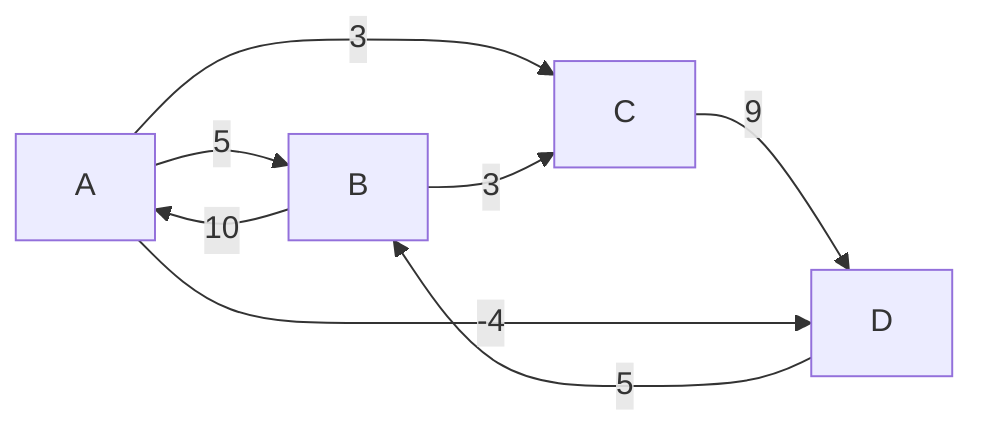

En MPI : les automates finis :

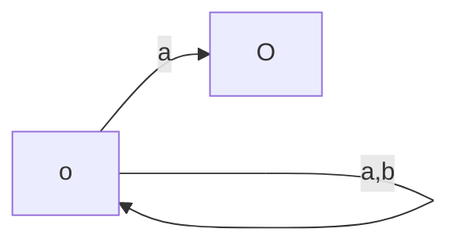

---

### 2.1.6. Graphes bipartis
- Définition (graphes bipartis) : Soit $G=(S,A)$ un graphe.

  On dit que $G$ est `biparti` s'il existe une partition de $S$ $(U, V)$ telle que pour toute arête $a$, une extrémité de $a$ appartienne à $U$ et l'autre à $V$.

- Exemple $({\color{red}{U}},V)$ :

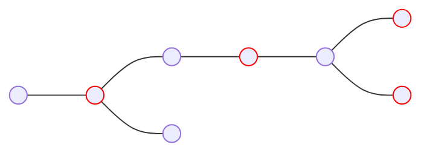

Peut aussi se représenter :
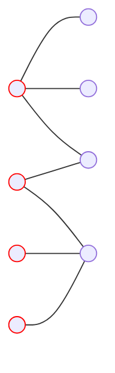

**Remarque :**
Un graphe biparti est 2-colorable.

---

## 2.2. Connexité
### 2.2.1. Définition : chemin
Soit $G=(S,A)$ un graphe.

Un chemin dans $G$ est une suite finie de sommets $s_0,\dots,s_n\in S$ tq $\forall i\in [\![0;n-1]\!], \{s_i;s_{i+1}\}\in A$ (resp. $(s_i+s_{i+1})\in A$ dans le cas orienté).

La longueur du chemin est le nombre d'arêtes / d'arcs parcourus, ici $n$.

---

### 2.2.2. Définition : cas particuliers des chemins
Soit $G=(S,A)$ un graphe et $p=s_0,\dots,s_n$ un chemin dans $G$ :
- $p$ est `fermé` ssi $s_0=s_n$
- $p$ est `élémentaire` ssi $p$ passe au plus une fois par chaque arête / arc, i.e. $\forall i\not ={j}\in[\![0;n-1]\!],\{s_i;s_{i+1}\}\not ={\{s_j;s_{j+1}\}}$ (resp. $\{s_i;s_{i+1}\}\not ={\{s_j;s_{j+1}\}}$)

 ```mermaid
 graph LR
   id1(( )) --> id2(( ))
   id2(( )) --> id1(( ))
  
 ```

 ```mermaid
 graph LR
   id3(( )) --- id4(( ))
 ```

- $p$ est simple ssi $\forall i\not ={j}\in[\![0;n]\!],s_i\not ={s_j}$, sauf éventuellement $s_0=s_n$ uniquement si $n\not = 2$ dans le cas non-orienté

**Attention :**
Vocabulaire différent selon les auteurs.

---

### 2.2.3. Vrai / Faux
1. $p$ élémentaire $\Rightarrow p$ simple
2. $p$ simple $\Rightarrow p$ élémentaire
   ```mermaid
   graph LR
     id1((4)) --- id2((0,3))
     id2 --- id3((1))
     id3 --- id4((2))
     id2 --- id4
   ```

3. $\exists$ des chemins simples / fermés de longueur non-nulle
   ```mermaid
   graph LR
     id1((O,2)) --- id2((1))
     id3(( )) --- id4(( ))

---

### 2.2.4. Définition : circuit / cycles / chemin eulériens
Soit $G=(S,A)$ un graphe, $p=s_0,\dots,s_n$ un chemin dans $G$
- $p$ est un `circuit` ssi $p$ est un chemin fermé de longueur non-nulle
- $p$ est un `cycle` ssi $p$ est un circuit élémentaire
- $G$ `acyclique` s'il ne contient aucun cycle
- $p$ est un `chemin eulérien` ssi $p$ passe exactement une fois par chaque arête / arc, i.e. si $\{\{s_i;s_{i+1}\},i\in [\![0;n-1]\!]\}=A$ et $|A|=n$ (resp. $(s_i;s_{i+1})$)
- $G$ est `eulérien` ssi $G$ contient un chemin fermé eulérien

---

### 2.2.5. Remarque
- un chemin est élémentaire
- on parle souvent de circuit / cycle eulérien dans la définition du graphe eulérien même si c'est une erreur de langage pour le graphe sans arête
- une branche est un cycle simple de longueur 1
- on peut toujours rendre simple un chemin / cycle en coupant les circuits intermédiaires
 ```mermaid
 graph LR
   id0((0)) --- id1((1)) --- id2((2,5))
   id2 --- id3((3))
   id2 --- id4((4))
   id3 --- id4
   id2 --- id6((6))
 ```

Cela n'est pas toujours possible pour les circuits : le circuit $s_0,s_1,s_0$ dans un graphe non-orienté contenant une arête $\{s_0;s_1\}$ ne peut pas être rendu simple (couper le circuit le rend de longueur nulle : ce n'est plus un circuit).

---

### 2.2.6. Proposition
Soit $G=(S,A)$ un graphe.

Si $G$ est biparti alors $G$ ne contient aucun cycle de longueur impaire.

**Démonstration :**
On note $(U,V)$ une partition de $S$ convenable.

Soit $c=s_0,\dots,s_n$ un cycle dans $G$. On suppose sans perte de généralité que $s_0\in U$.

On montre alors par récurrence finie que  $\left\{\begin{array}{ll}
 \forall i\in \mathcal{U}N\cap[\![0;n]\!], s_i\in U
 \\
 \forall j\in \mathcal{U}N+1\cap[\![0;n]\!], s_j\in V
\end{array}\right.$

Alors $s_n=s_0\in U$ donc $n\in\mathcal{U}N$

---

### 2.2.7. Remarque
C'est une caractérisation des graphes bipartis (réciproque en 4.1.8.).

---

### 2.2.8. Définition : connexité
Soit $G=(S,A)$ un GNO et $s,s'\in S$.
- On dit que $s$ et $s'$ sont connectés dans $G$, noté $s\sim_G s'$, s'il existe un chemin reliant $s$ ou $s'$ dans $G$
- $G$ est connexe ssi $\forall s,s'\in S, s\sim s'$
---

### 2.2.9. Proposition
Soit $G=(S,A)$ un GNO. Alors $\sim_G$ est une relation d'équivalence.

**Démonstration :**
En exercice.

---

### 2.2.10 Définition : composante connexes
Soit $G=(S,A)$ un GNO et $s\in S$.

La composante connexe de $G$ contenant $s$ est la classe d'équivalence de $s$ par $\sim_G$.

---

### 2.2.11. Lemme
Soit $G=(S,A)$ un GNO et $s_1,s_2\in A$.

On note $G'=(S,A\setminus \{\{s_1;s_2\}\})$, $C la composante connexe de $G$ contenant $s_1$ et $s_2$ et $\forall i\in [\![1;2]\!]$, $C_i$ la composante connexe de $G'$ contenant $s_i$.

Alors il existe un cycle dans $G$ passant pas $\{s_1:s_2\}$, alors $C_1=C_2=C$.

Sinon, $C_1\cap C_2=\varnothing$ et $C_1\cup C_2=C$

**Démonstration :**
- $C_1\cup C_2=C$ :
  $\subseteq$ : vrai car un chemin dans $G'$ est un chemin dans $G$
  $\supseteq$ : Soit $s\in C$

Il existe un chemin, $n_0,\dots,n_k$ de $s$ à $s_1$ dans $G$ (avec $n_0=s$ et $n_k=s_1$)

On considère $i=\min\{i\in[\![0;k]\!],n_i,s_1$ ou $n_i=s_2$ (existe car $n_k=s_1$)

Alors $n_0\dots n_i$ est une chemin dans $G'$ de $s$ à $s_1$ ou $s_2$ donc $s\in C_1$ ou $s\in C_2$

- Soit $C_1=C_2$, soit $C_1\cap C_2=\varnothing$ car $C_1$ et $C_2$ sont des clauses d'équivalence pour $\sim_{G'}$
- $C_1=C_2$ ssi $\{s_1;s_2\}$ appartient à un cycle de $G$

$\Rightarrow s_1\in C_2$ donc il existe un chemin $s_2 s_3\dots s_n s_1$ dans $G'$, que l'on suppose élémentaire (on peut toujours rendre simple un chemin).

Alors en ajoutant l'arête $\{s_1,s_2\}$ à ce chemin, on obtient $s_1 s_2\dots s_n s_1$, qui est un chemin fermé, de longueur non nulle et élémentaire car le chemin initial ne contenait pas $\{s1;s_2\}$ et était élémentaire. C'est donc un cycle contenant $\{s1;s_2\}$.

$\Leftarrow$ Quitte à réordonner les sommets, on peut supposer qu'il existe un cycle $s_2 s_3\dots s_n s_1$.

Comme il est élémentaire, le chemin $s_2 s_3\dots s_n s_1$ es un chemin de $s_2$ à $s_1$ **dans $G'$** donc $s_2\sim_{G'}s_1$ donc $C_1=c_2$.

---

### 2.2.12. Proposition
Soit $G=(S,A)$ un GNO avec $|S|=n$ et $|A|=m$
1. $G$ a au moins $n-m$ composantes connexes
2. $G$ a exactement $n-m$ composantes connexes ssi $G$ est acyclique

**Démonstration :**
Par l'absurde, considérons $G$ un contre-exemple avec $m$ minimal.
- Si $m=0$ : $G$ n'a pas d'arête donc $G$ est acyclique et a $n=n-0=n-m$ composantes connexes donc $G$ n'est pas un contre-exemple : absurde.
- donc $m>0$ : on peut essayer de supprimer une arête de $G$.

S'il existe un cycle dans $G$, on choisit une arête de ce cycle, d'après 2.2.11, on obtient $G'$ avec les mêmes composantes connexes que $G$.

Par minimalité de $m$, $G'$ n'est pas un contre-exemple donc a au moins $n-(m-1)$ composantes connexes donc $G$ a au moins $n-n+1>n-m$ composantes connexes donc $G$ n'est pas un contre-exemple : absurde.

- Donc $G$ est acyclique.

Donc d'après 2.2.11, supprimer une arête de $G$ donne $G'$ avec exactement une composante connexe de plus que $G$.

$G'$ est acyclique et n'est pas un contre-exemple par minimalité de $m$, donc $G'$ a exactement $n - (m - 1)$ composantes connexes.

Donc $G$ a exactement $n - m + 1 - 1 = n - m$ composantes connexes.

Donc $G$ n'est pas un contre-exemple : absurde.

---

### 2.2.13. Définition : arbre
Un arbre est un graphe non orienté connexe et acyclique.

---

### 2.2.14. Proposition
Soit $G=(S,A)$ un GNO avec $|S|=n$ et $|A|=m$.

Les assertions suivantes sont équivalentes :
1. $G$ est un arbre
2. $G$ est connexe avec $m$ minimal, i.e. si on retire une arête de $G$, on perd la connexité
3. $G$ est acyclique avec $m$ minimal, i.e. si on retire une arête de $G$, on perd l'acyclité
4. $G$ est connexe avec $m=n-1$
5. $G$ est acyclique avec $m=n-1$

**Démonstration :**
(1) $\Rightarrow$ (4) et (5) : $G$ est connexe donc a exactement une nouvelle composante connexe.

$G$ est acyclique donc a exactement $n-m$ composantes connexes d'après 2.2.12 donc $1=n-m$, i.e. $m=n-1$

(4) ou (5) $\Rightarrow$ (1) : d'après 2.2.12., $G$ a au moins $n-m=1$ composantes connexes, exactement ssi $G$ est acyclique donc $G$ est connexe ssi $G$ est acyclique donc (4) ou (5) $\Rightarrow$ (1).

(1) $\Rightarrow$ (2) : c'est 2.2.11. dans le cas acyclique

(2) $\Rightarrow$ (1) : si $G$ n'était pas acyclique, on pourrait supprimer une arête d'un cycle, ce qui contredit la minimalité de $m$ d'après 2.2.11.

(1) $\Rightarrow$ (3) : Si $m$ n'était pas maximal, on pourrait ajouter une arête à $G$ et obtenir $G'$ acyclique et toujours connexe

$G'$ serait un arbre donc par (2), retirer l'arête que l'on vient d'ajouter donnerait un graphe non connexe. Or, c'est $G$, qui est un arbre : absurde.

(3) $\Rightarrow$ (1) : Si $G$ n'est pas connexe, on peut ajouter une arête entre 2 sommets de 2 composantes connexes distinctes sans créer de cycle (d'après 2.2.11) donc $m$ n'est pas maximal : absurde.

---

### Définition : forêt
Une forêt est un GNO acyclique.

---

### 2.2.16. Remarque
- les composantes connexes d'une forêt dont des arbres
- la relation de connexité n'est pas une relation d'équivalence dans les graphes orientés, on perd la symétrie :

 ```mermaid
 graph LR
   id1(( )) --> id2(( ))
 ```

---

### 2.2.17. Définition : connexité forte
Soit $G = (S, A)$ un GO, et $s, s' \in S$.

- On dit de $s$ et $s'$ sont \textit{fortement connectés}, noté $s \sim_G s$ si il existe un chemin de $s$ à $s'$ et un chemin de $s'$ à $s$ dans $G$.

- On dit que $G$ est `fortement connexe` ssi $\forall s, s'\ s \sim_G s'$.

---

### 2.2.18. Proposition
Soit $G = (S, A)$ un GO.

Alors $\sim_G$ est une relation d'équivalence.

**Remarque :** 
Si $G$ est un GNO, $\sim_G = \sim_G$.

---

### 2.2.19. Définition : composantes fortement connexes
Soit $G = (S, A)$ un GO, et $s \in S$.

La `composante fortement connexe `de $G$ contenant $s$ est la clause d'équivalence de $s$ pour $\sim_G$.

---

### 2.2.20. Exemple

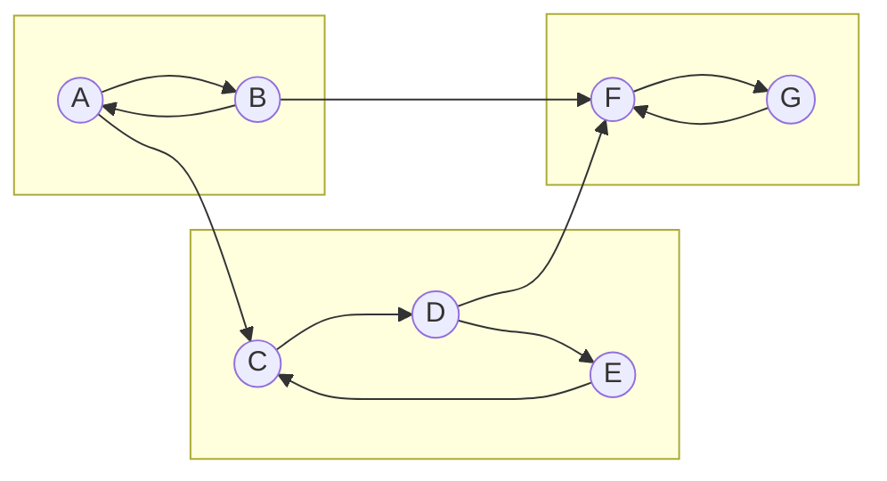

**Remarque :** 
Le graphe des composantes fortement connexes est un graphe orienté acyclique.
Dans un tel graphe, on définit naturellement une relation d'ordre entre sommets : $s \le s'$ ssi il existe un chemin de $s$ à $s'$ (on dit que $s'$ est accessible à partir de $s$).

Dans le cas général, cet ordre n'est pas total :

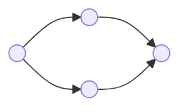

On peut choisir un ordre total compatible avec cet ordre partiel en effectuant un tri topologique du graphe (cf. TD 30)).

---

# 3. Représentation des graphes

## 3.0 Remarque
Il s'agit d'étudier des implémentations effectives des graphes. On suppose dans la suite qu'une numérotation des sommets a été choisie, donc que $S =[\![ 0;n-1]\!]$.

## 3.1. Matrice d'adjacence

### 3.1.1. Définition matrice d'adjacence
Soit $G=[\![ 0;A]\!],A$ un graphe.

La `matrice d'adjacence entière` (resp. booléenne) de $G$ est la matrice $A_G = (a_{i,j})_{i, j [\![ 0;n-1]\!]}$ définie par
$$\forall i, j \in[\![ 0;n-1]\!],a_{i,j} =\left\{\begin{array}{ll}
 1\ (\text{resp. V})\ \text{si}\ \{i, j\} \in A\ \text{(resp. $(i, j) \in A$ dans le cas orienté)}
 \\
 0\ (\text{resp. F})\ \text{sinon}
\end{array}\right.$$

---

### 3.1.2. Exemples

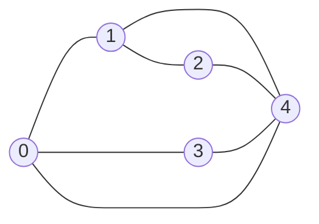

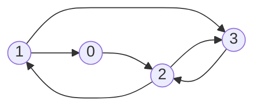

> À compléter

---

### 3.1.3. Proposition
Soit $G = (S, A)$ un GNO.

Alors $A_G$ est symétrique.

**Démonstration :**
$\forall i, j \in[\![ 0;n-1]\!],$
$$
 \begin{array}{rcl}
     a_{i, j} = 1\ \text{(resp. V)}
     &\Leftrightarrow & \{i, j\} \in A
     \\
     &\Leftrightarrow & \{j, i\} \in A
     \\
     &\Leftrightarrow & a_{j, i} = 1\ \text{(resp. V)}\
 \end{array}
$$

---

### 3.1.4. Proposition
Soit $G = ([\![ 0;n-1]\!], A)$ un graphe, et $A_G$ sa matrice d'adjacence entière.

Alors, $\forall (i, j) \in [\![ 0;n - 1]\!]^2$, en notant $\forall k \in \mathbb N,\ a_{i, j}^{(k)}$ le coefficient $(i, j)$ de $A_G^{(k)}$, $a_{i, j}^{(k)}$ est le nombre de chemins de longueur $k$ de $i$ à $j$.

**Démonstration :**
Par récurrence sur $k$

- $k = 0$ : $A_G^k = I_n$
  $\forall i, j \in [\![0;n - 1]\!]$, il existe un chemin de longueur nulle de $i$ à $j$ sii $ i = j$ : ok.

**Hérédité :**
$A_G^{k + 1} = A_G^k A_G$

Donc
&&
 \forall i, j \in [\![ 0;n - 1\rrbraket,a_{i,j}^{(k + 1)}
 = \sum_{l = 0}^{n - 1} a_{i,l}^{(k)} a_{l,j}^{(k)}
 = \sum_{\substack{l \in [\![ 0;n-1]\!] \\ \{l, i\} \in A}} a_{i,l}^{(k)}
&&

Or tout chemin de longueur $k + 1$ de $i$ à $j$ se décompose de manière unique en un chemin de $i$ à un sommet $l$ de longueur $k$ suivit  de l'arc / arête de $l$ à $j$.

Donc l'hypothèse de récurrence conclut.

---

### 3.1.5. Définition : matrice d'adjacence pondérée
Soit $G = (S, A, w)$ un graphe pondéré.

La `matrice d'adjacence pondérée` de $G$ est la matrice
$A_G = (a_{i,j})_{i,j \in [\![0;n - 1]\!]}$ définie par
$$
 \forall i, j \in ]\!]0;n - 1]\!],\
 \left\{\!\!
 \begin{array}{ll}
     w(\{i, j\})
     &\text{si}\ \{i, j\} \in A
     \\
     +\infty
     & \text{sinon}
 \end{array}
 \right.
$$


---

### 3.1.6. Implémentation
On utilise un tableau à deux dimensions.

- En OCaml :
 ```ocaml
 type graphe = int array array
 ```

- En C : d'après le programme, on n'utilise que des tableaux de taille statiquement connue.

 **Exemple :**
 ```c
 typedef int graphe[10][20];
 graphe g;
 g[0][0] = 1;
 ```

Dans le cas général, on devrait utiliser des pointeurs : `typedef int** graphe;` mais cela nécessiterait d'utiliser $n + 1$ fois la fonction `malloc`.

On préférera linéariser le tableau :

```c
typedef int* graphe;
graphe g = (graphe) malloc(n*n*sizeof(int));
//la case i, j est g[i*n + j]
free(g);
```

Avantage : 1 `malloc`, 1 `free`.

Inconvénient : risque de se tromper dans les accès.

---

### 3.1.7. Complexité
- Complexité spatiale : $\mathcal O(n^2)$
- Complexité temporelle des opérations usuelles :}
 - Création du graphe : $\mathcal O(n^2)$ ;
 - Test de l'existence  d'une arête / d'un arc de $i$ à $j$ : $\mathcal O(1)$ (un accès dans la matrice) ;
 - Calcul du nombre d'arêtes / d'arcs : $\mathcal O(n^2)$ ;
 - Calcul de la liste des voisins / successeurs d'un sommet : $\mathcal O(n)$ (parcours de la ligne) ;
 - Ajout / suppression d'une arête / d'un arc : $\mathcal O(1)$ (Attention au cas non orienté) ;
 - Ajout / suppression de sommet : $\mathcal O(n^2)$ (reconstruire la matrice).

**Exercice :**
Code

---

## 3.2. Listes d'adjacences

### 3.2.1. Définition (\textit{listes d'adjacence
Soit $G = ([\![ 0;n-1]\!])$ un graphe.

On peut représenter $G$ à l'aide d'un tableau de listes d'adjacence :
$\forall i \in [\![ 0;n-1]\!]$, la case d'indice $i$ contient la liste des voisins / successeurs de $i$.

---

### 3.2.2. Exemple


$\left|\begin{array}{llll}
 0 \;\; \square \; \rightarrow \; 1 \; \rightarrow \; 3 \; \rightarrow \; 4 \; \rightarrow
 \\
 1 \;\; \square \; \rightarrow \; 0 \; \rightarrow \; 2 \; \rightarrow \; 4 \; \rightarrow
 \\
 2 \;\; \square \; \rightarrow \; 1 \; \rightarrow \; 4 \; \rightarrow
 \\
 3 \;\; \square \; \rightarrow \; 0 \; \rightarrow \; 4 \; \rightarrow
 \\
 4 \;\; \square \; \rightarrow \; 0 \; \rightarrow \; 1 \; \rightarrow \; 2 \; \rightarrow \; 3 \; \rightarrow
\end{array}\right.$


$\left|\begin{array}{lll}
 0 \;\; \square \; \rightarrow \; 2 \; \rightarrow
 \\
 1 \;\; \square \; \rightarrow \; 0 \; \rightarrow \; 3 \; \rightarrow
 \\
 2 \;\; \square \; \rightarrow \; 1 \; \rightarrow \; 3 \; \rightarrow
 \\
 3 \;\; \square \; \rightarrow \; 2 \; \rightarrow
\end{array}\right.$

---

### 3.2.3. Cas des graphes pondérés
On peut utiliser des listes d'adjacence pondérées : chaque liste contient des couples (voisin, poids).

---

### 3.2.4. Implémentation
On utilise un tableau de listes chaînées.

- En OCaml :
```ocaml
type graphe = int list array
```

- En C :

```c
struct elem {
int val;
struct elem* next;
};
typedef struct elem* liste;

typedef liste* graphe;
```

**Remarque :**
On peut se passer des listes en utilisant des tableaux : on peut par exemple utiliser une matrice dont les lignes ne sont pas toutes de même longueur en plaçant dans la première case de chaque ligne ne nombre de voisins `g[i][0]` est le nombre de voisins de $i$ et les voisins sont `g[i][1],$\dots$, g[i[g[i][0]]]`

**Problème :**
La linéarisation de cette matrice n'est pas pratique à manipuler.

**Solution :**
On utilise un tableau `voisins` qui contient dans l'ordre les voisins des différents sommets et deux tableaux `debut` et `fin` tel que les voisins de $i$ sont stockés entre les indices `debut[i]` (inclus) et `fin[i]` (exclu).

---

### 3.2.5. Complexité
On utilise un tableau de listes chaînées.

On note $n = |S|$, $m = |A|$.

- **Complexité spatiale :** $\mathcal O(n + m)$ ;

- Complexité temporelle des opérations usuelles :
 - Création de graphe (sans arêtes) : $\mathcal O(n)$ ;
 - Test d'existence de l'arête $\{i, j\}$ / de l'arc $(i, j)$ : $\mathcal O(d_{(+)}(i))$ (parcours de la liste d'adjacence de $i$) ;
 - Calcul du calcul d'arêtes / d'arcs : $\mathcal O(n + m)$ (calcul de la somme des longueurs des listes, divisée par 2 dans le cas non orienté) ;
 - Calcul de la liste des voisins d'un sommet : $\mathcal O(1)$ (accès à la case du sommet) ;
 - Ajout d'une arête / d'un arc : $\mathcal O(1)$ (ajout en tête de liste) ;
 - Suppression d'une arête / d'un arc entre $i$ et $j$ : $\mathcal O(d_+(i))$ dans le cas orienté, $\mathcal O(d(i) + d(j))$ dans le cas non orienté ;
 - Ajout d'un n\oe ud : $\mathcal O(n)$ si tableau statique, $\mathcal O(1)$ amorti si tableau dynamique ;
 - Suppression d'un n\oe ud : $\mathcal O(n + m)$ (création d'un nouveau tableau + renumérotation des n\oe uds).

# 4. Parcours de graphes
## 4.1. Généralités
### 4.1.1. Définition : parcours d'un GNO connexe
Soit $G=(S,A)$ un GNO connexe.

On parcours de $G$ partant d'un sommet $s\in S$ est une suite finie de sommets $s_0\dots s_{n-1}$ tel que :
1. $s_0=s$
2. $n=|S|$ et $\{s_i;i\in[\![ 0;n-1]\!]\}=S$
3. $\forall i\in[\![ 1;n-1]\!],\exists j<i,\{s_i;s_j\}\in A$

---

### 4.1.2. Algorithme générique

**Définition bordure :**
Soit $G=(S,A)$ un GNO et $T\le S$.

On appelle `bordure` de $T$ l'ensemble $B(T)=\{s\in S\setminus T|\exists t\in T|\{s;t\}\in A\}$.

**Exemple :**
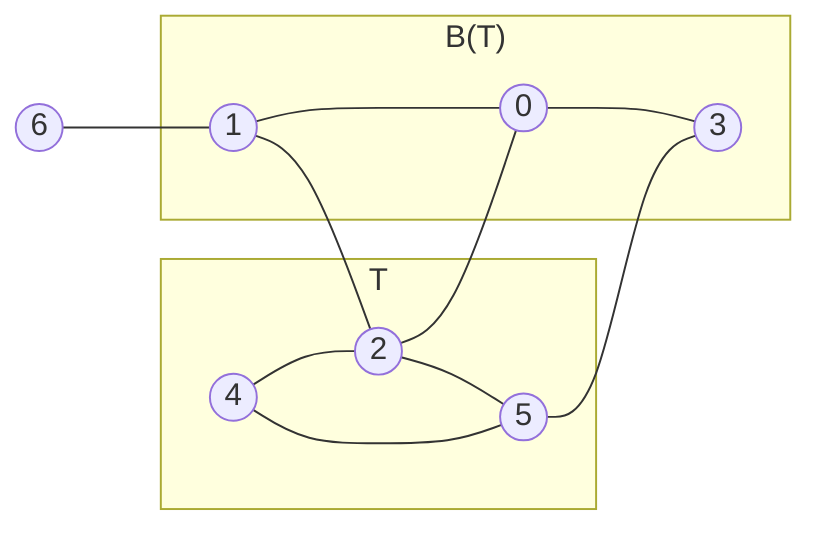

**Algorithme :**
Entrée : $G=(S,A)$ GNO connexe, $s\in S$

**Pseudo-code :**
- $s_0\leftarrow s$
- Pour $i$ de 1 à $|S|-1$
 - $s_i\leftarrow$ un élément de $B\{s_0;\dots;s_{i-1}\}$
- Renvoyer $s_0\dots s_{|S|-1}$

---

### 4.1.3. Proposition
Soit $G=(S,A)$ un GNO connexe.

Les parcours de $G$ sont exactement les suites produites par l'algorithme générique.

**Démonstration :**
$\subseteq$ : Soit $s_0\dots s_{n-1}$ un parcours de $G$

Soit $i\in[\![ 1;n-1]\!]$

$s_i\in B(\{s_0;\dots;n-1\})$ car $s_i\notin\{s_0;\dots;n-1\}$ (sinon le 2. de 4.1.1. est faux) et d'après 4.1.1. 3., $\exists j<i, \{s_i;s_j\}\in A$.

Donc l'algorithme produit $s_0 \ldots s_{n - 1}$ en choisissant $s_i$ à l'itération $i,\ \forall i \in [\![ 1;|S|-1]\!]$

$\supseteq$ Soit $s_0 \ldots s_{n - 1}$ une séquence générique produite par l'algorithme générique.

$\forall i \in [\![ 1;n-1]\!], \exists j < i\ |\ \{s_i, s_j\} \in A$ car $s_i \in B(\{s_0 \ldots s_{n - 1}\})$

Les $(s_i)_{i \in [\![0;n-1]\!]}$ sont 2 à 2 distinctes par définition de la bordure.

Il reste à montrer que $n = |S|$, i.e. que $\forall i \in [\![ 1;n-1]\!],\ B(\{s_0 \ldots s_{i - 1}\}) \neq \varnothing$.

Or, si $B(\{s_0;\dots;n-1\})=\varnothing$ avec $i<|S|$, alors il existe un sommet qui n'est pas connecté à $s_0;\dots;n-1$ donc le graphe n'est pas connexe.

---

### 4.1.4. Définition : sous-graphe induit / couvrant
Soit $G=(S,A)$ un graphe.
- Le sous-graphe induit par $T\subseteq S$ est le graphe $(T,A_T)$ où $A_T=\{a\in A, \text{les deux extrémités de a sont dans T}\}$
- Le sous-graphe induit par $A'\subseteq S$ est le graphe $(S',A')$ où $S'=\{s\in S, \text{s une extrémité d'un élément de A'}\}$
- Un graphe $(S',A')$ de $G$ est dit couvrant ssi $S'=S$.

---

### 4.1.5. Proposition
Soit $G=(S,A)$ un GNO connexe et $s_0\dots s_{n-1}$ un parcours de $G$.

$\forall i\in[\![ 1;n-1]\!]$, on choisit $t_i\in\{s_0;\dots;i-1\}$ tel que $\{s_i;t_i\}\in A$ (possible d'après 4.1.1. 3.).

Alors le sous-graphe induit par $\{\{s_i;t_i\};i\in[\![ 1;n-1]\!]\}$ est un arbre couvrant de $G$.

**Démonstration :**
$\forall k\in[\![ 1;n-1]\!]$ on note $G_k$ le sous-graphe induit par $\{\{s_i;t_i\};i\in[\![ 1;k]\!]\}$.

Il suffit de montrer que $G_{n-1}$ est un arbre à $n$ sommets.

En effet, $n=|S|$ d'après 4.1.1. 2. donc $G_{n-1}$ serait couvrant.

On note par récurrence finie que $\forall k\in[\![ 1;n-1]\!]$, $G_k$ est un arbre à $k+1$ sommets.

**Initialisation :**
$k=1$ : $G_1$ est le sous-graphe induit par $\{\{s_i;t_i\}\}$

$t_i=s_0\not ={s_1}$ donc $G$ est le graphe :

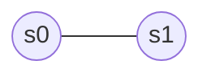

c'est bien un arbre à $2=1+1$ sommets.

**Hérédités :**
Soit $k\in[\![ 1;n-2]\!]$$ tel que $G_k$ est un arbre à $k+1$ sommets.

Montrons que $k_{k+1}$ est un arbre à $k+2$ sommets.

$G_{k+1}$ est construit à partir de $G_k$ en ajoutant l'arête $\{s_{k+1};t_{k+1}\}$.

$t_{k+1}$ est un sommet de $G_k$ et pas $s_{k+1}$

donc $G_{k+1}$ a exactement 1 sommet et une arête de plus que $G_k$.

Or, $G_k$ est connexe avec $k+1$ sommets et $k$ arêtes (cf. 2.2.14.)

donc $g_{k+1}$ est connexe avec $k+2$ sommets et $k+1$ arêtes (le seul sommet ajouté au graphe connexe $G_k$ est relié à un sommet de $G_k$ dans $G_{k+1}$)

donc $G_{k+1}$ est un arbre (cf. 2.2.14.) à $k+2$ sommets.

---

### 4.1.6. Exemple
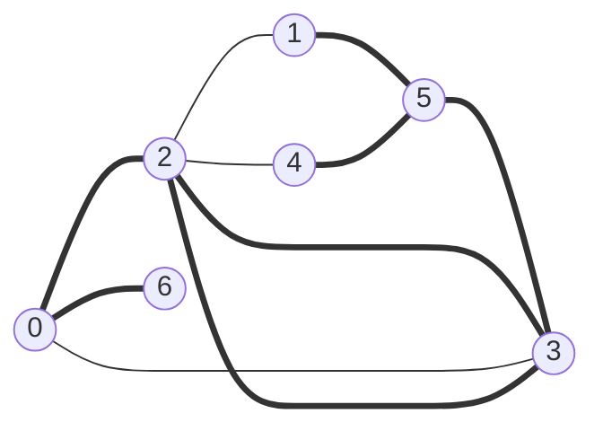

- Parcours : 0,2,3,5,6,1,4
- Antécédents : -,2,3,0,5,5
- **arbre couvrant**

---

### 4.1.7. Remarque
- Un problème classique est le calcul d'un arbre couvrant de poids minimal dans un graphe pondéré (où le poids d'un arbre est les sommets des poids de ses arêtes) (cf. MPI)
- En pratique, on implémente souvent les parcours en déterminant un voisin non visité d'un sommet "couvrant"
 Le sommet couvrant est donc naturellement choisi comme antécédent de ce voisin, ce qui produit un `arbre particulier` associé au parcours.

---

### 4.1.8. Proposition (réciproque de 2.2.6.)
Soit $G=(S,A)$ un GNO.

Si $G$ ne contient aucun cycle de longueur impaire, alors $G$ est biparti.

**Démonstration :**
On suppose sans perte de généralité que $G$ est connexe (sinon on travaille séparément sur ses composantes connexes).

Alors $G$ possède un arbre couvrant $T$, dont on distingue un sommet $M$.

Comme $T$ est un arbre, il existe un unique chemin simple dans $T$ entre toute paire de sommets.

**Exercice :**
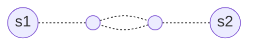

On peut alors partitionner $S$ en $(U,V)$ où :
- $U$ est l'ensemble des sommets $s$ tel que la longueur du chemin de $r$ à $s$ dans $T$ est paire ;
- $V$ est l'ensemble des sommets $s$ tel que la longueur du chemin de $r$ à $s$ dans $T$ est impaire.

$U\cup V=\varnothing$ et comme $T$ est couvrant, $U\cap V=S$.

Il reste à montrer que toute arête a une extrémité dans $U$ et l'autre dans $V$.

Supposons qu'il existe une arête $\{s;s'\}\in A$ avec $s\in U$ et $s'\in U$ (le cas de $V$ est similaire).

Il existe un unique chemin simple de $s$ à $s'$ dans $T$.
- S'il passe par $M$ :
 ```mermaid
 flowchart LR
   subgraph longueur paire
    id1((s)) -.-|longueur paire| id2((r)) -.-|logueur paire| id3((s'))
   end
 ```
 $\rightarrow$ l'ajout de $\{s;s'\}$ à ce chemin donne un cycle de longueur impaire

- Sinon : on procède de même avec le premier sommet $r'$ commun aux chemins de $s$ à $r$ et de $s'$ à $r$.
  La somme des longueur des chemins de $s$ à $r'$ et de $s'$ à $r'$ est bien paire car elles sont de même parité (par disjonction de cas selon que $r'\in U$ ou $r'\in V$)

 $\rightarrow$ ajouter l'arête $\{s;s'\}$ donne un cycle de longueur impaire $\rightarrow$ absurde.

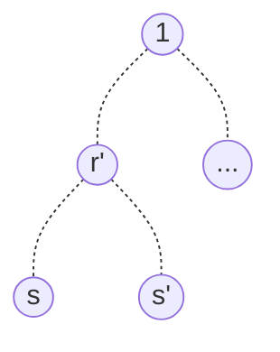
($s$ et $s'$ sont dans U)

---

### 4.1.5. Généralisation aux graphes non connexes
**Définition : `parcours d'un GNO` :**

Soit $G=(S,A)$ un GNO.

Un parcours de $G$, à partir de $s\in S$, est une suite finie $s_0\dots s_{n-1}\in S$ tel que :
1. $s_0=s$
2. $|S|=n$ et $\{s_i;i\in[\![ 0;n-1]\!]\}=S$
3. $\forall i\in[\![ 1;n-1]\!]$, **si** $\bold{B(s_0\dots s_{i-1})\not ={\varnothing}}$ alors $s_i\in B(s_0\dots s_{i-1})$.

**Conséquences :**
- Un parcours est la concaténation de parcours des composantes connexes ;
- On peut tirer d'un tel parcours une forêt couvrante du graphe.

---

### 4.1.10. Généralisation aux GO
On adopte simplement la notion de bordure : si $G=(S,A)$ est un GNO et $R\subseteq S$ :
$$B(T)=\{s\in S\setminus T, \exists t\in T, (t,s)\in A\}$$

On peut également sélectionner un antécédent pour chaque sommet du parcours.

Si touts les sommets sont accessibles à partir du sommet de départ (à fortiori si $G$ est fortement connexe), alors on obtient une arborescence couvrante de $G$.

**Définition : arborescence :**

Soit $G=(S,A)$ un GO.

$G$ est une `arborescence` s'il peut être obtenu à partir d'un arbre $(S,A')$ en distinguant un sommet $r\in S$ et en orientant chaque $\{s:s'\}\in A$ en $(s,s')$ si l'unique chemin simple de $r$ à $s'$ passe par $s$, en $(s',s)$ sinon.

On parle également d'arbre enraciné.

On parle également de forêt pour un ensemble d'arborescence disjointes et un parcours d'un GO permet de définir une forêt couvrante en sélectionnant des arcs comme dans le cas non orienté.

On dit que ce sont des arcs de liaisons pour les distinguer des autres catégories d'arcs.

---

### 4.1.11. Catégoriation des arcs
Soit $G=(S,A)$ un GO, $s_0\dots s_{n-1}$ un parcours de $G$.

On note $I=\{[\![ 1;n_1]\!],B(\{s_0\dots s_{i-1}\})\not ={\varnothing}\}$

$\forall i\in I$, on choisit $t_i\in\{s_0\dots s_{i-1}\}$ tel que $(t_i,s_i)\in A$ (on choisit les arcs de liaison).

Soit $(u,v)\in A$
- $(u,v)$ est un arc de liaison s'il existe $i\in I$ tel que $\left\{\begin{array}{ll}
  u=t_i
  \\
  v=s_i
  \end{array}\right.$
- $(u,v)$ est un arc arrière si $v$ est un ancêtre de $u$ dans une arborescence de la forêt définie par les arcs de liaison, i.e. $\exists i<j, \left\{\begin{array}{ll}
  s_i=u
  \\
  s_j=u
  \end{array}\right., \exists k_1<k_2<\dots<k_l$ où $l\ge 2$ tel que $\left\{\begin{array}{lll}
  k_1=i
  \\
  k_l=j
  \\
  \forall r\in[\![ 2;l]\!],s_{k_{r-1}}=t_{k_r}
  \end{array}\right.$
- $(u,v)$ est un arc avant si $v$ est un descendant non direct de $u$ dans une arborescence de la forêt définie par les arcs de liaisons, i.e. $\exists i<j, \left\{\begin{array}{ll}
  v=s_j
  \\
  u=s_i
  \end{array}\right.\exists k_1<k_2<\dots<k_l$ où $l>2$ tel que $\left\{\begin{array}{lll}
  k_1=i
  \\
  k_l=j
  \\
  \forall r\in[\![ 2;l]\!],s_{k_{r-1}}=t_{k_r}
  \end{array}\right.$
- $(u,v)$ est un arc transverse s'il n'entre pas dans les catégories précédentes.

  **Exemple :**
  ```mermaid
  flowchart LR
    ida(( )) -->|arcs de laison| idb(( ))
    idc(( )) ==>|arcs arrières| idd(( ))
    ide(( )) -.->|arcs transerverses|idf(( ))
    id0((0)) --> id1((1)) --> id2((2)) --> id3((3))
    id4((4)) --> id5((5)) --> id6((6)) --> id7((7))
    id7 --> id8((8))
    id8 --> id10((10))
    id1 -->|arc avant|id3
    id4 ==> id0
    id5 ==> id2
    id7 ==> id2
    id8 ==> id7
    id10 ==> id7
    id7 -.-> id5
    id7 -.- id6
  ```

## 4.2. Parcours en profondeur
### 4.2.1. Retour sur l'algorithme générique
Cet algorithme nécessite de déterminer la bordure d'un ensemble de sommets construits `incrémentalement`. Cela implique que l'on peut déterminer cette bordure sans la recalculer de zéro : il suffit d'y ajouter les voisins non encore visités du dernier sommet extrait, à chaque itération.

**Algo :**
Entrée : $G=(S,A)$ un graphe et $s\in S$

Pseudo-code :
- $B\leftarrow\{s\}$
- $i\leftarrow 0$
- $V\leftarrow\{s\}$
- Tant que $B\not ={\varnothing}$
- $s_i\leftarrow$ un élément que l'on extrait de $B$
- $i\leftarrow i+1$
- Pour chaque voisin $v$ de $s_i$ :
  - Si $v\notin V$ :
    - $V\leftarrow V\cup\{v\}$
    - $B\leftarrow B\cup\{v\}$
- Renvoyer $s_0\dots s_{i-1}$

<p align="center">
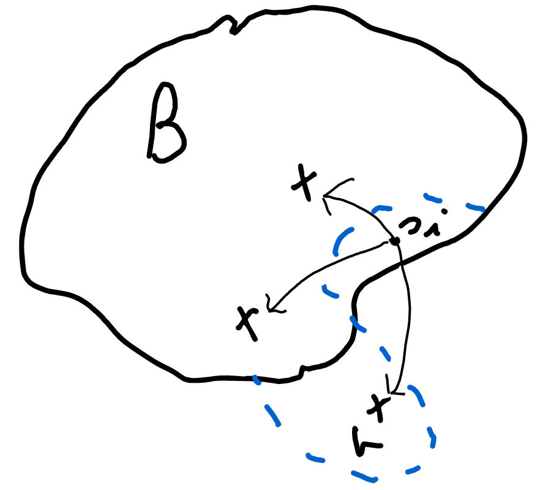
</p>

---

### 4.2.2. Remarque
Cet algorithme facilite la construction d'un arborescence pour le parcours obtenu : par exemple, le père de chaque sommet $v$ est le sommet $s_i$ qui a provoqué l'insertion de $v$ dans $B$.

L'ordre d'extraction des sommets est donc déterminant pour la structure du parcours $\rightarrow$ le choix des structures de données est important.

---

### 4.2.3. Parcours en profondeur
On obtient en parcours en profondeur si l'on extrait toujours le dernier sommet insérée : $B$ se comporte comme une pile. L'ensemble $V$ peut être représenté par un tableau de booléens (sa fonction indicatrice). On utilise pour $G$ les listes d'adjacence car la seule opération sur $G$ est le parcours de l'ensemble des voisins d'u sommet.

**Implémentation :**
En ajoutant une fonction de traitement des sommets :
```ocaml
let dfs (traitement : int -> unit) (g : graphe) (s : int) : unit =
  let b = Stack.create () in
  let v = Array.make (Array.length g) false in
  Stack.push s b;
  v.(s) <- true;
  while not (Stack.is_empty b) do
    let s = Stack.pop b in
    traitement s;
    List.iter (fun s' -> if not v.(s') then begin v.(s') <- true; Stack.push s' b end) g.(s)
  done
```
**Complexité :**
- Spaciale : $\mathcal{O}(|S|)$ ($v$ de taille $|S|$ et $b$ de taille au plus $|S|$ car chaque sommet accessible depuis $s$ y est inséré exactement une fois) ;
- Temporelle : $s_i$ traitement est de complexité $\mathcal{O}(1),\mathcal{O}(|S|+|A|)$ ($\mathcal{O}(|S|)$ pour créer $v+\sum_{s' accessible depuis s} d_{(+)}(s')$).

---

### 4.2.4. Exemple :
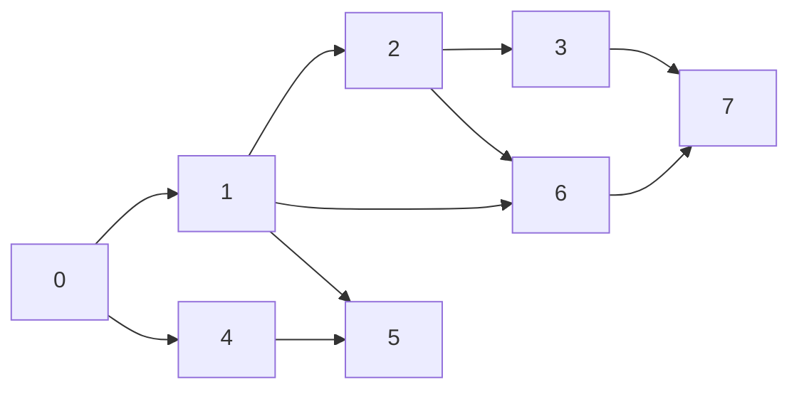
Parcours en profondeur : 0, 1, 2, 3, 7, 5, 6, 4

---

### 4.2.5. Remarque
On verra dans le TP 30 (du cours) une implémentation récursive du parcours où l'on manipule pas explicitement $B$ car c'est la pile des appels récursifs.

---

### 4.2.6. Application : test d'accessibilité
```ocaml
let est_accessible_depuis (g:graphe) (s:int) (s':int):bool=
  let res = ref false in
  dfs (fun v -> res := !res || v = s') g s;
  !res
```
Autre version, qui est plus efficace dans le meilleur cas :
```ocaml
exception Trouve
let est_accessible_depuis (g:graphe) (s:int) (s':int):bool=
  try 
    dfs (fun v -> if v = s' then raise Trouve) g s;
    false
  with
    |Trouve -> true
```

---

### 4.2.7. Application : test de connexité
```ocaml
let est_connexe (g:graphe):bool =
  let n = ref 0 in (*n est le nombre de sommets rencontrés*)
  dfs (fun _ -> incr n) g 0;
  !n = Array.lenght g
```

---

### 4.2.8. Application : calcul des composantes connexes
**Idée :**
On attribue un numéro à chaque composante et en marge de ce numéro les sommets de la composante lors d'un parcours. On lance des parcours tant qu'il reste des sommets non numérotés.

```ocaml
let composantes_connexes (g:graphe) : int array =
  let n = Array.length g in
  let composante = Array.make n (-1) in
  let c = ref 0 in
  for i = 0 to n-1 do
    of composante.(i) = -1 then begin
      dfs (fun v -> composante.(v) <- !c) g i;
      incr c
    end
  done;
  composante
```

**Complexité :**
$\mathcal{O}(|S|^2)$ dans le pire cas (à cause de la création de $v$ dans chaque appel à dfs)

**Exercice :**
On peut obtenir une complexité $\mathcal{O}(|S|+|A|)$ en ne créant pas un tableau à chaque nouveau parcours (remarque : not v.(s) $\leftrightarrow$ composante.(s)=1)

## 4.3. Parcours en largeur 
### 4.3.1. Idée
On obtient un parcours en largeur en visitant tous les voisins d'un sommet avant de poursuivre plus en profondeur $\rightarrow$ il faut extraire de $B$ les sommets par ordre d'insertion donc $B$ se comporte comme une file.

**Implémentation :**
Comme bfs avec Quine à la place de Stack

**Remarque :**
- même complexité ($\mathcal{O}(|S|+|A|)$)
- on parcours les sommets par ordre de distance au sommet de départ

---

### 4.3.2. Exemple

> À compléter

**Parcours en profondeur :** 0, 1, 4, 2, 5, 6, 3, 7

Les sommets sont parcourus par ordre de distance au premier sommet.

---

### 4.3.3. Application
Calcul de plus courts chemins dans un graphe non pondéré.

**Idée :**
Comme les sommets sont parcourus par ordre de distance au sommet de départ une arborescence bien choisie d'un parcours en largeur donne des plus courts chemins du sommet de départ vers les sommets accessibles depuis ce sommet.

```mermaid
flowchart LR
	id1((x)):::red
	id1 --- id2((x)) --- id3((x)) --- id4((x)) --- id6((x)) --- id7((x)) -.- id8(( ))
	classDef red stroke:#FF0000
```

On représente l'arborescence à l'aide d'un tableau de prédécesseurs : le prédécesseurs d'un sommet donné est le père de ce sommet dans l'arborescence choisie.

```ocaml
let plus_courts_chemin (g : graphe) (s : int) : int array =
	let pred = Array make (Array.length g) (-1) in
	pred.(s) <- s;
	bfs (fun s -> List.iter (fun s' -> if pred.(s') = -1 then pred.(s') <- s) g.(s))
		g s;
	pred
```

**Complexité :** 
$\mathcal O(|S|+|A|)$ (au lieu de faire un parcours des voisins de chaque sommet, on en fait 2).

---

### 4.3.4. Proposition : correction de plus_courts_chemin
On suppose sans perte de généralité que $G$ est connexe.

$\forall s'\in S$, on note :
- $d_{s'}$ la distance de $s$ à $s'$ (i.e. la longueur d'un plus court chemin de $s$ à $s'$)
- $l_{s'}$ la longueur du chemin de $s$ à $s'$ obtenu à l'aide du tableau pred
- $n_{s'}$ le rang d'insertion de $s'$ dans la file (convention : $n_s=0$)

Alors $\forall s'\in S$ :
1. $d_{s'}=l_{s'}$
2. $\forall s''\in S,$ si $d_{s''}<d_{s'}$ alors $n_{s''}<n_{s'}$

**Démonstration :**
Par récurrence forte sur le rang d'insertion :
- $n_{s'}=0$ : alors $s'=s$, $l_s=d_s$ et 2. est trivial (il n'existe pas de sommet $s''$ avec $d_{s''}<0$)

**Hérédité :**
On suppose la propriété vraie jusqu'au rang $n$ et on note $s'$ le sommet de rang $n_{s'}=n+1$
1. On sait que $d_{s'}\le l_{s'}$ par définition. Supposons $d_{s'}<l_{s'}$.

	On considère un plus court chemin de $s$ à $s'$, noté $s\rightsquigarrow s''\rightarrow s'$, et on note $p=pred.(s')$.
	On sait que :
	- $d_{s'}=1+d_{s''_{(**)}}$ (sinon le chemin choisi ne serait pas un plus court chemin)
	- $l_{s'}=1+lp_{(***)}$
	- $n_p<n_{s'}$ ($s'$ est inséré lorsque $p$ est extrait)

	Par hypothère de récurrence, on sait alors que $d_p=l_p$, d'où $d_{s''}<d_p$ (avec $(*),(**)$ et $(***)$) donc par hypothère de récurrence, $n_{s''}<n_p$ donc lorsque $s''$ est extrait, $s'$ n'a pas encore de prédécesseur et $s''$ devrait être le prédécesseur de $s'\rightarrow$ absurde donc $d_{s'}=l_{s'}$
	
2. Supposons qu'il existe $s''\in S$ tel que $d_{s''}<d_{s'}$ et $n_{s''}<n_{s'}$ (cas d'égalité impossible)

	$$(\neg(\forall x, A(x)\rightarrow B(x))\equiv\exists x, A(x)\wedge\neg B(x))$$

	On considère un plus court chemin $s\rightsquigarrow q\rightarrow s''$ et on note $p=pred.(s')$

	$m_p<n_{s'}$ donc on dispose de l'hypothère de récurrence pour $p$.

	donc $d_p=l_p\overset{(1)} = l_{s'}-1>d_{s'}-1=d_q$

	donc, par hypothère de récurrence, $n_q<n_p$

	Alors, comme le prédécesseur de $s''$ est définie au plus tard au moment de l'extraction de $q$, $s''$ est inséré dans la file avant tous les successeurs de $p$, dont $s'\rightarrow$ absurde.
	
# 5. Plus courts chemins dans un graphe pondéré

## 5.1. Contexte

### 5.1.1. Intro
Certaines applications nécessitent de travailler dans des graphes pondérés (ex : 1.2.1. et 1.2.4.). Dans ce contexte, le poids d'un arc représente le coût d'un certain choix et on ne cherche plus à minimiser le nomre d'arcs mais pultôt le coût global des choix.

---

### 5.1.2. Définition : poids d'un chemin

Soit $G=(S,A,w)$ un graphe pondéré et $p=s_0\dots s_n$ un chemin dans $G$.

Le `poids` de $p$ est $\mathrm w(p)=\displaystyle\sum^{n-1}_{i=1}\mathrm w(\{s_i;s_{i+1}\})$ (resp. $\mathrm w(\{s_i;s_{i+1}\})$ dans le cas orienté).

---

### 5.1.3. Remarque
Soit $G=(S,A,\mathrm w)$ un graphe pondéré.

S'il existe un cycle $c$ dans $G$ de poids $\mathrm w(c)<0$, on ne peut pas vraiment parler de plus courts chemins dans $G$ : $\forall s\in c$ et $\forall p=s_0\dots s_n$ tel que $\exists i\in [\![0;n]\!]$ vérifiant $s_i=s$, on peut construire un chemin $p'$ de poids $\mathrm w(p')<\mathrm w(p)$, de $s_0$ à $s_n$ en insérant dans $p$, à la position $i$, le cycle $c$ réordonné pour avoir un cycle de $s$ à lui-même en insérant dans $p$, à la position $i$, le cycle $c$ réordonné pour avoir un cycle de $s$ ) lui-même.

$\rightarrow$ on interdira les graphes contenant un cycle de poids $<0$.

```mermaid
flowchart LR
	id0((s_0)) -.- idi((s_i=s)) -.- idn((s_n))
	idi -.-|<0|idi
```

---

### 5.1.4. Définition : plus court chemin / distance
Soit $G=(S,A,\mathrm w)$ un graphe pondéré sens cycle de poids $<0$.

Un chemin $p=s_0\dots s_n$ est un `plus court chemin` de $s_0$ à $s_n$ si $\forall p'$ chemin de $s_0$ à $s_n$, $\mathrm w(p)\le\mathrm w(p')$.

$\forall s,s'\in S$, la distance de $s$ à $s'$ est $\mathrm d(s,s')=\min\{\mathrm w(p), p\text{ chemin de s à s'}$ (ou $+\infty$ s'il n'y a pas de chemin de $s$ à $s'$).

**Démonstration :** (de l'existance du $\min$)
On note $\mathrm d=\min\{s,s'\}$, i.e. $\forall p$ chemin de $s$ à $s'$, $\mathrm w(p)\ge \mathrm d$

Si $p$ est simple, c'est vrai pae définition.

Si $p$ n'est pas simple, alors en notant $p=s_0\dots s_n,\exists 0\le i\le j\le n$ tel que $s_i=s_j$.

Donc on peut couper le circuit de $s_i$ à $s_j$, de poids $\ge 0$, et obtenir $p'=s_0\dots s_is_{j+1}\dots s_n$ tel que $\mathrm w(p')\le |p'|<|p|.$

En procédant par induction bien fondée avec les chemins simles comme cas de base, on montre qu'il existe un chemin simple $p''$ de $s_0$ à $s_n$ tel que $\underbrace{\mathrm w(p'')}_{\ge 1}\le\mathrm w(p)$

---

### 5.1.5. Exercice
Montrons que $\mathrm d$ satisfait l'inégalité triangulaire.

---

### 5.1.6. Problème
On s'intéresse aux problèmes suivants :
1. Déterminer des plus courts chemins entre tous les couples de sommets
2. Déterminer des plus courts chemins d'un sommet donné vers tous les sommets

**Remarque :**
Résoudre l'un de ces problèmes permet de résoudre l'autre, mais il existe des algos spécialisés pour chacun des 2 problèmes.

## 5.2. Algorithme de Floyd-Narshall

### 5.2.1. Principe
On cherche à résoudre le problème 5.1.6. 1. dans un graphe pondéré  $G=(S,A,\mathrm w)$ sans cycle de poids $<0$, en cherchant des chemins simples (possible grâce au point 5.1.4.).

**L'idée de l'`algorithme de Floyd-Narshall` est la suivante :** on procède par programmation dynamique en cherchant $\forall k\in[\![0;|S|]\!],\forall s, s'\in S$, un plus court chemin de $s$ à $s'$ n'utilisant que des sommets intermédiaires d'indice strictement inférieur à $k$ (étant donné une numérotation des sommets).

---

### 5.2.2. Relation de récurrence
- Cas de base ($k=0$) : comme il n'y a pas de sommet d'indice $<0$, il ne peut pas y avoir de sommet intermédiaire, donc les plus courts chemins sont les arcs / arêtes.

En notant $\forall s,s'\in S,\mathrm d^{(k)}(s,s')$ la longueur d'un plus court chemin de $s$ à $s'$ n'utilisant que des sommets intermédiares d'indice $<k$, on sait que $d^{(0)}(s,s')=\mathrm w(\{s;s'\})$ avec la convention $\mathrm w(\{s;s'\})=+\infty$ si $\{s;s'\}\notin A$ (idem avec des couples dans le cas orienté).

- Hérédité : Soit $s,s'\in S$

	Un plus court chemin de $s$ à $s'$ n'utilisant que des sommets intermédiares d'indice $<k+1$ peut ne pas passer par le sommet d'indice $k$ et dasn ce cas réalise $d^{(0)}(s,s')$.

	Si un tel chemin passe par $k$, on peut supposer qu'il y passe uen seule fois jusqu'au cherche des chemins simples.

	Les portions de chemins de $s$ à $k$ et de $k$ à $s'$ sont alors des plus court chemins (sinon le chemin initial ne serait pas un plus court chemin : propriété de sous-structure optimale) n'utilisant que des sommets intermédiaires d'indice $< k$.

	Ainsi, $d^{(k + 1)}(s, s') = \min(d^{(k)}(s, s'), d^{(k)}(s, k) + d^{(k)}(k, s'))$.

**Résolution du problème :**
C'est $d^{(|S|)}$ qui nous intéresse car tous les sommets intermédiaires sont autorisés.

**Exercice :**
Relation de récurrence sur $p^{(k)}(s, s')$, le prédécesseur de $s'$ sur un plus court chemin de $s$ à $s'$ n'utilisant que des sommets intermédiaires d'indice $< k$.

$$\left\{\begin{array}{ll}
 p^{(0)}(s,s')=s
 \\
 p^{(k+1)}(s,s')=\left\{\begin{array}{ll}
 p^{(k)}(s,s')\text{ si } d^{(k+1)}(s,s')=d^{(k)}(s,s')
 \\
 p^{(k)}(s,s')\text{ sinon}
\end{array}\right.
\end{array}\right.$$

---

### 5.2.3. Exemple
```mermaid
flowchart LR
	0 -->|-2|2 -->|2|3 -->|-1|1 -->|4|0
	1 -->|3|2
```

$$\begin{array}{cc}
d^{(0)} :
\begin{pmatrix}
+\infty & +\infty & -2 & +\infty
\\
4 & +\infty & 3 & +\infty
\\
+\infty & +\infty & +\infty & 2
\\
+\infty & -1 & +\infty & +\infty
\end{pmatrix}
&
d^{(1)} :
\begin{pmatrix}
+\infty & +\infty & -2 & +\infty
\\
4 & +\infty & \boxed{2} & +\infty
\\
+\infty & +\infty & +\infty & 2
\\
+\infty & -1 & +\infty & +\infty
\end{pmatrix}
\\
d^{(2)} :
\begin{pmatrix}
+\infty & +\infty & -2 & +\infty
\\
4 & +\infty & 2 & +\infty
\\
+\infty & +\infty & +\infty & 2
\\
\boxed{-3} & -1 & \boxed{1} & +\infty
\end{pmatrix}
&
d^{(3)} :
\begin{pmatrix}
+\infty & +\infty & -2 & \boxed 0
\\
4 & +\infty & 2 & \boxed 4
\\
+\infty & +\infty & +\infty & 2
\\
-3 & -1 & 1 & \boxed 3
\end{pmatrix}
\end{array}$$

$$d^{(4)} :
\begin{pmatrix}
\boxed 3 & \boxed{-1} & -2 & 0
\\
4 & \boxed 3 & 2 & 4
\\
\boxed 5 & \boxed 1 & \boxed 3 & 2
\\
-3 & -1 & 1 & 3
\end{pmatrix}$$

**Remarque :**
Dans la matrice d'adjacence pondéré, on peut choisir de placer des 0 sur la diagonale puisque le plus court chemin d'un sommet à lui-même est le chemin vide.

---

### 5.2.4. Implémentation en C
- **Structures de données :** On choisit une matrice pour $d^{(k)}$, $p^{(k)}$ et aussi pour $G$ (matrice d'adjacence pondérée, car c'est directement $d^{(0)}$). On pourrait utiliser des listes d'adjacences car la complexité de calcul de $d^{(0)}$ à partir de ces listes est donnée par la complexité du reste de l'algorithme.

On supposera que la matrice est linéarisée.
```c
typedef double* graphe;
int* floyd_warsshall (graphe g, int n){
	double* d = (double*) malloc (n*n*sizeof(double));
	double* p = (int*) malloc (n*n*sizeof(int));
	for(int i=0 ; i<n ; i++){
		for(int j=0 ; j<n ; j++){}
			d[i*n+j] = g[i*n+j];
			p[i*n+j] = i;
		}
		for(int j=0 ; j<n ; j++){
			for(int j=0 ; j<n ; j++){
				for(int j=0 ; j<n ; j++){
					if(d[i*n+k]+d[k*n+j]<d[i*n+j]){
						d[i*n+j] = d[i*n+k] + d[k*n+j];
						p[i*n+j] = p[k*n+j];
					}
				}
			}
		}
	}
	free(d);
return p;
}
```
**Complexité :**
- Temporelle : $\mathcal O(|S|³)$
- Spaciale : $\mathcal O(|S|²)$

## 5.3. Algorithme de Dijkstra

### 5.3.1. Principe
On cherche à résoudre le problème 5.1.6. 2. dans un graphe pondéré $G=(S,A,\mathrm w)$ où $\mathrm w\rightarrow\mathbb R⁺$. On étudie donc, étant donné $s\in S$, à calculer $d(s,s')$, $\forall s'\in S$.

L'algorithme de Dijkstra est un algorithme glouton qui se présente comme une variante du parcours en largeur : on parcours les sommets par ordre de distance à $s$ coissante, mais ici la distance est définie par la pondération du graphe. La file du parcours en largeur est remplacée par une file de priorité dont les priorité sont des estimations des distances (puisque ces dernières ne sont pas connues).

<p align="center">
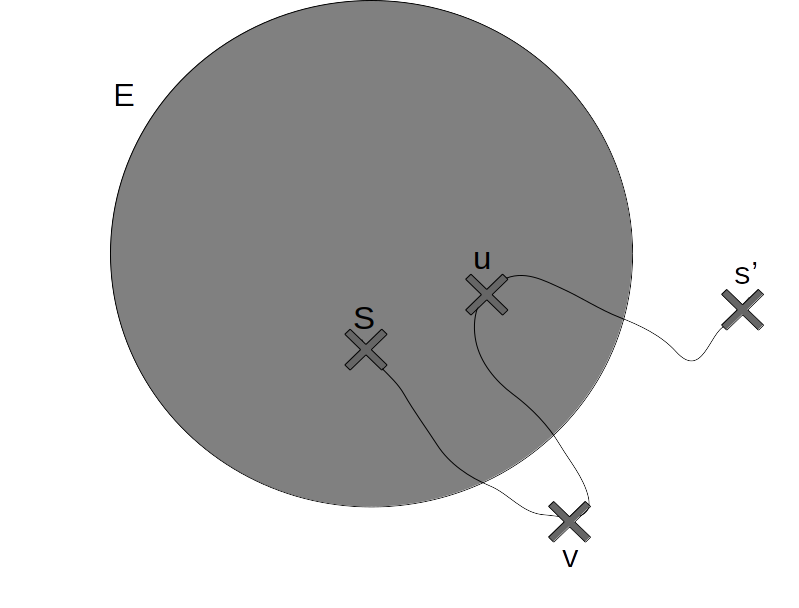
</p>

---

### 5.3.2. Algorithme glouton
$\forall s'\in S$, on note $\mathrm w(s')$ l'estimation de $\mathrm d(s,s')$.

Initialement, $\left\{\begin{array}{ll}
	 \mathrm w(s)=0
	 \\
	 \mathrm w(s')=+\infty, \forall s'\not = s
\end{array}\right.$

0n construit incrémentalement un ensemble $E\subseteq S$ tel que $\forall s'\in E,\mathrm w(s')=\mathrm d(s,s')$.

Initialement, $E=\varnothing$ puis à chaque itération, on insère dans $E$ un sommet $s'\in S\setminus E$ tel que $\mathrm w(s')$ est minimal (choix glouton). Lors de l'insertion de $s'$ dans $E$, on observe les voisins de $s'$ pour essayer d'améliorer l'estimation pour ces sommets : $\forall s''\in S\setminus E$ voisins de $s'$, on remplace $\mathrm w(s'')$ par $\min(\mathrm w(s''),\underbrace{\mathrm d(s,s')}_{=\mathrm w(s')}+\underbrace{\mathrm w(\{s',s''\})}_{\text{resp. }(s',s'')\text{ dans le cas orienté}}$.

En parallèle, on met à jour un tableau de prédécesseurs pour représenter les plus courts chemins.

**Remarque :**
$S\setminus E$ se comporte comme une file de priorité $\min$ où $\mathrm w(s')$ est la priorité de l'élément $s'$. Quitte à compléter $G$ avec des arêtes / arcs du poids $+\infty$, c'est aussi la bordure utilisée dans l'algorithme générique de parcours.

---

### 5.3.3. Exemple
```mermaid
flowchart LR
	1 -->|6|3
	0 -->|5| 1 -->|1|2 -->|6|4 -->|1|3 -->|3|0
	0 -->|3|2
	2 -->|2|1
	3 -->|7|4
	0 ==>|2|2 ==> 4 ==> 3
	0 ==> 1
```
$s=0$

|$s'$|0|1|2|3|4|
|:-:|:-:|:-:|:-:|:-:|:-:|
|$\mathrm w(s')$|0|5|3|10|9|
|$\mathrm p(s')$|0|0|0|4|2|

E : 0, 2, 1, 4, 3

---

### 5.3.4. Correction de l'algorithme de Dijkstra
On démontre l'invariant suivant : $\left\{\begin{array}{ll}
	 \forall s'\in E, \mathrm w(s')=\mathrm d(s,s')
	 \\
	 \forall s''\in S\setminus(E\cup\{s\}), \mathrm w(s'')=\min_{s'\in E}(\mathrm d(s,s')+\mathrm w(\{s',s''\}))
\end{array}\right.$
- Initialement : $E=\varnothing,\forall s''\in S\setminus\{s\},\mathrm w(s'')=+\infty=\min\varnothing$ (par convention) $\rightarrow$ l'invariant est vrai :
	- à la première itération, $s'=s$
	  $\mathrm w(s)=0=\mathrm(s,s)$ (car les poids sont positifs)
	  $\forall s''\not =s,\mathrm w(s'')$ ne charge pas si $s$ et $s''$ ne sont pas adjacents $\rightarrow$ ok pour le calcul du $\min$ et $\mathrm w(s'')$ devient $\mathrm w(\{s,s''\})$ si $s$ et $s''$ sont adjacents $\rightarrow$ encore ok
	- aux itérations suivantes : on suppose que $\left\{\begin{array}{ll}
		 \forall s'\in E, \mathrm w(s')=\mathrm d(s,s')
		 \\
		 \forall s''\in S\setminus(E\cup\{s\}), \mathrm w(s'')=\min_{s'\in E}(\mathrm d(s,s')+\mathrm w(\{s',s''\}))
	\end{array}\right.$

On choisit $s'\in S\setminus E$ tel que $\mathrm w(s')l$ est minimal pour l'insérer dans $E$.

Montrons que $\mathrm w(s')=\mathrm d(s,s')$.

On considère un chemin de poids $\min$ de $s$ à $s'$. Il s'écrit $p = s \rightsquigarrow u \rightarrow v \rightsquigarrow s'$, où $v$ est le premier sommet du chemin tel que $v \notin E$

$$\begin{array}{rcl}
	d(s, s') =
	w(p) &=&
	\underbrace{w(s \rightsquigarrow u)}_{= d(s, u)}
	+ w(\set{u, v})
	+ \underbrace{w(v \rightsquigarrow s')}_{\ge 0}
	\\
	&\ge&
	\displaystyle \min_{u \in E}(d(s, u) + w(\set{u, v}))
	\\
	&=& w(v)\ \text{car $v \notin E$ (et $v \neq s$ car $s \in E$)}
	\\
	&\ge& w(s')\ \text{par définition de $s'$}
\end{array}$$

donc $\mathrm d(s,s')\ge\mathrm w(s')$.

Or $\mathrm w(s')$ est le poids d'un chemin de $s$ à $s'$ : $\mathrm w(s')=\min_{u\in E}(\mathrm d(s,u)+\mathrm w(\{u;s'\}))$ donc en choississant $u\in E$ qui réalise ce minimum et en concaténant un plus court chemin de $s$ à $u$ et l'arête $\{u,s'\}$, on obtient un chemi de $s$ à $s'$ de poids $\mathrm w(s')$

donc $\mathrm w(s')\ge\mathrm d(s,s')$ d'où $\mathrm d(s,s')=\mathrm w(s')$

$\forall s''\in S\setminus(E\cup\{s,s'\})$, si $s'$ et $s''$ ne sont pas adjacents, alors $\mathrm w(s'')$ est inchangé $\rightarrow$ ok pour le calcul du $\min$

si $s'$ et $s''$ sont adjacent, $\mathrm w(s'')$ devient :
$$\begin{array}{rcl}
	&&\displaystyle \min(w(s''), d(s, s') + w(\set{s', s""}))
	\\
	&=& \displaystyle \min({\min_{u \in E}(d(s, u) + w(\set{u, s''})), d(s, s') + w(\set{s', s''})})
	\\
	&=& \displaystyle \min_{u \in E \cup \set{s'}} (d(s, u + w(\set{u, s''})))
\end{array}$$

- **Correction :** à la fin de l'algorithme, $E=S$ donc l'invariant donne $\forall s'\in S,\mathrm w(s')=\mathrm d(s,s')$ donc si les mises à jour de prédécesseurs sont cohérentes avec le calcul des $\mathrm w(s')$, alors on obtient des plus courts chemins de $s$ vers tous les sommets.

---

### 5.3.5. Implémentation
- **Structures de données :** On utilise une file de priorité $\min$ pour $S\setminus E$ qui doit permettre la mise à jour des priorités. On utilise des tableaux pour $\mathrm w$ et les prédécesseurs. On représente $G$ par des listes d'adjacence pondérés car à chaque itération on a besoin de parcours les voisins d'un sommet donné.

```c
struct arc {
double poids;
int cible;
};

struct elem {
struct arc val;
struct elem* next;
};

typedef struct elem* liste;
typedef liste* graphe;
```

On suppose implémenté un type `fp` (file de priorité) proposant les primitives suivantes :
- **fp create(double* w, int n) :** Crée une file contenant $\{0;n-1\}$ avec les priorités w[i] ;
- **bool is\_empty(fp f) :** Test de vacuité ;
- **int take\_min(fp, f) :** Extraction de l'élément de priorité $\min$ ;
- **void update(fp f, int i, double w) :** Définit $w$ comme la nouvelle priorité de $i\in f$.

```c
int* dijkstra(graphe g, int n, int s){
	double* w = (double*)malloc(n*siezof(double));
	for(int i=0 ; i<n ; i++){
		if(i==s)
			w[i] = 0;
		else
			w[i] = INFINITY;
	}
	fp f = create(w, n);
	int* p = (int*)malloc(n*sizeof(int));
	for(int i=0 ; i<n ; i++)
		p[i] = -1;
	while(!is_empty(f)){
		int u = take_min(f);
		liste l = g[u];
		while(l!=NULL){
			struct arc a = l->val;
			if(w[u]+a.poids<w[a.cible]){
				w[a.cible] = w[u]+a.poids;
				p.[a.cible] = u;
				updaye(f, a.cible, w[a.cible]);
			}
			l = l->next;
		}
	}
	// libéaration de la mémoire occupée par f si nécessaire, via un destructeur (non prévu)
	free(w);
	return p; 
}
```
**Complexité :**
- Spaciale : $\mathrm O(|S|)$
- Temporelle : cela dépend de l'implémentation du type fp.
	- Implémentation naïve : tableau $w$ des priorités + tableau de booléens + nombre d'éléments (test de vacuité en temps constant) :
		- Initialisation : $\mathrm O(|S|)$
		- Test de vacuité  : $\mathrm O(1)$ (répété $|S|+1$ fois)$
		- Extraction du min : $\mathrm O(|S|)$ (répété $|S|$ fois)
		- Mise à jeu de priorité : $\mathrm O(1)$ (répété $d_{(+)}(u)$ fois, $\forall u\in S$)
		- Au total : $\mathrm O(|S|)+\mathrm O(1)+\mathrm O(|S|²)+\underbrace{\mathrm O(\displaystyle\sum_{u\in S}d_{(+)}}_{=\mathrm O(|A|)=\mathrm O(|S|²)})=\mathrm O(|S|²)$
	- Implémentation à l'aide d'un tas :
		- Initialisation : $\mathrm O(|S|)$ (via une contruction par forêt)
		- Test de vacuité : $\mathrm O(1)$ répété $|S|+1 fois$
		- Extraction du min : $\mathrm O(\log|S|)$ (répété $|S|$ fois)
		- Mise à jeu de priorité : $\mathrm O(\log|S|)$ (percolation) (répété $d_{(+)}(u)$ fois, $\forall u\in S$)
 
 
**H.P. :** 
Avec une implémentation à l'aide de tas de Fibonacci, o obtient $\mathrm O(|S|\log|S|+|A|)$.