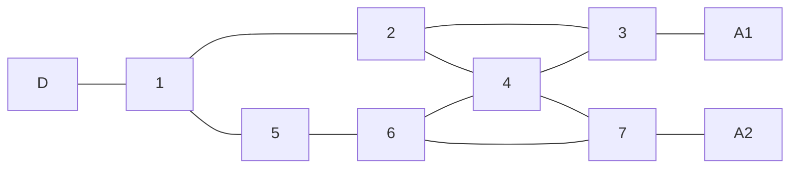
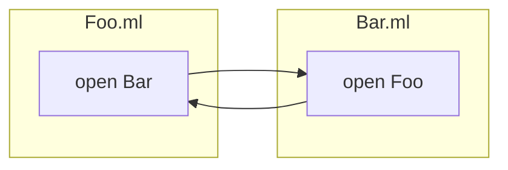
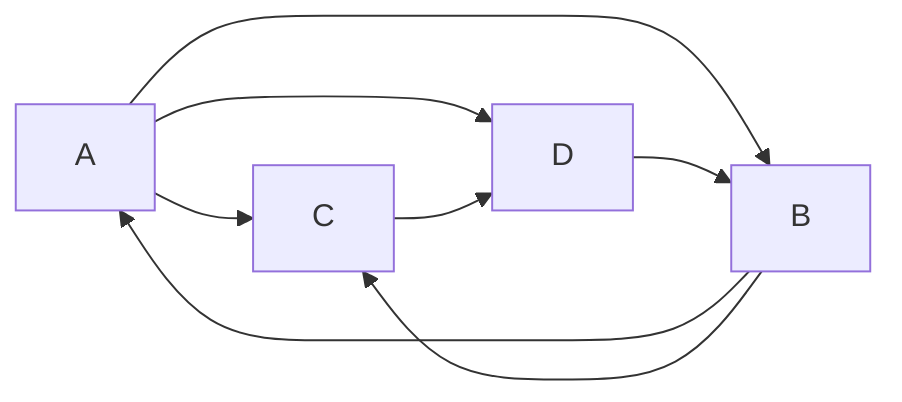
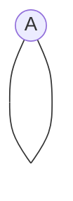
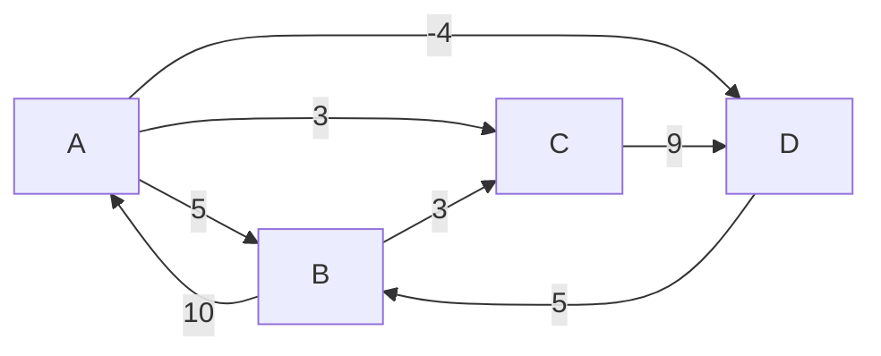

**Chapitre 10 : Théorie des graphes**
===
# 1. Introduction
## 1.1. Les origines
### 1.1.1. Le problème fondateur : les 7 points de Königsberg
**Énoncé :**
Peut-on effectuer une promenade à Königsberg passant exactement une fois par chacun des ponts .

**Variante :**
Peut-on le faire en revenant à son point de départ ?

> Insert Graphe 1

---

### 1.1.2. Une solution formelle
Présentée par Euler en 1735, avec 3 étapes :
1. Nommage des zones et représentation abstraite ;
2. Formalisation de la notion de chemin ;
3. Démonstration d'impossibilité : il n'existe pas de chemin / circuit eulérien dans ce graphe.

---

### 1.1.3. Remarque
Les points 1. et 2. sont les étapes fondatrices de la théorie des graphes vue comme une théorie mathématique.

Cette théorie a pris une grande ampleur car elle permet de modéliser de nombreux problèmes.

---

## 1.2. De nombreuses applications

---
### 1.2.1. Compilation
- Modélisation : on représente le graphe de dépendance entre fichiers

- Problème : faisabilité : c'est un problème de détecton de cycle.
  - ordre de compilation : choisir un ordre, c'est effectuer un tri topologique du graphe

---

### 1.2.2. Transport
- Modélisation : on représente un réseau de transports en commmun en représentant les stations liées par les lignes qui y passent ;
- Problème : recherche de chemin le plus court en terme de distance / temps (nécessité d'annotation) / nombre de station.

---

### 1.2.3. Ordonnancement de tâches
- Problème : représention d'un ensemble de tâches sur un nombre minimal d'unité de calcul ;
- Modélisation : on utilise un graphe d'incompatibilité : on lie les tâches incompatibles entre elles. On veut attribuer une couleur (une unité de calcul) à chaque sommet de sorte qu'aucun sommet ne soit de la même couleur que l'un de ces voisins. Le nombre minimal de couleurs est le nombre chromatique du graphe.

---

### 1.2.4. Construction d'un réseau électrique
- Problème : on veut raccorder un certain nombre de villes en utilisant le moins de cable possible ;
- Modélisation : on utilise un graphe qui représente les villes liées par des axes annotés par leur longueur. On veut sélectionner des axes pour lier toutes les villes entre elles en utilisant le moins de longueur possible. C'est la recherche d'un arbre couvrant, de poids minimal.

---

# 2. Bases des graphes
## 2.1. Vocabulaire
### 2.1.1. Définition : graphe
Un graphe est un couple $G=(S,A)$ où :
- $S$ est un ensemble fini de sommets ou de noeuds ;
- $A$ est un ensemble d'associations entre 2 sommets, qui peut prendre plusieurs formes :
  - Si $A$ est un ensemble de paires de sommets, on dit que $G$ est non orienté
  
    Si $a=\{s,s'\}\in A$, on dit que $a$ est une arrête d'extrémité $s$ et $s'$, que $a$ est incidente à $s$ et $s'$ et que $s$ et $s'$ sont adjacents ou voisins
  - Si $A$ est un ensemble de couples de sommets, on dit que $G$ est orienté
  
    Si $a=\{s,s'\}\in A$, on dit que $a$ est un arc, que s'est un successeur de $s$, que $a$ est un arc sortant pour $s$ et entrant pour $s'$.

---

### 2.1.2. Représentation graphique
On place un points pour chaque sommet et on relie les extrémités d'une même arête (avec une flèche dans le cas orienté)

**Exemple :**
$G=(\{A;B;C;D\};\{\{A;B\};\{B;C\};\{C;A\}\})$ est un graphe non orienté (`GNO`)

> Check 2.

est la représentation du graphe orienté (`GO`) :
$$G=(\{A;B;C;D\};\{(A;B);(B;A);(B;C);(D;B);(A;D);(A;C);(C;D)\})$$

---

### 2.1.3. Boucles
**Définition :**
Une boucle dans un graphe est une arête / arc dont les extrémités sont égales

**Remarque :**
> A compléter

On pourrait aussi utiliser les multi-ensembles pour autoriser les multi-arêtes / plusieurs arêtes entre 2 sommets données, comme en 1.1.1.) mais c'est `H.P.` : $A$ sera toujours un ensemble.

---

### 2.1.4. Degré
- **Définition (degré) :** Soit $G=(S,A)$ un GNO et $s\in S$.

  Le degré de $s$, noté $d(s)$ est le nombre de voisins de $s$.
  $$d(s)=|\{a\in A,s\in a\}|$$

- **Définition (degré entrant / sortant) :** Soit $G=(S,A)$ un GO et $s\in S$.

  Le degré entrant (resp. sortant) de $s$, noté $d_-(s)$ (resp. $d_+(s)$), est le nombre d'arcs entrants (resp. sortants) pour $s$.
  $$d_-(s)=|\{a\in A,\exists s'\in S,a=(s',s)\}|$$
  $$d_+(s)=|\{a\in A,\exists s'\in S,a=(s,s')\}|$$

- **Propriété (formules de la somme des degrés) :** Soit $G=(S,A)$ un graphe :

  1. Si $G$ est un GNO, $\displaystyle\sum_{s\in S}d(s)=2|A|$ si $G$ est sans boucle ;
  2. Si $G$ est un GO $\displaystyle\sum_{s\in S}d_-(s)=\sum_{s\in S}d_+(s)=|A|$.

  **Démonstration :**
  1. On compte les extrémités d'arêtes
   
     - on arête compte pour 2 extrémités car ce n'est pas une boucle donc il y en a $2|A|$
     - $\forall s\in S$, $s$ est extrémité de $d(s)$ arêtes donc il y en a $\displaystyle\sum_{s\in S}d(s)$.
  
  2. Par récurrence sur |A| : 
   
     - si $|A|=0,\forall s\in S, d_+(s)=d_-(s)=0\rightarrow$ Ok
     - Hérédité : si $|A|>0$, alors $\exists(s,s')\in A$

     On note $G'=(S,A\setminus\{s,s'\})$.

     Par hypothèse de récurrence : 
     $$|A|-1=|A\setminus\{s,s'\}|=\displaystyle\sum_{v\in S\setminus\{s'\}}d_-(v)+\underbrace{d_-(s)-1}_{\text{degré sortant de }s\text{ dans }G'}$$
     donc $|A|=\displaystyle\sum_{v\in S}d_-(v)$ de même pour les degrés entrants, en considérant $s'$ plutôt que $s$.

- **Corollare (hondshaking lemma) :** Tout GNO sans boucle possède un nombre pair de sommets de degré impair.

> A compléter

  **Démonstration :** $2\mathbb{N}\ni 2|A|=\displaystyle\sum_{s\in S}d(s)=\displaystyle\sum_{s\in S\text{ tq }d(s)\in2\mathbb{N}}d(s)+\displaystyle\sum_{s\in S}d(s)$

  Contre-exemple en cas de boucle

---

### 2.1.5. Graphes étiquetés
**Définition (graphe étiqueté / pondéré) :**
Soit $G=(S,A)$ un graphe.

On dit que $G$ est :
- étiqueté s'il est muni d'une fonction $f:A\rightarrow V$ où $V$ est un ensemble de valeurs appelées les étiquettes ;
- pondéré s'il est étiqueté par des nombres (entiers / réels) : on parle de poids plutôt que d'étiquette.

**Exemple :**
1.1.2., 1.2.4.,

En MPI : les automates finis :

---

### 2.1.6. Graphes bipartis

> A rattraper