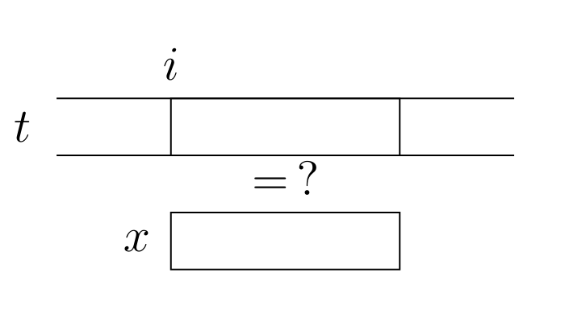
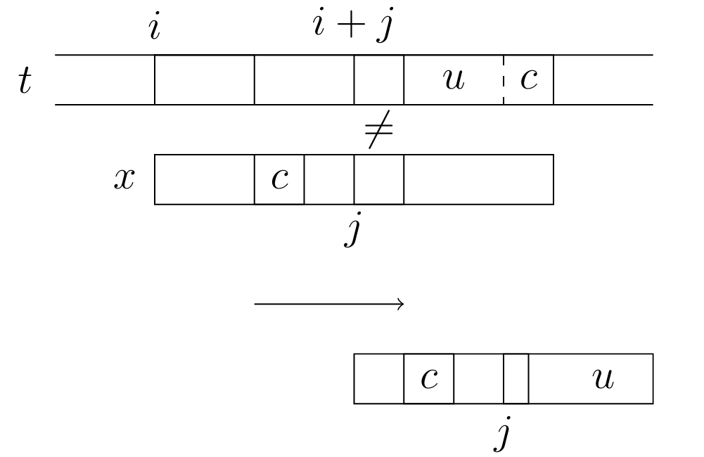
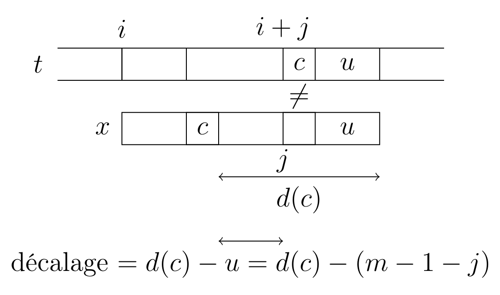
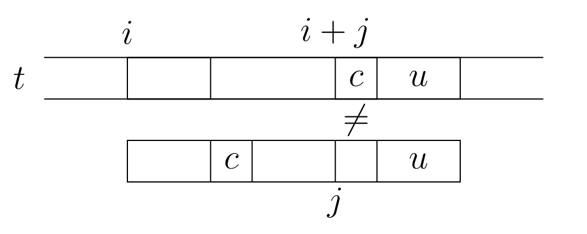
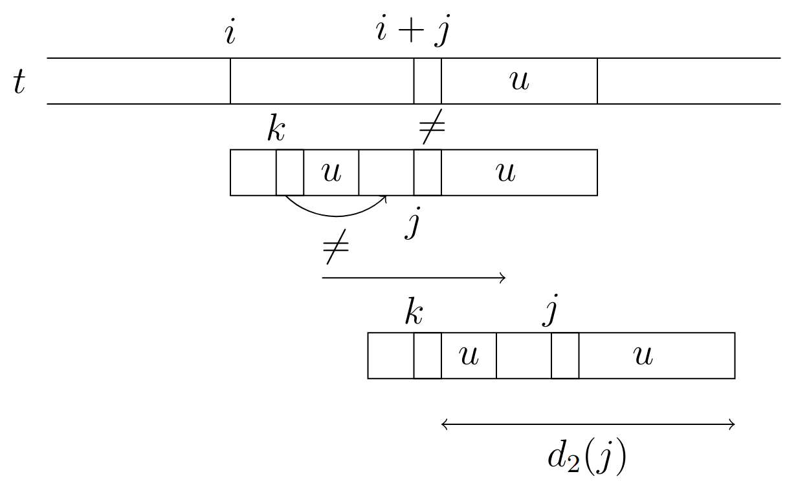
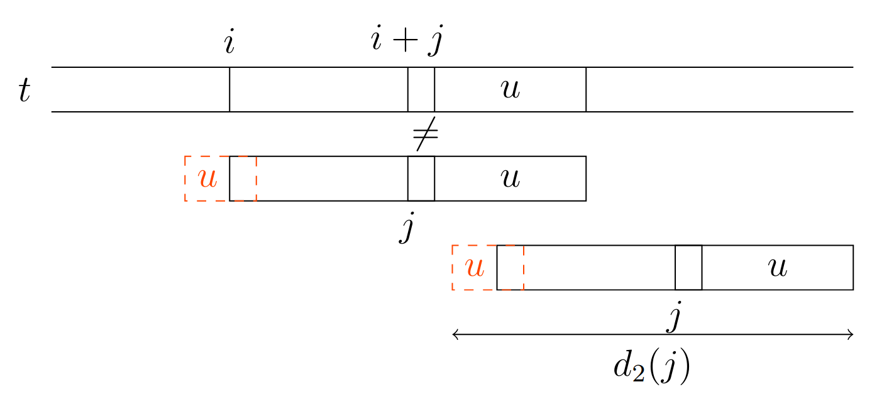
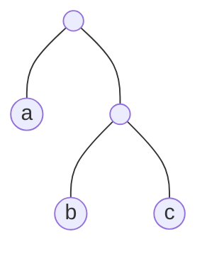
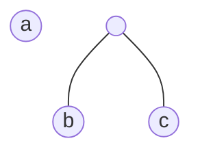

Chapitre 11 : Algorithme du texte
===
# 1. Rechercherche dans un texte
## 1.1. Introduction
### 1.1.1. Problème
Étant donné un texte (un fichier / une chaîne de caractère) $t$ et un motif (une chaîne de caractère) $x$, on veut trouver une / toutes les occurences de $x$ dans $t$ (on veut les positions (indices)).

---

### 1.1.2. Algorithme naïf
On test toutes les positions dans $t$ pour déterminer si ce sont des positions d'occurences de $x$.

```ocaml
let recherche_naive (x:string) (t:string) : int list =
	let l = ref [] in
	let n = String.length t and m = String.length x in
	for i=0 to n-m do
		let j = ref 0 in
		while !j < m and x.[!j] = t.[i+!j] do
			incr j
		done;
		if !j = m then l := i := !l
	done;
	!l
```
**Complexité :**
Dans le pire cas, la boucle while va s'arrêter au dernier indice de x (exemple : $t=a^n=\underbrace{a\dots a}_{n\text{ fois}}$ et $x=a^{n-1}b$)

$\rightarrow\mathcal O ((n-m+1)m) =\mathcal O(nm)$ si $n$ est petit devant $m$.

---

### 1.1.3. Remarque
Cet algorithme fait partie d'une famille d'algorithmes, dits de `fenêre glissante` : on fait glisser une fenêtre sur le texte en notant toutes les positions auxquelles la fenêtre contient le motif.

<p align="center">

</p>

Le côté naïf de cet algorithme vient du fait que l'on fait systématiquement glisser la fenêtre d'un rang, quel que soit son contenu. En analysant les raisons de l'échec d'un comparaison, on peut espérer décaler la fenêtre de plusieurs rangs.

## 1.2. Algorithme de Boyer-Moore
### 1.2.1. Introduction
L'algorithme de Boyer-Moore est une algorithme de fenêtre glissante, mais la comparaison entre le contenu de la fenêre et le motif se fait de la droite vers la gauche, afin de repérer en cas d'échec la caractère le plus à droite que ne correspond pas au motif. À partir de cette position qui entraîne l'échec de la comparaison, on peut calculer un décalage pour la fenêtre. En pratique, le décalage est précalculé pour toutes les positions du motif et il existe de nombreuses variantes suivant la manière dont le décalage est calculé.

---

### 1.2.2. Algorithme de Boyer-Moore-Horspool
Dans cette variante, si la comparaison de $x_0\dots x_{m-1}$ et $t_i\dots t_{i+m-1}$ (la fenêre) échoue à l'indice $j$, i.e. $x_{j+1}\dots x_{m+1}=t_{i+k+1}\dots t_{i+m+1}$ et $x_j\not =t_{i+j}$, on cherche à aligner $t_{i+m-1}$ avec son occurrence la plus à droite dans $x$ (sauf $x_{m-1}$)

<p align="center">

</p>

**Exemple :**
$x=aababab$ et 

$\begin{array}{ll}t=&aabbbababacaabbaba
\\
&\begin{array}{ll}aaba&bab
\\
&\begin{array}{ll}a&ababa
\\
&\begin{array}{ll}aababa&b
\\
&aababab
\end{array}
\end{array}
\end{array}
\end{array}$

> À compléter

**Algorithme :**
Pour toute lettre $a$, on note $\mathrm d(a)$ le décalage à effectuer pour alogner cette lettre avec son occurrence la plus à droite dans $x$ (sauf la dernière lettre) en cas d'échec d'une comparaison avec une fenêtre dont la dernière lettre est $a$ :

$$\mathrm d(a)=\left\{\begin{array}{ll}
	|u| \text{ si } u \text{ est le plus petit affixe non vide de } x \text{tel que } au \text{ est un suffixe de }x
	\\
	|x| \text{ si } u \text{ n'existe pas, i.e. si } x \text{ ne contient pas } a \text{ ou alors seulement en dernière position}
\end{array}\right.$$

**Pseudo-code :**
- $i\leftarrow 0$
- Tant que $i\le n-m$ :
	- $j\leftarrow m-1$
	- Tant que $j\ge 0$ et $x_j=t_{i+j}$ :
		- $j\leftarrow j+1$
	- Si $j=-1$ :
		- $i$ est la position d'une occurence de $x$
		- $i\leftarrow i+1$
	- Sinon :
		- $i\leftarrow i+\mathrm d(t_{i+n-1})$

**Précalcul de $\mathrm d$ :**
Pour toute lettre $a$, $\mathrm d(a)\leftarrow m$

Pour $i$ de $0$ à $m-2$ : $\mathrm d(x_i)\leftarrow m-1-i$

> Insert G3

**Complexité :**
- Précalcul : $\mathcal O(|A|+m)$ où $A$ est l'alphabet, i.e. l'ensemble des symboles possibles dans un texte
- Algorithme : Dans le pire cas, on décale toujours d'un rang (exemple : $t=a^n$ et $x=ba^{m-1}$)$\rightarrow$ même complexité que l'algorithme naïf.

En pratique, c'est plus efficace : $\mathcal O(n)$ en moyenne (admis).

---

### 1.2.3. Algorithme de Boyer-Moore (simplifié)
L'algorithme de Boyer-Moore-Horspool ne tient pas compte de ce qu'il se passe lors de la lecture de la fenêtre, mais seulement de son dernier caractère.

**Par exemple :**
Si $x=aababab$ et la fenêtre vaut $aabcbab$, le décalage calculé vaut 2 alors que l'absence de $c$ dans $x$ permet un décalage de 4 rangs.

L'idée de Boyer et Moore est d'aligner plutôt la caractère qui provoque l'échec de la comparaison avec son occurence la plus à droite dans $x$ (sauf la dernière lettre).

Plus précisément, si $x_j\not =t_{i+j}$ et $x_{j+1}\dots x_{m-1}=t_{i+j+1}\dots t_{i+m-1}$, alors on décale la fenêtre de $\mathrm d(t_{i+j})-(m-1-j)$

<p align="center">

</p>

**Attention :**
Cela ne fait pas toujours progresser la recherche

<p align="center">

</p>

$\rightarrow$ on obtient un décalage négatif ! Dans ce cas, on décale seulement d'un rang par sécurité.

**Exemple :**

> À compléter 3) -> feuille note

**Algorithme :**
- $i\leftarrow 0$
- Tant que $i\le n-m$ :
	- $j\leftarrow m-1$
	- Tant que $j\ge 0$ et $x_j=t_{i+j}$ :
		- $j\leftarrow j-1$
	- Si $j=-1$ :
		- Occurence de $x$ à la position $i$
		- $i\leftarrow i+1$
	- Sinon :
		- $i\leftarrow i+\max(1,\mathrm d(t_{i+j}-(m-1-j))$

**Complexité :**
Dans le pire cas $\mathcal O(mn)$ avec le même exemple qu'en 1.2.2.

---

### 1.2.4. Algorithme de Boyer-Moore
La version complète de l'algorithme de Boyer-Moore utilise une seconde fonction de décalage.

Celle de 1.2.3. correspond à la règle du mauvais caractère : si un caractère de la fenêtre fait échouer la comparaison avec le motif, on essaie de l'aligner avec sa dernière occurence dans le motif (sauf la dernière lettre).

Il y a aussi la règle du bon suffixe : lorsqu'un caractère fait échouer la comparaison, on a réussi à lire un suffixe de $x$ dans la fenêtre. On peut essayer d'aligner ce suffixe dans le texte avec son occurence la plus à droite dans $x$ à condition qu'elle soit précédée d'un caractère différent.

<p align="center">

</p>

$\mathrm d_2(j) =$ longueur du plu court suffixe de $x$ qui a $x_{j+1}\dots x_{n-1}$ comme suffixe  et préfixe et qui n'est pas précédé dans $x$ de $x_j$.

Si un tel suffixe n'existe pas, on peut chercher le plus long suffixe de $u$ qui est préfixe de $x$ et l'aligner avec le $u$ de la fenêtre

<p align="center">

</p>

$\mathrm d_2(j) =$ longueur du plu court mot $w$ qui a $u$ comme préfixe et $x$ comem suffixe.

**Remarque :**
- $|w|\le |u|+|x|$
- $\mathrm d_2(j)\ge 1+m-j-1,\forall j$

L'algorithme de Boyer-Moore utilise le décalage maximal entre ceux calculés à partir de $\mathrm d$ et $\mathrm d_2$.

**Remarque :**
Si on trouve une occurence de $x$ (u=x), alors on tombe dans le deuxième cas du calcul de $d_2$ : on cherche le plus long suffixe de $x$ qui est aussi préfixe de $x$, que l'on appelle le bord de $x$ (on note $\mathrm d_2(-1)$.

**Algorithme :**
- $i\leftarrow 0$
- Tant que $i\le n-m$ :
	- $j\leftarrow m-1$
	- Tant que $j\ge 0$ et $x_j=t_{i+j}$ :
		- $j\leftarrow j-1$
	- Si $j=-1$ :
		- Occurence de $x$ à la position $i$
		- $i\leftarrow i+\mathrm d_2(j)-m$
	- Sinon :
		- $i\leftarrow i+\max(\mathrm d(t_{i+j})-(m-1-j),\mathrm d_2(j)-(m-j-1))$

**Exemple :**

> Insert ex

**Complexité :**
On admet que $d_2$ peut être précalculée en temps $\mathcal O(m)$.

Dans le pire des cas la recherche est encore en $\mathcal O(nm)$ (exemple : $x=a^m$$ et $t=a^n$).

**Remarque :**
Il existe une version plus complexe avec n prétraitement qui permet une complexité $\mathcal O(n+m)$ `H.P.`

## 1.3. Algorithme de Karp-Rabin
### 1.3.1. Principe
L'idée de l'algorithme de Karp-Rabin est d'éviter les comparaisons en temps linéaire entre le motif et le contenu d'une fenêtre en utilisant une fonction de hachage. On parle d'emprunte pour désigner le haché d'une chaîne de caractères par la fonction de hachage choisie et on compare les empruntes du motif et du contenu de la fenêtre. Pour contrer le problème des collisions, un cas d'égalité des empruntes on compare aussi les deux chaînes de caractères.

**Algorithme :**
Entrée : texte $t=t_0\dots t_{n-1}$, motif $x=x_0\dots x_{m-1}$ (+$h$ la fonction de hachage choisie à l'avance)

Pseudo-code :
- $h_x\leftarrow\mathrm h(x_0\dots x_{m-1})$
- $h_t\leftarrow\mathrm h(t_0\dots t_{m-1})$
- Pour $i$ de $0$ à $n-m$ :
  - Si $h_x=h_t$ et (paresseux) $x_0\dots x_{m-1}=t_0\dots t_{m-1}$ :
    - Occurence de $x$ à la position $i$
  - Si $i<n-m$ :
    - $h_t\leftarrow\mathrm h(t_{i+1}\dots t_{i+m})$

---

### 1.3.2. Choix de la fonction de hachage
**Plusieurs contraintes :**
- On doit pouvoir comparer des empruntes en temps constant : en pratique, les empruntes sont des entiers machines donc ce n'est pas un problème.
- Il doit y avoir peu de collisions `avec le haché du motif`
- On doit pouvoir calculer l'emprunte de la fenêtre à l'itération suivante sans lire tous ses caractères (sinon on retrouve la complexité de l'algorithme naïf).

On peut par exemple utiliser une fonction de hachage déroulante, i.e. une fonction $h$ telle qu'il est possible de calculer en temps constant $\mathrm h(u_1\dots u_m)$ à partir de $\mathrm h(u_0\dots u_{m-1})$.

> Insert Graph 1)

**Exemple :**
On concidère quz les caractères sont codés sur un octet, i.e. on les assimile à des entiers compris entre $0$ et $m-1$ (avec $r=2^8$). On peut voir une chaîne de caractères de longueur $m$, cmme l'écriture en base $r$ d'un entier compris entre $0$ et $r^m-1$.

$$\mathrm P(u_0\dots u_{m-1})=\sum^{n-1}_{i=0}u_ir^{m-1-i}=u_0r^{m-1}+u_1r^{m-2}+\dots+u_{m-1}$$

On choisit un nombre premier $p$ et on définit $\mathrm h(u)=\mathrm P(u)\text{mod }p$

$$\begin{array}{lll}
	\mathrm h(u_0\dots u_{m-1})&=\displaystyle\sum^{m}_{i=1}u_ir^{m-1-i+1}\text{mod }p
	\\
	&=\displaystyle(\sum^{m-i}_{i=1}u_ir^{m-i}+u_m)\text{mod }p
	\\
	&=\displaystyle(r(\sum^{m-1-i}_{i=1}u_ir^{m-i}-u_or^{n-1})+u_m)\text{mod }p
	\\
	&=(r(\mathrm h(u_0\dots u_{m-1})-u_or^{n-1})+u_m)\text{mod }p
\end{array}$$

$$\delta(u_0,u_m):e\mapsto(r(e-u_0r^{n-1})+u_m)\text{mod }p$$

**Remarque :**
Si on précalcule $r^{m-1}$ alors $\delta(u_0,u_m)$ est bien calculable en temps constant.

Complexité du précalcul : $\mathcal O(\log m)$ avec l'exponentiation rapide (modulo).

---

### 1.3.3. Implémentation en OCaml
```ocaml
let hash (r:int)(p:int)(s:string):int=
	let e = ref O in
	for i=0 to String.length s-1 do
		e := (r*!e+(Char.code s.[i])) mod p (*schéma de Horner*)
	done;
	!e

let delta (r:int)(p:int)(rm:int)(u0:char)(un=char)(e:int):int=
	(r*(e-(Char.code u0)*rm)+Char.code um)mod p

let harp_rabin (t:int)(x:string):int=
	let n = String.length t and m=String.length x in
	let l = ref[] in
	let r = 256 and p = Ox7fffffff in (*p=(2^31)-1*)
	let rm = fast_exp_mod r (n-1) p in (*(r^n-1) mod p*)
	let hx = hash r p x and e = ref (hash r p (String.sub 0 m t)) in
	for i=0 to n-m do
		if hx=!e && x=String.sub i m t
		then l := i::!l;
		if i<n-m then e := delta r p rm t.[i] t.[i+m] !e
	done;
	!l
```

---

### 1.3.4. Etude de la complexité
- Complexité de l'initialisation :
  - calcul de $rm$ : $\mathcal O(\log m)$
  - calcul de $hx$ et $e=\mathrm h(t_0\dots t_{n-1})$ : $\mathcal O(m)$
  - $\mathcal O(m)$ au total pour l'initialisation
- Complexité de la boucle :
  - à chaque itération : 1 comparaison et 1 calcul de delta en $\mathcal O(1)$
  - en cas d'égalité d'empruntes : 1 extraction + comparaison de chaîne d taille $m$ : $\mathcal O(m)$
  - Au total : $\mathcal O(m)+(n-m)\times\mathcal O(1)+\#\text{égalités d'empruntes}\times\mathcal 0(m)=\mathcal O(n+m\#\text{égalités d'empruntes})$
  - Avec $t=a^n$ et $x=a^m$, on a égalité à chaque itération et on obtient une complexité $\mathcal O((n-m)m)$

Exemple de ce cas où le pire cas est atteint sans occurence de $x$ dans $t$ : $x=aa$, $t=arar\dots ar$

$p=17$ et $r=26$

$\mathrm h(aa)=0=\mathrm h(ar)=\mathrm h(ra)$

**Remarque :**
Dans la publication de Karp et Rabin, l'idée est de choisir un nombre premier $p$ au hasard parmi un ensemble prédéfini pour limiter le risque de collision.

**Admis :**
Si on choisit deux chaînes de taille $m$ aléatoirement uniformément, la probabilité de collision avec la fonction de hachage choisie est de l'ordre de $\frac{1}{p}$ ($<10^{-9}$ si $p=2^{31}-1$).

**Attention :**
En pratique les chaînes étudiées ne sont pas du tout choisies uniformément.

---

### 1.3.5. Extension à la recherche de plusieurs motifs
Même si cet algorithme est moins efficace que l'algorithme de Bayer-Moore pour la recherche d'un seul motif, il devient plus intéressant pour la recherche de Plusieurs motifs car on peut l'adapter pour éviter de lancer une recherche par motif. En choisissant une structure d'ensemble adaptée, il est possible de vérifier en temps constant si l'emprunte d'une sous-chaîne est égale à l'emprunte des motifs (test d'appartenance).

$\rightarrow$ Il suffit de remplacer le test d'égalité d'empruntes par un test d'appartenance à l'ensemble des empruntes des motifs (précalculées) dans l'algorithme de Karp-Robin.

# 2. Algorithmes de compression

## 2.1. Contexte

### 2.1.1. Principe
On dispose d'une texte (en fait, d'un fichier, quel que soit son contenu, puisque c'est une séquence finie d'octets) et on souhaite réduire l'espace mémoire qu'il occupe via un changement d'encodage. On s'intéresse ici à la compression sans perte, i.e. on doit pouvoir retrouver l'intégralité de l'information initiale à partir du texte compressé. Formellement, on note $\Sigma$ l'ensemble des symboles authorisés dans le texte, appelé alphabet (en pratique $\Sigma=\{0;1\}$) et $\Sigma^*$ l'ensemble des séquences des séquences finies d'éléments de $\Sigma$. On Cherche alors une fonction de $\Sigma^*$ dans $\Sigma^*$, nommée compression, telle qu'il existe decompression : $\Sigma^*\rightarrow\Sigma^*$ tel que $\forall t\in\Sigma^*\mathtt{decopression}(\mathtt{compression}(t))=t$.

---

### 2.1.2. Remarque
On ne peut pas avoir $\forall t\in\Sigma^*|\mathtt{compression}(t)|<|t|$.

En effet, la condition $\mathtt{decompression}\circ\mathtt{compression}=\mathtt{id}$ impose que compression soit injective. Mais dans ce cas, on aurait une fonction injective de l'ensemble des textes d'une taille donnée vers l'ensemble des textes de taille strictement inférieure : impossible car le cardinal du second ensemble est strictement inférieur à celui du premier.

Il existe donc toujours des textes dont la version compressée est plus grande que la version décompressé. L'important est alors de trouver des algorithmes qui compressent efficacement les textes qui sont pertinents pour l'utilisateur.

---

### 2.1.3. Algorithmes au programme
On va étudier l'algorithme de Huffman, qui exploite des données sur la fréquence d'apprition des caractères dans le texte pour déterminer un encodage, et l'algorithme de Lempel-Ziv-Welch, qui ne nécessite pas la connaissance de l'intégralité du texte pour calculer un encodage car il construit incrémentalement un dictionnaire de codes pour les motifs apparaissants dans le texte.

## 2.2. Algorithme de Huffman

### 2.2.1. Principe
L'idée principale de cet algorithme est d'associer un code plus court aux caractères les plus fréquents pour diminuer la taille du texte.

**Exemple :**
$abaabc$ nécessite 12 bits avec un code de taille fixe (3 lettres $\leadsto$ 2 bits par caractère) mais seulement 9 bits avec un code de taille variable (exemple : $a=0,b=10,c=11$).

**Remarque :**
Pour pouvoir décompresser sans ambiguité un encodage taille variable, on ne peut pas encoder un caractère avec un préfixe du code d'un autre caractère. On appelle cela un code préfixe.

L'algorithme de Huffman est un algorithme qui, étant donné un texte, produit un code préfixe optimal pour la compression de ce texte, en termes de la taille du texte compressé.

---

### 2.2.2. Représentation de l'encodage des symboles
On s'intéresse uniquement à des encodages binaires. Un code peut être représenté à l'aide d'un arbre binaire (strict) : dans cet arbre, les caractères sont placés aux feuilles et le chemin de la racine vers une feuille donne le code du caractère correspondant (descendre à gauche correspond au bit 0 et descence à droite au bit 1).

**Exemple :**
Le code de $a=0$, $b=10$, $c=11$ est représenté par :


Donne $a=00$, $b=01$, $c=10$ et $d=11$

$\rightarrow$ pour avoir un code optionnel, l'arbre doit être binaire strict

**Remarque :**
La longueur du code d'un caractère est la profondeur de la feuille correspondante dans l'arbre représentant l'encodage. Déterminer un code préfixe optimal revient à chercher un minimum pour $\varphi(t)=\sum_{x\in\text{feuilles}(t)}\mathrm f(x)\times\mathrm p(x,t)$ où :
- $\mathrm p(x,t)$ est la profondeur de la feuille $x$ dans l'arbre $t$ ;
- $\mathrm f(x)$ est la fréquence du caractère $x$ dans le texte.

---

### 2.2.3. Encodage et décodage
On concidère un arbre binaire $t$ représentant un code préfixe et on suppose que l'on travaille sur l'alphabet des octets (type char).
- Pour décoder une séquence de bits, il suffit de descendre dans l'arbre selon les bits lus et, lorsque l'on atteint une feuille, de produire le caractère correspondant et poursuivre le lecture en repartant de la racine.

	**Code :**
	```ocaml
	type arbre = Feuille of char |Noeud of arbre * arbre
	```

	On représente un bit par un booléen (false pour 0 et true pour 1).

	```ocaml
	let decode (l:bool list) (t:arbre):char list =
		let rec aux (l:bool list) (a:arbre):char list =
			match l, a with
			|_, Feuille c -> c::aux l t (*Attention à l'ordre*)
			|[], _ -> []
			|b::q, Noeud(g,l) -> if b then aux q d else aux q g
		in aux l t
	```

	**Complexité :**
	$\mathcal O(\#\text{bits dans le texte compressé})$

- Pour un texte, étant donnée un arbre représentant un encodage pour chacun des caractère du texte, on ne veut pas parcourir l'arbre à chaque caractère pour déterminer son code. On calcule donc d'abord une table d'encodage associant à chaque caractère son code. On peut la calculer avec un unique parcours de l'arbre :

	```ocaml
	let codes (t:arbre):bool list array =
		let a = Array.make 256 [] in (*on travaille sur les octets*)
		let rec aux (t:arbre) (acc:bool list):unit =
			match t with
			|Feuille c -> a.(Char.code c) <- List.rev acc (*chemin accumulé à l'envers*)
			|Noeud(g,d) -> aux g (false::acc); aux d (true::acc)
		in aux t [];
		a
	```

	**Complexité :**
	Chaque noeud interne est traité en $\mathcal O(1)$ et chaque feuille $x$ est traité en $\mathcal O(\mathrm p(x,t))$


En notant $n$ le nombre de caractères encodés ($n\le |\Sigma|$), il y a $n$ feuilles et $n-1$ noeuds internes car l'arbre est binaire strict (cf Chap 6.1.1.10). La hauteur de l'arbre est comprise entre $\lceil \log_2(n) \rceil$ et $n$.

Dans la complexité est en $\Omega(n\log n)$ et en $\mathcal O(n^2)$.

Une fois la table d'encodage calculée, il suffit de remplacer chaque caractère par son code :

```ocaml
let encode (l:char) (t:arbre):bool list =
	let a = codes t in
	List.flatten (List.map (fun c -> a.(Char.code c)) l)
```

---

### 2.2.4. Arbre de Huffman
Il reste à déterminer comment calculer un arbre représentant un code préfixe adapté à la compression d'un arbre donné. L'algorithme de Huffman est algorithme glouton déterminant un arbre optimal. Cet algorithme part d'une forêt de feuilles et les fusionne 2 à 2 jusqu'à l'obtention d'un unique arbre. La fusion de deux arbres est la construction d'un nouveau noeud dont les arbres sont les fils.

**Exemple :**

$~~~~~~~~~~a~b~c\\~~~~~~~~~~~~~\Downarrow$ 

$~~~~~~~~~~~~\Downarrow$


L'idée du choix glouton est la suivante : la fusion incrémente la longueur du code des feuilles des deux arbres concernés donc les arbres contenant les caractères les moins fréquents doivent subir le plus de fusion donc être fusionnés en priorité.

On généralise la fonction $\mathrm f$ de 2.2.2. aux arbres en définissant $\displaystyle\mathrm f(t)=\sum_{x\in\text{feuilles}(t)}\mathrm f(x)$.

L'algorithme de Huffman s'écrit alors ainsi :
Entrée : texte $s$
Pseudo-code :
- $\mathrm{occ}\leftarrow$ table des occurrences des caractères de $s$
- $F\leftarrow$ ensemble des feuilles $c$ où $c$ est tel que $\mathrm{occ}(c)>0$
- Tant que $|F|\ge 2$ :
  - Extraire $t_1$ de $F$ tel que $\mathrm f(t_1)$ est minimale
  - Extraire $t_2$ de $F$ tel que $\mathrm f(t_2)$ est minimale
  - $F\leftarrow F\bigcup$
  - $F \leftarrow F \cup \{\mathtt{fusion}(t_1, t_2)\}$
- Renvoyer l'unique élément de $F$

**Implémentation :**
La forêt $F$ se comporte comme une file de priorité min où la priorité d'un arbre $t$ est $f(t)$.

On suppose donné un type \texttt{fp} associé aux primitives suivantes :
- $\texttt{create : unit -> fp}$ qui crée une file de priorité vide ;
- $\texttt{add : arbre -> int -> fp -> unit}$ qui insère un arbre avec la priorité (entière) donnée dans la file ;
- $\texttt{take\_min : fp -> arbre*int}$ qui extrait un arbre de priorité min et qui renvoie aussi sa priorité ;
- $\texttt{size : fp -> int}$ qui renvoie la taille de la file.