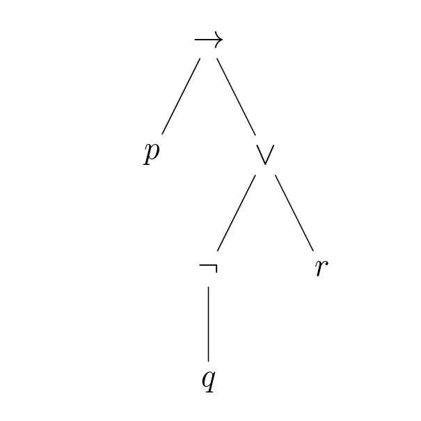
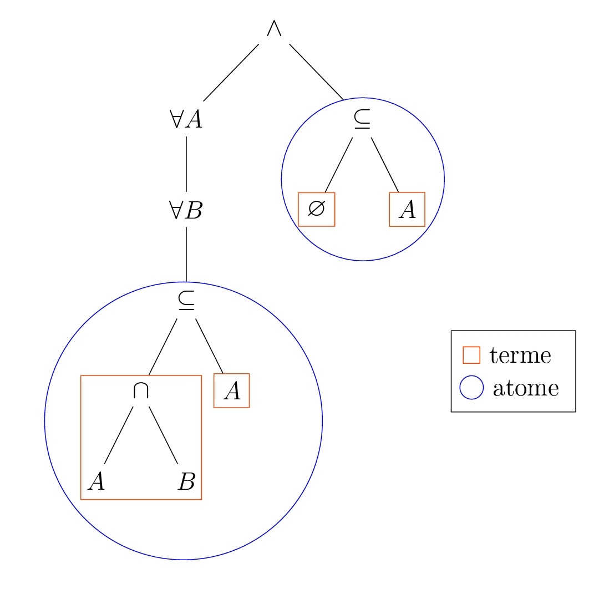
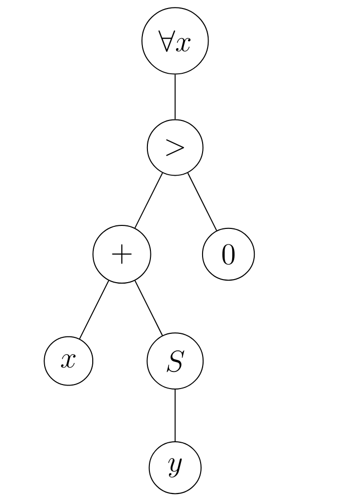

Chapitre 8 : Logique
===
# 1. Introduction
La logique est un domaine mathématique dont l'objet d'étude est l'ensemble des propriétés que l'on peut exprimer, leur valeur de vérité et la notion de démonstration. La logique propose un cadre formel pour manipuler ces notions, où l'on distingue la syntaxe, i.e. la manière d'exprimer les propriétés de la sémantique,i.e. des interprétations que l'on peut donner à la syntaxe.

Les démonstrations, vues en tant qu'objets mathématiques, ne seront étudiées qu'en MPI.

# 2. Syntaxe des formules logiques
## 2.1. Logique propositionnelle

---
### 2.1.1. Introduction
On décompose les propriétés que l'on cherche à exprimer pour faire ressortir leur structure logique. Les énoncés que l'on ne peut pas décomposer sont appelés atomes. En logique propositionnelle, on abstrait les atomes en des variables dites propositionnelles.

---
### 2.1.2. Définition : formules de la logique propositionnelle
Soit $V$ un ensemble de variables propositionnelles. On définit inductivement l'ensemble $\mathcal{F}$ des formules de la logique proportionnelle par :

$\dfrac{x\in V}{x\in\mathcal{F}}$
$\dfrac{\varphi\in\mathcal{F}}{\neg\varphi\in\mathcal{F}}$
$\dfrac{\varphi_1\in\mathcal{F}\;\varphi_2\in\mathcal{F}}{\varphi_1\vee\varphi_2\in\mathcal{F}}$
$\dfrac{\varphi_1\in\mathcal{F}\;\varphi_2\in\mathcal{F}}{\varphi_1\wedge\varphi_2\in\mathcal{F}}$
$\dfrac{\varphi_1\in\mathcal{F}\;\varphi_2\in\mathcal{F}}{\varphi_1\rightarrow\varphi_2\in\mathcal{F}}$

On appelle :
- $\neg$ la négation
- $\vee$ la disjonction
- $\wedge$ la conjonction
- $\rightarrow$ l'implication

On appelle aussi équivalence le symbole $\leftrightarrow$ définit par $\varphi_1\leftrightarrow\varphi_2=(\varphi_1\rightarrow\varphi_2)\wedge(\varphi_2\rightarrow\varphi_1)$

---
### 2.1.3. Remarque
Malgré leur nom, les symboles de la définition précédente n'ont aucune signification. Le sens des symboles tient du domaine de la sémantique. On parle ici de syntaxe abstraite. On peut utiliser une autre représentation pour les syntaxes abstraites, appelée grammaire, qui s'écrit comme suit :

$\varphi::=x|\neg\varphi|\varphi_1\vee\varphi_2|\varphi_1\wedge\varphi_2|\varphi_1\rightarrow\varphi_2$ où x parcourt $\vee$.

L'étude précise des grammaires relève du programme de MPI.

---
### 2.1.4. Vocabulaire
Les symboles $\neg,\vee,\wedge,\rightarrow$ et $\leftrightarrow$ sont appelés connecteurs logiques. Ce sont eux qui définissent la structure logique des énoncés. Le nombre d'arguments d'un connecteur logique est appelé son arité.

---
### 2.1.5. Représentation des formules
On représente généralement les formules de manière linéaire en ajoutant des parenthèses pour désambiguïser la lecture.

Par exemple, $p\vee q\wedge r$ peut se lire :
- $p\vee (q\wedge r)$
- $(p\vee q)\wedge r$

Par convention, la négation est prioritaire sur les autres connecteurs, donc $\neg p\vee q$ se lit $(\neg p)\vee q$ et pas $\neg(p\vee q)$.

En raison de leur définition inductive, les formules ont une représentation arborescente naturelle : chaque règle d'inférence utilisée définit un symbole de tête / connecteur principal qui est la racine du sous-arbre correspondant.

**Exemple :**
$p\rightarrow(\neg q\vee r)$ est représentée par :

 

**Remarque :**
On obtient un arbre (binaire) dont les nœuds internes sont les connecteurs logiques et les nœuds externes sont les atomes. L'arité d'un connecteur est l'arité du nœud correspondant.

L'écriture linéaire de la formule correspondant au parcours en profondeur infixe, en adoptant une représentation préfixe pour les nœuds d'arité 1.

On pourrait envisager d'utiliser les parcours préfixe / postfixe pour représenter les formules.

### 2.1.6. Vocabulaire
- Une sous-formule d'une formule $\varphi$ donnée est la formule associée à un sous-arbre de l'arbre représentant $\varphi$.

 On définit inductivement l'ensemble $SF(\varphi)$ des sous-formules de $\varphi$ par :

 $\forall x\in V, SF(x)$ $SF(\neg\varphi)=\{\neg\varphi\}\cup SF(\varphi)$

 $\forall\circ\in\{\vee;\wedge;\rightarrow\},SF(\varphi_1\circ\varphi_2)=\{\varphi_1\circ\varphi_2\}\cup SF(\varphi_1)\cup SF(\varphi_2)$

 **Exemple :**
 $SF(p\rightarrow(\neg q\wedge r))=\{p\rightarrow(\neg q\vee r);\neg q\vee r;p;\neg q;r;q$\}

- La taille $|\varphi|$ d'une formule $\varphi$ est le nombre de connecteurs logiques de la formule, i.e. le nombre de nœuds internes de l'arbre $A_\varphi$ associé à $\varphi$.

 **Proposition :**
 $|\dfrac{|A_\varphi|-1}{2}\le|\varphi|\le|A_\varphi|-1$

 **Démonstration :**
 L'arbre $A_\varphi$ contient au moins une feuille donc $|\varphi|\le|A_\varphi|-1$
  (cas d'égalité pour $\varphi$ de taille $n$ : $\varphi=\underbrace{\neg\neg...\neg}_{\text{n fois}} p$)

 $A_\varphi$ est un arbre binaire ayant |\varphi| noeuds internes, donc il a au plus $|\varphi|+1$ feuilles (Chap 6 1.1.10.) donc $A_\varphi\le|\varphi|+|\varphi|+1=2|\varphi|+1$.

- La hauteur d'une formule est la hauteur de l'arbre associé, i.e. le nombre maximal de connecteurs à traverser pour atteindre une variable proportionnelle.

 **Exemple :**
 La hauteur de $p\rightarrow(\neg q\vee r)$ est 3.

---
## 2.2. Logique du premier ordre
---
### 2.1.1. Définition : langage du premier ordre
Un langage du premier ordre est défini par une signature $\Sigma$, composée de :
- symboles de fonction, chacun muni d'une arité $k\in\mathbb N$. Les symboles de fonction d'une arité 0 sont appelés symboles de constante.
- symboles de prédicat ou de relation, chacun muni d'une arité $k\in\mathbb N$. Les symboles de fonction d'une arité 0 sont appelés symboles de constante propositionnelle.

---
### 2.2.2. Exemple
Le langage de la théorie des ensembles est défini par la signature suivante :
- symboles de fonction :
 - $\empty$ (arité 0)
 - $\{.\}$ (arité 1)
 - $.\cup.$ et $.\cap .$ (arité 2)
 - $.^c$ (arité 1)
- symboles de prédicat :
 - $.=.$, $.\subseteq.$, $.\in.$ (arité 2)

---
### 2.2.3. Définition : termes et formules de la logique du premier ordre
Soit $\Sigma$ une signature et $\vee$ un ensemble de variables. $\Sigma$ et $\vee$ définissent des ensembles de termes et de formules via grammaires suivantes :
- Terme : $t::=x|f(t_1,...,t_k)$
  où
 $\left\{\begin{array}{ll}
   x\text{ parcours }\vee
   \\
   (f,k)\text{ parcourt les symboles de fonction et leur arité}
 \end{array}\right.$

- Formules : $\varphi::=p(t_1,...,t_k)|\neg\varphi|\varphi_1\vee\varphi_2|\varphi_1\wedge\varphi_2|\varphi_1\rightarrow\varphi_2|\forall x.\varphi|\exists x.\varphi$
  où
 $\left\{\begin{array}{ll}
   x\text{ parcours }\vee
   \\
   (p,k)\text{ parcourt les symboles de prédicat et leur arité}
 \end{array}\right.$

On appelle :
- $\forall$ le qualificateur universel
- $\exists$ le quantificateur existentiel

Les atomes de cette logique sont les formules de la forme $p(t_1,...,t_k)$.

$\exists!x,P(x)\equiv\exists x(P(x)\wedge\forall y.(P(y)\rightarrow y=x))$

On parle de logique du 1er ordre car on ne peut quantifier que sur des variables représentant des termes. Si l'on peut quantifier sur des variables représentant des formules, on parle de logique du second ordre.

---
### 2.2.4. Exemple
En théorie des ensemble, la formule $(\forall A.\forall B.A\cap B\subseteq A)\wedge\empty\subseteq A$ est représentée de manière arborescente par :

 

---
### 2.2.5. Remarque
- La logique du premier ordre est aussi appelée calcul des prédicats
- Dans une formule du premier ordre, les variables peuvent être "capturées" par un quantificateur ou indépendantes de toute quantification

 On peut voir une formule comme une propriété des variables indépendantes de toute quantification et donc remplacer ces variables par des termes concrets.

- Le calcul propositionnel est un cas particulier du calcul des prédicats où il n'y a pas que des constantes propositionnelles (les quantificateurs et les termes deviennent inutiles).

> New

---
### 2.2.6. Définition : variables libres / liées
Les variables libres d'une formule $\varphi$ sont les variables qui ne sont pas "capturées" par un quantificateur. On les définit inductivement par :

$$FV(p(t_1,...,t_p))=\displaystyle\bigcup_{i=1}\mathrm{Vars}(t_i)\text{ où }\left\{\begin{array}{ll}
 \mathrm{Vars}(x)=\{x\}
 \\
 \mathrm{Vars}(f(t_i,...,t_n))=\displaystyle\bigcup_{i=1}\mathrm{Vars}(t_i)
\end{array}\right.$$

$FV(\neg\varphi)=FV(\varphi)$

$FV(\varphi_1\circ\varphi_2)=FV(\varphi_1)\cup FV(\varphi_2),\forall\circ\in\{\wedge;\vee;\rightarrow\}$

$FV(Qx\varphi)=FV(\varphi)\setminus\{x\},\forall Q\in\{\exists,\forall\}$

**Exemple :**
$FV(\forall x,x+Sy>0)=\{y\}$

$FV((\forall x,x+y=1)\wedge(\forall y,x+y=1))=\{x;y\}$

Une variable est dite liée si elle n'est pas libre. Un même nom de variable peut avoir des occurrences libres et des occurrences liées. Dans une formule de la forme $Qx\varphi$ où $Q\in\{\exists,\forall\}$, on dit que $\varphi$ est la portée de la liaison pour x. Une variable est donc
- libre si elle admet une occurrence hors de la portée de toutes les liaisons pour cette variable
- liée si toutes ses occurrences sont dans la portée d'une liaison pour cette variable.

Une formule dont toutes les variables sont liées est dite close.

---
### 2.2.7. Remarque
Le nom des variables liées n'est pas important (exemple : $\forall x, x=x$ et $\forall y, y=y$ expriment la même propriété) donc on identifiera les formules au renommage près de leurs variables liées.

On appelle cela l'$\alpha$-équivalence. Lors du renommage de variables liées, il faut faire attention au phénomène de capture de variables, par exemple $\forall y,x+y=1$ n'est pas la même formule que $\forall x,x+x=1$.

---
### 2.2.8. Définition : substitution
$\begin{array}{lll}
 \text{Soit } & \varphi\text{ une formule}
 \\
 & x\text{ une variable}
 \\
 & t\text{ un terme}
\end{array}$

La substitution de $t$ à $x$ dans $\varphi$, notée $\varphi[x:=t]$, est définie inductivement par :

$$p(t_1,...,t_n)[x:=t]=(t_1[x:=t],...,t_n[x:=t])$$
$$\text{où }\left\{\begin{array}{ll}
 x[x:=t]=t
 \\
 y[x:=t]=y,\forall y\in\vee\setminus\{x\}
 \\
 f(t_1,...,t_n)[x:=t]=f(t_1[x:=t],...,t_n[x:=t])
\end{array}\right.$$

$(\neg\varphi)[x:=t]=\neg(\varphi[x:=t])$

$(\varphi_1\circ\varphi_2)[x:=t]=\varphi_1[x:=t]\circ\varphi_2[x:=t],\forall\circ\in\{\wedge;\vee;\rightarrow\}$

$\forall Q\in\{\exists;\forall\},(Qx\varphi)[x:=t]=Qx\varphi$

$(Qy\varphi)[x:=t]=Qy(\varphi[x:=t]),\forall y\not =x$ et $y\notin\mathrm{Vars}(t)$

**Exemple :**
$(\forall y,y=y+x)[x:=1+y]\not =\forall y(y=y+1+1)$ mais plutôt $\forall z,z=z+1+y\\$ ~> on renomme les occurrences liées dans $\varphi$ des variables de $t$ avant de substituer.

---
### 2.2.9 Remarque
Le principe de l'$\alpha$-équivalence et les restrictions de la substitution sont liés aux questions de sémantique : l'$\alpha$-équivalence et la substitution doivent en quelque sorte conserver la signification logique des formules.

---
# 3. Sémantique de la logique proportionnelle
## 3.1. Vocabulaire

---
### 3.1.1. Introduction
Définir une sémantique revient à donner du sens aux symboles utilisés dans la syntaxe abstraite. On doit donc choisir un ensemble de valeurs qui servent d'interprétation aux termes construits à l'aide de la syntaxe et on doit décrire l'effet des symboles sur cet ensemble de valeurs.

**Exemple :**
On considère des termes arithmétiques définis pas :

$t::=x|c|t_1+t_2|t_1-t_2|t_1\times t_2$ où $x$ parcourt un ensemble $V$ de variables et $c$ parcours $\mathbb{N}$, l'ensemble des constantes.

On peut définir une sémantique en choisissant $\mathbb{N}$ pour l'ensemble des valeurs :
- $c+1$ comme interprétation de $c$
- la fonction $\min$ comme interprétation de $+$
- la fonction $\max$ pour $-$
- l'addition pour $X$

On peut bien-sûr donner une autre sémantique à ces termes, plus en cohérence avec les règles de l'arithmétique.

**Problème :**
L'interprétation des variables ~> elle dépend d'un contexte qui donne une valeur à chaque variable.

Les sémantiques sont donc paramétrées par son environnement.

---
### 3.1.2. Définition : valuation
Une évaluation est une fonction de l'ensemble $\mathcal{V}$ des variables dans l'ensemble des valeurs choisies pour définir la sémantique. On parle également d'environnement ou, dans le cadre de la logique proportionnelle, de distribution de vérité. L'ensemble des valeurs de vérité est noté $\{V;F\}$ où :
- $V$ est la valeur vraie
- $F$ est la valeur fausse

---
### 3.1.3. Définition : valeur de vérité d'une formule
Soit $\varphi$ une formule et $\mathrm{v}$ une valuation.

On définit inductivement l'interprétation de $\varphi$ pour $\mathrm{v}$, notée $[\![\varphi]\!]_v$ par :

$[\![x]\!]_v=\mathrm{v}(x), \forall x$ variable propositionnelle

$[\![\neg\varphi]\!]_v=\left\{\begin{array}{ll}
 V\text{ si }[\![\varphi]\!]_v=F
 \\
 F\text{ sinon} 
\end{array}\right.$

$[\![\varphi_1\vee\varphi_2]\!]_v=\left\{\begin{array}{ll}
 F\text{ si }[\![\varphi_1]\!]_v=[\![\varphi_2]\!]_v=F
 \\
 V\text{ sinon}
\end{array}\right.$

$[\![\varphi_1\wedge\varphi_2]\!]_v=\left\{\begin{array}{ll}
 V\text{ si }[\![\varphi_1]\!]_v=[\![\varphi_2]\!]_v=V
 \\
 F\text{ sinon}
\end{array}\right.$

$[\![\varphi_1\rightarrow\varphi_2]\!]_v=\left\{\begin{array}{ll}
 F\text{ si }[\![\varphi_1]\!]_v=V\text{ et }[\![\varphi_2]\!]_v=F
 \\
 V\text{ sinon}
\end{array}\right.$

On dit que $\mathrm{v}$ est un modèle de $\varphi$ si $[\![\varphi_]\!]_v=V$

---
### 3.1.4. Définition : tautologique / anthologie / satisfiabilité
Soit $\varphi$ une formule. On dit que $\varphi$ est :
- une tautologie sii toute valuation est un modèle de $\varphi$. On note alors $\models\varphi$
- une antilogie ssi elle n'admet aucun modèle
- satisfiable ssi elle admet un modèle

---
### Remarque
On ajoute parfois à la syntaxe une tautologie notée $T$ et une anthologie notée $\bot$.

On peut toutefois les encoder : $T=x\vee\neg x$ et $\bot=x\wedge\neg x$

La tautologie $\varphi\vee\neg\varphi$ est appelée loi du tiers exclu.

**Exercice :**
Montrer que les formules suivantes sont des tautologies :
- $p\rightarrow(q\rightarrow p)$
- $(p\rightarrow q)\vee(q\rightarrow r)$
- $(p\rightarrow(q\rightarrow r))\rightarrow((p\rightarrow q)\rightarrow(p\rightarrow r))$

---
### 3.1.6. Définition : table de vérité
Soit $\varphi$ une formule.

La table de vérité de $\varphi$ est la table indexée par les valuations des variables de $\varphi$ et qui contient comme entrée correspondant à une valuation $\mathrm{v}$ la valeur $[\![\varphi]\!]_v$.

On représente la table de $\varphi$, de variable $x_1...x_n$, en plaçant une colonne pour chaque $x_i$ et une colonne pour $\varphi$.

Pour chaque valuation de $\mathrm{v}$ l'entrée correspondant à $x_i$ est $\mathrm{v}(x_i)$ et l'entrée correspondant à $\varphi$ est $[\![\varphi]\!]_v$.

---
### 3.1.7. Exemple : table de vérité de $p\longleftrightarrow q$
> Tab à recopier

| $p$ | $q$ | $p\rightarrow q$ | $q\rightarrow p$ | $p\leftrightarrow q$
|:---:|:---:|:---:|:---:|:---:|
| $F$ | $F$ | $V$ | $V$ | $V$ |
| $F$ | $V$ | $V$ | $F$ | $F$ |
| $V$ | $F$ | $F$ | $V$ | $F$ |
| $V$ | $V$ | $V$ | $V$ | $V$ |

$(p\leftrightarrow q=(p\rightarrow q)\rightarrow(q\rightarrow p))$

**Remarque :**
Ici, on a inséré des colonnes supplémentaires pour des sous-formules pour simplifier le calcul.

---
### 3.1.8. Remarque
Construire une table de vérité est un algo simple pour déterminer si une formule est satisfaisante / une tautologie / une antilogie.

Cependant, si $\varphi$ a $n$ variables distinctes, alors il y a $2^n$ lignes dans sa table de vérité.

De plus, étant donné $\mathrm v$, déterminer $[\![\varphi]\!]_v$ se fait en temps $\mathcal{O}(|\varphi|)$ et $\varphi$ peut avoir au plus $|\varphi|+1$ variables distinctes.

Cela donne donc un aglo de complexité $\mathcal{O}(|\varphi|2^{|\varphi|})$

---
### 3.1.9 Proposition
Il y a $2^{(2^n)}$ tables de vérités distinctes pour des formules à $n$ variables distinctes.

**Démonstration :**
Il y a $2^n$ lignes dans une table et pour chaque ligne on a le choix entre 2 valeurs de vérité.