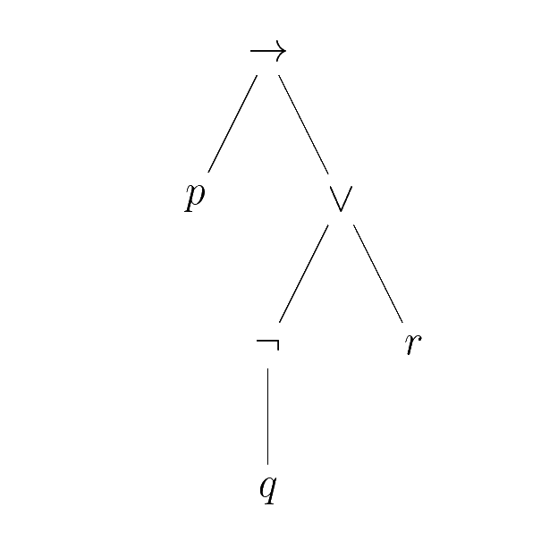

Chapitre 8 : Logique
===
# 1. Introduction
La logique est un domaine mathématique dont l'objet d'étude est l'ensemble des propriétés que l'on peut exprimer, leur valeur de vérité et la notion de démonstration. La logique propose un cadre formel pour manipuler ces notions, où l'on distingue la syntaxe, i.e. la manière d'exprimer les propriétés de la sémantique,i.e. des interprétations que l'on peut donner à la syntaxe.

Les démonstrations, vues en tant qu'objets mathématiques, ne seront étudiées qu'en MPI.

# 2. Syntaxe des formules logiques
## 2.1. Logique propositionnelle

---
### 2.1.1. Introduction
On décompose les propriétés que l'on cherche à exprimer pour faire ressortir leur structure logique. Les énoncés que l'on ne peut pas décomposer sont appelés atomes. En logique propositionnelle, on abstrait les atomes en des variables dites propositionnelles.

---
### 2.1.2. Définition : formules de la logique propositionnelle
Soit $V$ un ensemble de variables propositionnelles. On définit inductivement l'ensemble $\mathcal{F}$ des formules de la logique proportionnelle par :

$\dfrac{x\in V}{x\in\mathcal{F}}$
$\dfrac{\varphi\in\mathcal{F}}{\neg\varphi\in\mathcal{F}}$
$\dfrac{\varphi_1\in\mathcal{F}\quad\varphi_2\in\mathcal{F}}{\varphi_1\vee\varphi_2\in\mathcal{F}}$
$\dfrac{\varphi_1\in\mathcal{F}\quad\varphi_2\in\mathcal{F}}{\varphi_1\wedge\varphi_2\in\mathcal{F}}$
$\dfrac{\varphi_1\in\mathcal{F}\quad\varphi_2\in\mathcal{F}}{\varphi_1\rightarrow\varphi_2\in\mathcal{F}}$

On appelle :
- $\neg$ la négation
- $\vee$ la disjonction
- $\wedge$ la conjonction
- $\rightarrow$ l'implication

On appelle aussi équivalence le symbole $\leftrightarrow$ définit par $\varphi_1\leftrightarrow\varphi_2=(\varphi_1\rightarrow\varphi_2)\wedge(\varphi_2\rightarrow\varphi_1)$

---
### 2.1.3. Remarque
Malgré leur nom, les symboles de la définition précédente n'ont aucune signification. Le sens des symboles tient du domaine de la sémantique. On parle ici de syntaxe abstraite. On peut utiliser une autre représentation pour les syntaxes abstraites, appelée grammaire, qui s'écrit comme suit :

$\varphi::=x|\neg\varphi|\varphi_1\vee\varphi_2|\varphi_1\wedge\varphi_2|\varphi_1\rightarrow\varphi_2$ où x parcourt $\vee$.

L'étude précise des grammaires relève du programme de MPI.

---
### 2.1.4. Vocabulaire
Les symboles $\neg,\vee,\wedge,\rightarrow$ et $\leftrightarrow$ sont appelés connecteurs logiques. Ce sont eux qui définissent la structure logique des énoncés. Le nombre d'arguments d'un connecteur logique est appelé son arité.

---
### 2.1.5. Représentation des formules
On représente généralement les formules de manière linéaire en ajoutant des parenthèses pour désambiguïser la lecture.

Par exemple, $p\vee q\wedge r$ peut se lire :
- $p\vee (q\wedge r)$
- $(p\vee q)\wedge r$

Par convention, la négation est prioritaire sur les autres connecteurs, donc $\neg p\vee q$ se lit $(\neg p)\vee q$ et pas $\neg(p\vee q)$.

En raison de leur définition inductive, les formules ont une représentation arborescente naturelle : chaque règle d'inférence utilisée définit un symbole de tête / connecteur principal qui est la racine du sous-arbre correspondant.

**Exemple :**
$p\rightarrow(\neg q\vee r)$ est représentée par :

<p align="center">

</p>

**Remarque :**
On obtient un arbre (binaire) dont les nœuds internes sont les connecteurs logiques et les nœuds externes sont les atomes. L'arité d'un connecteur est l'arité du nœud correspondant.

L'écriture linéaire de la formule correspondant au parcours en profondeur infixe, en adoptant une représentation préfixe pour les nœuds d'arité 1.

On pourrait envisager d'utiliser les parcours préfixe / postfixe pour représenter les formules.

### 2.1.6. Vocabulaire
- Une sous-formule d'une formule $\varphi$ donnée est la formule associée à un sous-arbre de l'arbre représentant $\varphi$.

On définit inductivement l'ensemble $SF(\varphi)$ des sous-formules de $\varphi$ par :

$\forall x\in V, SF(x)$ $SF(\neg\varphi)=\{\neg\varphi\}\cup SF(\varphi)$

$\forall\circ\in\{\vee;\wedge;\rightarrow\},SF(\varphi_1\circ\varphi_2)=\{\varphi_1\circ\varphi_2\}\cup SF(\varphi_1)\cup SF(\varphi_2)$

**Exemple :**
$SF(p\rightarrow(\neg q\wedge r))=\{p\rightarrow(\neg q\vee r);\neg q\vee r;p;\neg q;r;q$\}

- La taille $|\varphi|$ d'une formule $\varphi$ est le nombre de connecteurs logiques de la formule, i.e. le nombre de nœuds internes de l'arbre $A_\varphi$ associé à $\varphi$.

**Proposition :**
$|\dfrac{|A_\varphi|-1}{2}\le|\varphi|\le|A_\varphi|-1$

**Démonstration :**
L'arbre $A_\varphi$ contient au moins une feuille donc $|\varphi|\le|A_\varphi|-1$
 (cas d'égalité pour $\varphi$ de taille $n$ : $\varphi=\underbrace{\neg\neg\dots\neg}_{\text{n fois}} p$)

$A_\varphi$ est un arbre binaire ayant |\varphi| noeuds internes, donc il a au plus $|\varphi|+1$ feuilles (Chap 6 1.1.10.) donc $A_\varphi\le|\varphi|+|\varphi|+1=2|\varphi|+1$.

- La hauteur d'une formule est la hauteur de l'arbre associé, i.e. le nombre maximal de connecteurs à traverser pour atteindre une variable proportionnelle.

**Exemple :**
La hauteur de $p\rightarrow(\neg q\vee r)$ est 3.

---
## 2.2. Logique du premier ordre
---
### 2.1.1. Définition : langage du premier ordre
Un langage du premier ordre est défini par une signature $\Sigma$, composée de :
- symboles de fonction, chacun muni d'une arité $k\in\mathbb N$. Les symboles de fonction d'une arité 0 sont appelés symboles de constante.
- symboles de prédicat ou de relation, chacun muni d'une arité $k\in\mathbb N$. Les symboles de fonction d'une arité 0 sont appelés symboles de constante propositionnelle.

---
### 2.2.2. Exemple
Le langage de la théorie des ensembles est défini par la signature suivante :
- symboles de fonction :
- $\empty$ (arité 0)
- $\{.\}$ (arité 1)
- $.\cup.$ et $.\cap .$ (arité 2)
- $.^c$ (arité 1)
- symboles de prédicat :
- $.=.$, $.\subseteq.$, $.\in.$ (arité 2)

---
### 2.2.3. Définition : termes et formules de la logique du premier ordre
Soit $\Sigma$ une signature et $\vee$ un ensemble de variables. $\Sigma$ et $\vee$ définissent des ensembles de termes et de formules via grammaires suivantes :
- Terme : $t::=x|f(t_1,\dots,t_k)$
 où
$\left\{\begin{array}{ll}
  x\text{ parcours }\vee
  \\
  (f,k)\text{ parcourt les symboles de fonction et leur arité}
\end{array}\right.$

- Formules : $\varphi::=p(t_1,\dots t_k)|\neg\varphi|\varphi_1\vee\varphi_2|\varphi_1\wedge\varphi_2|\varphi_1\rightarrow\varphi_2|\forall x.\varphi|\exists x.\varphi$
 où
$\left\{\begin{array}{ll}
  x\text{ parcours }\vee
  \\
  (p,k)\text{ parcourt les symboles de prédicat et leur arité}
\end{array}\right.$

On appelle :
- $\forall$ le qualificateur universel
- $\exists$ le quantificateur existentiel

Les atomes de cette logique sont les formules de la forme $p(t_1,\dots,t_k)$.

$\exists!x,P(x)\equiv\exists x(P(x)\wedge\forall y.(P(y)\rightarrow y=x))$

On parle de logique du 1er ordre car on ne peut quantifier que sur des variables représentant des termes. Si l'on peut quantifier sur des variables représentant des formules, on parle de logique du second ordre.

---
### 2.2.4. Exemple
En théorie des ensemble, la formule $(\forall A.\forall B.A\cap B\subseteq A)\wedge\empty\subseteq A$ est représentée de manière arborescente par :

<p align="center">

</p>

---
### 2.2.5. Remarque
- La logique du premier ordre est aussi appelée calcul des prédicats
- Dans une formule du premier ordre, les variables peuvent être "capturées" par un quantificateur ou indépendantes de toute quantification

On peut voir une formule comme une propriété des variables indépendantes de toute quantification et donc remplacer ces variables par des termes concrets.

- Le calcul propositionnel est un cas particulier du calcul des prédicats où il n'y a pas que des constantes propositionnelles (les quantificateurs et les termes deviennent inutiles).

> New

---
### 2.2.6. Définition : variables libres / liées
Les variables libres d'une formule $\varphi$ sont les variables qui ne sont pas "capturées" par un quantificateur. On les définit inductivement par :

$$FV(p(t_1,\dots,t_p))=\displaystyle\bigcup_{i=1}\mathrm{Vars}(t_i)\text{ où }\left\{\begin{array}{ll}
\mathrm{Vars}(x)=\{x\}
\\
\mathrm{Vars}(f(t_i,\dots,t_n))=\displaystyle\bigcup_{i=1}\mathrm{Vars}(t_i)
\end{array}\right.$$

$FV(\neg\varphi)=FV(\varphi)$

$FV(\varphi_1\circ\varphi_2)=FV(\varphi_1)\cup FV(\varphi_2),\forall\circ\in\{\wedge;\vee;\rightarrow\}$

$FV(Qx\varphi)=FV(\varphi)\setminus\{x\},\forall Q\in\{\exists,\forall\}$

**Exemple :**
$FV(\forall x,x+Sy>0)=\{y\}$

<p align="center">

</p>

$FV((\forall x,x+y=1)\wedge(\forall y,x+y=1))=\{x;y\}$

Une variable est dite liée si elle n'est pas libre. Un même nom de variable peut avoir des occurrences libres et des occurrences liées. Dans une formule de la forme $Qx\varphi$ où $Q\in\{\exists,\forall\}$, on dit que $\varphi$ est la portée de la liaison pour x. Une variable est donc
- libre si elle admet une occurrence hors de la portée de toutes les liaisons pour cette variable
- liée si toutes ses occurrences sont dans la portée d'une liaison pour cette variable.

Une formule dont toutes les variables sont liées est dite close.

---
### 2.2.7. Remarque
Le nom des variables liées n'est pas important (exemple : $\forall x, x=x$ et $\forall y, y=y$ expriment la même propriété) donc on identifiera les formules au renommage près de leurs variables liées.

On appelle cela l'$\alpha$-équivalence. Lors du renommage de variables liées, il faut faire attention au phénomène de capture de variables, par exemple $\forall y,x+y=1$ n'est pas la même formule que $\forall x,x+x=1$.

---
### 2.2.8. Définition : substitution
$\begin{array}{lll}
\text{Soit } & \varphi\text{ une formule}
\\
& x\text{ une variable}
\\
& t\text{ un terme}
\end{array}$

La substitution de $t$ à $x$ dans $\varphi$, notée $\varphi[x:=t]$, est définie inductivement par :

$$p(t_1\dots,t_n)[x:=t]=(t_1[x:=t],\dots,t_n[x:=t])$$
$$\text{où }\left\{\begin{array}{ll}
x[x:=t]=t
\\
y[x:=t]=y,\forall y\in\vee\setminus\{x\}
\\
f(t_1,\dots,t_n)[x:=t]=f(t_1[x:=t],\dots,t_n[x:=t])
\end{array}\right.$$

$(\neg\varphi)[x:=t]=\neg(\varphi[x:=t])$

$(\varphi_1\circ\varphi_2)[x:=t]=\varphi_1[x:=t]\circ\varphi_2[x:=t],\forall\circ\in\{\wedge;\vee;\rightarrow\}$

$\forall Q\in\{\exists;\forall\},(Qx\varphi)[x:=t]=Qx\varphi$

$(Qy\varphi)[x:=t]=Qy(\varphi[x:=t]),\forall y\not =x$ et $y\notin\mathrm{Vars}(t)$

**Exemple :**
$(\forall y,y=y+x)[x:=1+y]\not =\forall y(y=y+1+1)$ mais plutôt $\forall z,z=z+1+y\\$ ~> on renomme les occurrences liées dans $\varphi$ des variables de $t$ avant de substituer.

---
### 2.2.9 Remarque
Le principe de l'$\alpha$-équivalence et les restrictions de la substitution sont liés aux questions de sémantique : l'$\alpha$-équivalence et la substitution doivent en quelque sorte conserver la signification logique des formules.

---
# 3. Sémantique de la logique proportionnelle
## 3.1. Vocabulaire

---
### 3.1.1. Introduction
Définir une sémantique revient à donner du sens aux symboles utilisés dans la syntaxe abstraite. On doit donc choisir un ensemble de valeurs qui servent d'interprétation aux termes construits à l'aide de la syntaxe et on doit décrire l'effet des symboles sur cet ensemble de valeurs.

**Exemple :**
On considère des termes arithmétiques définis pas :

$t::=x|c|t_1+t_2|t_1-t_2|t_1\times t_2$ où $x$ parcourt un ensemble $V$ de variables et $c$ parcours $\mathbb{N}$, l'ensemble des constantes.

On peut définir une sémantique en choisissant $\mathbb{N}$ pour l'ensemble des valeurs :
- $c+1$ comme interprétation de $c$
- la fonction $\min$ comme interprétation de $+$
- la fonction $\max$ pour $-$
- l'addition pour $X$

On peut bien-sûr donner une autre sémantique à ces termes, plus en cohérence avec les règles de l'arithmétique.


**Problème :**
L'interprétation des variables ~> elle dépend d'un contexte qui donne une valeur à chaque variable.

Les sémantiques sont donc paramétrées par son environnement.

---
### 3.1.2. Définition : valuation
Une évaluation est une fonction de l'ensemble $\mathcal{V}$ des variables dans l'ensemble des valeurs choisies pour définir la sémantique. On parle également d'environnement ou, dans le cadre de la logique proportionnelle, de distribution de vérité. L'ensemble des valeurs de vérité est noté $\{V;F\}$ où :
- $V$ est la valeur vraie
- $F$ est la valeur fausse

---
### 3.1.3. Définition : valeur de vérité d'une formule
Soit $\varphi$ une formule et $v$ une valuation.

On définit inductivement l'interprétation de $\varphi$ pour $v$, notée $[\![\varphi]\!]_v$ par :

$[\![x]\!]_v=v(x), \forall x$ variable propositionnelle

$[\![\neg\varphi]\!]_v=\left\{\begin{array}{ll}
V\text{ si }[\![\varphi]\!]_v=F
\\
F\text{ sinon}
\end{array}\right.$

$[\![\varphi_1\vee\varphi_2]\!]_v=\left\{\begin{array}{ll}
F\text{ si }[\![\varphi_1]\!]_v=[\![\varphi_2]\!]_v=F
\\
V\text{ sinon}
\end{array}\right.$

$[\![\varphi_1\wedge\varphi_2]\!]_v=\left\{\begin{array}{ll}
V\text{ si }[\![\varphi_1]\!]_v=[\![\varphi_2]\!]_v=V
\\
F\text{ sinon}
\end{array}\right.$

$[\![\varphi_1\rightarrow\varphi_2]\!]_v=\left\{\begin{array}{ll}
F\text{ si }[\![\varphi_1]\!]_v=V\text{ et }[\![\varphi_2]\!]_v=F
\\
V\text{ sinon}
\end{array}\right.$

On dit que $v$ est un modèle de $\varphi$ si $[\![\varphi_]\!]_v=V$

---
### 3.1.4. Définition : tautologique / anthologie / satisfiabilité
Soit $\varphi$ une formule. On dit que $\varphi$ est :
- une tautologie sii toute valuation est un modèle de $\varphi$. On note alors $\models\varphi$
- une antilogie ssi elle n'admet aucun modèle
- satisfiable ssi elle admet un modèle

---
### Remarque
On ajoute parfois à la syntaxe une tautologie notée $T$ et une anthologie notée $\bot$.

On peut toutefois les encoder : $T=x\vee\neg x$ et $\bot=x\wedge\neg x$

La tautologie $\varphi\vee\neg\varphi$ est appelée loi du tiers exclu.

**Exercice :**
Montrer que les formules suivantes sont des tautologies :
- $p\rightarrow(q\rightarrow p)$
- $(p\rightarrow q)\vee(q\rightarrow r)$
- $(p\rightarrow(q\rightarrow r))\rightarrow((p\rightarrow q)\rightarrow(p\rightarrow r))$

---
### 3.1.6. Définition : table de vérité
Soit $\varphi$ une formule.

La table de vérité de $\varphi$ est la table indexée par les valuations des variables de $\varphi$ et qui contient comme entrée correspondant à une valuation $v$ la valeur $[\![\varphi]\!]_v$.

On représente la table de $\varphi$, de variable $x_1\dotsx_n$, en plaçant une colonne pour chaque $x_i$ et une colonne pour $\varphi$.

Pour chaque valuation de $v$ l'entrée correspondant à $x_i$ est $v(x_i)$ et l'entrée correspondant à $\varphi$ est $[\![\varphi]\!]_v$.

---
### 3.1.7. Exemple : table de vérité de $p\longleftrightarrow q$

| $p$ | $q$ | $p\rightarrow q$ | $q\rightarrow p$ | $p\leftrightarrow q$
|:---:|:---:|:---:|:---:|:---:|
| $F$ | $F$ | $V$ | $V$ | $V$ |
| $F$ | $V$ | $V$ | $F$ | $F$ |
| $V$ | $F$ | $F$ | $V$ | $F$ |
| $V$ | $V$ | $V$ | $V$ | $V$ |

$(p\leftrightarrow q=(p\rightarrow q)\rightarrow(q\rightarrow p))$

**Remarque :**
Ici, on a inséré des colonnes supplémentaires pour des sous-formules pour simplifier le calcul.

---
### 3.1.8. Remarque
Construire une table de vérité est un algo simple pour déterminer si une formule est satisfiable / une tautologie / une antilogie.

Cependant, si $\varphi$ a $n$ variables distinctes, alors il y a $2^n$ lignes dans sa table de vérité.

De plus, étant donné $\mathrm v$, déterminer $[\![\varphi]\!]_v$ se fait en temps $\mathcal{O}(|\varphi|)$ et $\varphi$ peut avoir au plus $|\varphi|+1$ variables distinctes.

Cela donne donc un aglo de complexité $\mathcal{O}(|\varphi|2^{|\varphi|})$

---
### 3.1.9 Proposition
Il y a $2^{(2^n)}$ tables de vérités distinctes pour des formules à $n$ variables distinctes.

**Démonstration :**
Il y a $2^n$ lignes dans une table et pour chaque ligne on a le choix entre 2 valeurs de vérité.

---
## 3.2. Conséquence et équivalence

---
### 3.2.1. Définition : conséquence
Soit $\varphi$ et $\psi$ deux formules.

On dit que $\psi$ est une conséquence logique de $\varphi$, noté $\varphi\models\psi$, si tout modèle de $\varphi$ est un modèle de $\psi$

---
### 3.2.2. Proposition
Soit $\varphi$ et $\psi$ deux formules.
$\varphi\models\psi$ ssi $\models\varphi\rightarrow\psi$

**Démonstration :**
$\varphi\models\psi$ sii tout modèle de $\varphi$ est une modèle de $\psi$

ssi $\forall$ valuations $v$, soit $[\![\varphi]\!]_v=V=[\![\psi]\!]$, soit $[\![\varphi]\!]=F$

ssi $\forall$ valuations $v$, $[\![\varphi\rightarrow\psi]\!]_v=V$

ssi $\models\varphi\rightarrow\psi$.

---
### 3.2.3. Généralisation aux ensembles de formules
- modèle : un modèle d'un ensemble $\Gamma$ de formules est une valuations $v$ tel que $\forall\varphi\in\Gamma,[\![\varphi]\!]_v=V$
- satisfiabilité : un ensemble $\Gamma$ de formules est dit :
 - satisfiable si $\Gamma$ admet un modèle
 - contradictoire si $\Gamma$ n'admet aucun modèle
- conséquence logique : une formule $\varphi$ est conséquence logique d'un ensemble $\Gamma$ de formules si tout modèle de $\Gamma$ est modèle de $\varphi$. On note alors $\Gamma\models\varphi$.

**Remarque :**
- $\varphi\models\psi$ ssi $\{\varphi\}\models\psi$
- l'intuition est la suivante : un ensemble de formules $\Gamma$ définit une théorie (un ensemble d'axiomes) et on s'intéresse aux formules vraies dans cette théorie (les conséquences logiques de $\Gamma$)

---
### 3.2.4. Proposition
Soit $\Gamma$ un ensemble de formules et $\varphi$ une formule

$\Gamma=\varphi$ ssi $\Gamma\cup\{\neg\varphi\}$ est contradictoire.

**Démonstration :**
$\Gamma\models\varphi$ ssi tout modèle de $\Gamma$ est un modèle de $\varphi$

ssi $\forall$ valuations $v$, soit $v$ n'est pas ne modèle de $\Gamma$, soit $v$ est un modèle de $\Gamma$ et $[\![\varphi]\!]_v=V$

ssi $\forall$ valuations $v$, soit $v$ n'est pas ne modèle de $\Gamma$, soit $v$ est un modèle de $\Gamma$ et $[\![\neg\varphi]\!]_v=F$

ssi $\Gamma\cup\{\neg\varphi\}$ n'admet aucun modèle

ssi $\Gamma=\varphi$ ssi $\Gamma\cup\{\neg\varphi\}$ est contradictoire.

---
### 3.2.5. Proposition
Soit $\varphi_1\dots\varphi_n$ et $\psi$ des formules
$\{\varphi_1\dots\varphi_n\}\models\psi$ ssi $\models(\varphi_1\wedge\dots\wedge\varphi_n)\rightarrow\psi$

**Démonstration :**
Lemme : Soit $\Gamma$ un ensemble de formules et $\varphi$ et $\psi$ deux formules

$\Gamma\cup\{\varphi\}\models\psi$ ssi $\Gamma\models\varphi\rightarrow\psi$

- **Démonstration :**
 $\Gamma\models\varphi\rightarrow\psi$ ssi $\forall$ valuation $v$ n'est pas un modèle de $\Gamma\cup\{\varphi\}$, soit $[\![\psi]\!]_v=V$

 ssi $\forall$ valuation $v$ n'est pas un modèle de $\Gamma$, soit $[\![\varphi]\!]_v=F$, soit $[\![\varphi]\!]_v=V=[\![\psi]\!]_v$

 ssi $\forall$ valuation $v$ n'est pas un modèle de $\Gamma$, soit $[\![\varphi]\!]_v=F$, soit $[\![\varphi\rightarrow\psi]\!]_v=V$
  ssi $\Gamma\models\varphi\rightarrow\psi$.

On procède alors par récurrence en remarquant que $\forall\varphi_1,\varphi_2,\psi,(\varphi_1\wedge\varphi_2)\rightarrow\psi$ et $\varphi_1\rightarrow(\varphi_2\rightarrow\psi)$ ont les mêmes modèles.

**Remarque :**
Cela ne s'exprime que pour les ensembles finis de formules, car les formules sont des objets finis.

Le théorème de compacité (`H.P`) permet toujours de se ramener à un ensemble fini de formules.

---
### 3.2.6. Définition : équivalence
Soit $\varphi$ et $\psi$ deux formules.

On dit que $\varphi$ et $\psi$ sont équivalents, noté $\varphi\equiv\psi$, si $\varphi$ et $\psi$ ont les mêmes modèles.

---
### 3.2.7. Remarque
$\varphi\equiv\psi$ ssi $(\varphi\models\psi$ et $\psi\models\varphi)$ ssi $\models\varphi\leftrightarrow\psi$ (d'après 3.2.1.)
- $\models\equiv$ est une relation d'équivalence
- deux formules sont équivalentes si elles ont la même table de vérité donc il y a au plus $2^{(2^n)}$ classes d'équivalence pour des formules à $n$ variables.

On verra comment construire une formule associée à chaque table de vérité possible.

---
### 3.2.8. Équivalence classique
- Élément neutre :
 - $\varphi\wedge\top\equiv\varphi$
 - $\varphi\vee\bot\equiv\varphi$
- Élément absorbant :
 - $\varphi\wedge\top\equiv\bot$
 - $\varphi\vee\top\equiv\top$
- Commutativité :
 - $\varphi_1\wedge\varphi_2\equiv\varphi_2\wedge\varphi_1$
 - $\varphi_1\vee\varphi_2\equiv\varphi_2\vee\varphi_1$
- Associativité :
 - $\varphi_1\wedge(\varphi_2\wedge\varphi_3)\equiv(\varphi_1\wedge\varphi_2)\wedge\varphi_3$
 - $\varphi_1\vee(\varphi_2\vee\varphi_3)\equiv(\varphi_1\vee\varphi_2)\vee\varphi_3$
- Distributivité :
 - $\varphi_1\wedge(\varphi_2\vee\varphi_3)\equiv(\varphi_1\wedge\varphi_2)\vee(\varphi_1\wedge\varphi_3)$
 - $\varphi_1\vee(\varphi_2\wedge\varphi_3)\equiv(\varphi_1\vee\varphi_2)\wedge(\varphi_1\vee\varphi_3)$
- Idempotence :
 - $\varphi \wedge \varphi \equiv \varphi$
 - $\varphi \vee \varphi \equiv \varphi$
- Involutivité :
 - $\neg \neg \varphi \equiv \varphi$
- Règles de complément (tiers exclu) :
 - $\varphi \wedge \neg \varphi \equiv \bot$
 - $\varphi \vee \neg \varphi \equiv \top$
- Lois de De Morgan :
 - $\neg (\varphi \wedge \psi) \equiv \neg \varphi \vee \neg \psi$
 - $\neg (\varphi \vee \psi) \equiv \neg \varphi \wedge \neg \psi$
- Décomposition de l'implication :
 - $\varphi \rightarrow \psi \equiv \neg (\varphi \wedge \neg \psi) \equiv \neg \varphi \vee \psi$
- Contraposition :
 - $\varphi \rightarrow \psi \equiv \neg \psi \rightarrow \neg \varphi$
- Curryfication :
 - $(\varphi_1 \wedge \varphi_2) \rightarrow \varphi_3 \equiv \varphi_1 \rightarrow (\varphi_2 \rightarrow \varphi_3)$

---
### 3.2.9. Remarque
Ces équivalences définissent des règles de simplification qui préservent la valeur logique des formules. Ces règles peuvent aussi s'appliquer aux sous-formules d'une formule donnée. On dit que l'équivalence passe au contexte et que c'est une relation de congruence.

Ces règles permettent de donner une formule particulière aux formules afin de simplifier l'étude de leur stabilité.

---
## 3.3. Formes normales

---
### 3.3.1. Définition : littéraux, clauses, formes normales
- Un littéral est une formule qui suit une variable, soit la négation d'une variable.
- Une clause est conjonctive (resp. disjonctive) est une conjonction (resp. disjonction) de littéraux.
- Une formule sous forme normale disjointe (resp. conjonctive) est une disjonction (resp. conjonction) de classes conjonctives (resp. disjonctives).

---
### 3.2.2. Exemple
- $(\neg x\wedge\neg y)\vee(\neg x\wedge\neg z\wedge t)$ est une FND
- $(x\vee y)\wedge(\neg x\vee\neg y)$ est une FNC (c'est le XOR)

---
### 3.3.3. Théorème
Toute formule est équivalente à une forme normale conjonctive (resp. disjonctive).

**Démonstration :**
- Il suffit de montrer le théorème pour les FND :

 Soit $\varphi$ une formule. Alors $\neg\varphi$ est équivalente à une FND.
  Cette FND, $\displaystyle\bigvee_{i=1}^m c_i$ où $\forall i\in[\![a;n]\!]$ la classe $c_i$ s'écrit $\displaystyle\bigwedge_{j=1}^{m_i} l_{i,j}$ avec les $l_{i,j}$ des littéraux.

 Donc

 $
 \begin{array}{rcl}
    \varphi
    &\equiv& \neg \neg \varphi
    \ \equiv\ \displaystyle \neg (\bigvee_{i = 1}^n c_i)
    \ \equiv\ \displaystyle \bigwedge_{i = 1}^n \neg c_i
    \\
    &\equiv& \displaystyle \bigwedge_{i = 1}^n \neg (\bigwedge_{j = 1}^{m_i} l_{i, j})
    \ \equiv\ \displaystyle \bigwedge_{i = 1}^n \bigvee_{j = 1}^{m_i} \neg l_{i, j}
    \\
    &\equiv& \displaystyle \underbrace{\bigwedge_{i = 1}^n \bigvee_{j = 1}^{m_i} \widetilde{l_{i, j}}}_{\text{FNC}}
 \end{array}
 $
 où
 $
 \forall (i, j),\ \widetilde{l_{i, j}} =
 \left\{
 \begin{array}{ll}
    \neg x_{i, j} & \text{si }l_{i ,j} = x_{i ,j} \in \mathcal{V}
    \\
    x_{i ,j} & \text{si }l_{i ,j} = \neg \underbrace{x_{i, j}}_{\in \mathcal{V}}
 \end{array}
 \right.
 $

- Soit $\varphi$ une formule. Montrons que $\varphi$ est équivalent à une FND.

Soit $v$ une valuation. On construit la classe $c_v=\displaystyle\bigwedge_{\substack{x\in V\\\text{tq }v(x)=V}}x\wedge\bigwedge_{\substack{x\in V\\\text{tq }v(x)=F}}\neg x$ (clause conjonctive).

 (**Exercice :**
$v$ est l'unique modèle de $c_v$)

 Alors $\varphi\equiv\displaystyle\bigvee_{\substack{v\\\text{tq }[\![\varphi]\!]_v=V}}x$ (FND).

---
### 3.3.4. Remarque
On a démontré qu'il existe une formule associée à toute table de vérité.
- la normalisation d'une formule peut résulter en une formule de taille exponentielle en la taille de la formule initiale.

 **Exemple :**
 $\varphi=(x_1\vee y_1)\vee\dots\vee(x_n\vee y_n)$ est une FNC dont la FND est de taille exponentielle en $n$

 **Exercice :**
 Cette formule admet $3^n$ modèles.

- si on ne s'intéresse qu'à la satisfiabilité d'une formule, il est inutile de préserver l'équivalence : il suffit de considérer une formule qui lui est équisatisfiable, i.e. satisfiable ssi la formule initiale est satisfiable.

---
### 3.3.5. Transformation de Tseitin (`H.P`)
**Idée :**
On ajoute de nouvelles variables qui seront "équivalentes" aux sous-formules.

Soit $\varphi$ une formule. $\forall\psi\in\mathrm{SF}(\varphi)$ on ajoute une variable $p_\psi$ et on construit une FNC $f_\psi$ définie inductivement par :
- $f_x~~~~~~=(\neg p_x\vee x)\wedge(p_x\vee\neg x)$
- $f_{\neg\psi}~~~~=(\neg p_{\neg\psi}\vee\neg p_\psi)\wedge(p_{\neg\psi}\vee p_\psi)$
- $f_{\psi_1 \vee \psi_2} = (\neg p_{\psi_1 \vee \psi_2} \wedge p_{\psi_1} \vee p_{\psi_2}) \wedge (p_{\psi_1 \vee \psi_2} \vee \neg p_{\psi_1}) \wedge (p_{\psi_1 \vee \psi_2} \vee \neg p_{\psi_2})$
- $f_{\psi_1 \wedge \psi_2} = (\neg p_{\psi_1 \wedge \psi_2} \vee p_{\psi_1}) \wedge (\neg p_{\psi_1 \wedge \psi_2} \vee p_{\psi_2}) \wedge (p_{\psi_1 \wedge \psi_2} \vee \neg p_{\psi_1} \vee \neg p_{\psi_2})$

On suppose avoir éliminé les simplifications ce qui ne fait que doubler la taille de la formule dans le pire cas.

La transformée de Tseitin de $\varphi$ est alors $p_\varphi \wedge \bigwedge_{\psi \in SF(\varphi)} f_\psi$, qui est une FNC.

**Remarque :**
La traqnfmorm.ee de Tsentin se clacule en taille linéaire en la taille de la formule

**Prop (admise) :**
$\varphi$ et $p_\varphi \wedge \displaystyle \bigwedge_{\psi \in SF(\varphi)} f_\psi$ sont équisatisfiable.

**Idée :**
$f_\psi$ exprime $\psi \leftrightarrow p_\psi$.

---
# 4. Problème de la satisfiabilité des formules proportionnelles

## 4.1 Représentation du problème

---
### 4.1.1. Définition : problème SAT
Le problème SAT est le problème de décision suivant : étant donné une formule $\varphi$ de la logique proportionnelle, $\varphi$ est-elle satisfiable ?

---
### 4.1.2. Remarque
Il existe un algorithme pour répondre à ce problème (on dit que SAT est décidable), mais l'algorithme vu en 3.1.8. est de complexité exponentielle.

**Question :**
Peut-on faire mieux ?

---
### 4.1.3. Proposition
Une clause conjonctive est une antilogie / antinomie ssi elle contient une variable et sa négation.

**Démonstration :**
- $\Leftarrow$ : Si la clause s'écrit $x\wedge\neg x\wedge c$ (à l'ordre près des littéraux), alors $\forall v,[\![x\wedge\neg\wedge c]\!]_v=F$ car $[\![x\wedge\neg x]\!]_v=F$
- $\Rightarrow$ : Par contraposée, on suppose que la clause ne contient pas une variable et sa négation. On montre qu'elle est satisfiable.

 On peut supposer que les littéraux portent sur des variables 2 à 2 distinctes

 $x\wedge x=x$ et $\neg x\wedge\neg x=\neg x$

 On note alors :
 - $l_1\dots l_n$ les littéraux ;
 - $x_1\dots x_n$ les variables associées.

 On définit une valuation $v$ par $\forall i\in[\![1;n]\!], v(x_i) = \left\{\begin{array}{ll}
   V\text{ si }l_i=x_i
   \\
   F\text{ si } l_i=\neg x_i
 \end{array}\right.$

 Alors $\displaystyle[\![\bigwedge_{i=1}^n l_i]\!]_v=V$

 Donc la clause est satisfiable.

---
### 4.1.4. Corollaire
On peut résoudre SAT en temps polynomial pour les FND.

**Démonstration :**
Une FND est satisfiable ssi l'une de ses clauses est satisfiable ssi l'une de ses clauses ne contient pas une variable et sa négation.

Vérifier si une clause ne contient pas une variable et sa négation se fait en temps $\mathcal{O}(n^2)$ si la clause contient $n$ littéraux voire $\mathcal{O}(n)$ si les variables sont représentées par des entiers.

On applique cette vérification à chaque clause.

---
### 4.1.5. Remarque
- On ne sait pas s'il est possible de résoudre SAT en temps polynomial (cf. cours sur la classe NP) ;
- C'est déjà le cas pour certains cas particuliers de SAT.

---
### 4.1.6. Définition : $k$-SAT
Étant donné $k\in\mathbb{N}^*$, $k$-SAT est le problème de décision suivant : étant donné une formule $\varphi$ sous FNC telle que chaque clause contient au plus $k$ littéraux, $\varphi$ est-elle satisfiable ?

---
### 4.1.7. Remarque
- $1$-SAT est résoluble en temps polynomial (cf. 4.1.3.) ;
- on verra que $2$-SAT est résoluble en temps polynomial (cf. cours en théorie des graphes) ;
- la transformation de Tseitin fournit pour toute formule $\varphi$ une instance de $3$-SAT qui est de taille linéaire en la taille de $\varphi$ et qui est équisatisfiable à $\varphi$, donc on ne sait pas résoudre $k$-SAT en temps polynomial pour $k\ge 3$ ;
- SAT et ses restrictions sont des problèmes importants car ils servent à modéliser de nombreux problèmes. On parle de réduction de ces problèmes à SAT.

---
### 4.1.8. Exemple de réduction à SAT : Le problème du Sudoku
- Rappel des règles : on dispose d'une grille $n\times n$ qu'on veut remplir avec des entiers de $[\![1;n]\!]$ de telle sorte que chaque ligne / colonne / bloc de taille $l\times l$ où $n=l^2$ contienne chaque entier exactement une fois.

 Une grille peut être partiellement pré-remplie afin qu'il n'existe qu'une seule solution.

- Réduction à SAT :

 On introduit $n^3$ variables propositionnelles $(x_{i,j}^k)_{i,j,k\in[\![1;n]\!]}$.

**Idée :**
$x_{i,j}^k$ signifie "la case $(i,j)$ contient l'entier $k$"

On peut représenter les règles à l'aide de formules :
- chaque case contient un unique chiffre : $\displaystyle\bigwedge_{i=1}^n\bigwedge_{j=1}^n\bigvee_{k=1}^n\left(x_{i,j}^k\wedge\bigwedge_{k'\not =k}\neg x_{i,j}^{k'}\right)$
- chaque ligne contient au moins une fois chaque chiffre : $\displaystyle\bigwedge_{k=1}^n\bigwedge_{i=1}^n\bigvee_{j=1}^nx_{i,j}^k$
- chaque ligne contient au plus une fois chaque chiffre : $\displaystyle\bigwedge_{i=1}^n\bigwedge_{j=1}^n\bigwedge_{k=1}^n\left(x_{i,j}^k\rightarrow\bigwedge_{j'\not =j}\neg x_{i,j'}^{k}\right)$
- etc...

On peut représenter les cases pré-remplies par des clauses unitaires $x_{i,j}^{k}$ (si la case $(i,j)$ est pré-remplie avec $k$)

La conjonction de toutes ces formules donne une instance de SAT telle que tout modèle de cette conjonction représente une solution.

---
## 4.2. Résolution du problème SAT

---
### 4.2.1. Algorithme de Quine
L'algorithme de Quine est un algorithme de résolution de SAT pour les FNC.

**Idée :**
On teste toutes les valuations possibles, mais en construisant de manière incrémentale les valuations en simplifiant la formule lors de la construction.

Si $v(x)=V$ et si une clause $c$ contient $x$, alors $[\![c]\!]_v=V$ donc on peut retirer $c$ de a formule.

Si $v(x)=V$ et si une clause $c$ contient $\neg x$, alors $[\![c]\!]_v=[\![c\setminus\{\neg x\}]\!]_v$ donc on peut retirer $\neg x$ de $c$

Cas symétrique si $v(x)=F$

Si on parvient à retirer toutes les clauses, alors la formule est satisfiable

Si on retire tous les littéraux d'une clause, alors elle n'est pas satisfiable dans la valuation partielle $\rightarrow$ il faut changer de valuation partielle en revenant sur les choix précédents

**Algorithme :**

Entrée : ensemble de clauses disjointes $C$

Algo :
- Si $C=\empty$ :
  - alors renvoyer vraie
- Si la clause vide $\in C$ :
  - alors renvoyer faux
- Choisir $x$, une variable apparaissant dans une clause de $C$
- $C'\leftarrow C$ où :
  - toute clause contenant $x$ a été supprimée
  - $\neg x$ a été retiré de toutes les clauses
- Si $\mathrm{Quine}(C')$ :
  - alors renvoyer vraie
- Sinon :
  - $C''\leftarrow C$ où :
    - toute clause contenant $\neg x$ a été supprimée
    - $x$ a été retiré de toutes les clauses
- Renvoyer $\mathrm{Quine}(C'')$

**Dans le pire cas :**
On test toutes les valuations, d'où une complexité exponentielle

---
### 4.2.2. Implémentation de l'algorithme de Quine
On peut représenter les clauses par des listes de littéraux et les FNC par des listes de clauses.

```OCaml
type litteral = Var of string |NVar of string
type clause = literal list
type fnc = clause list

let rec quine (f : fnc) : bool =
 match f with
 |[] -> true
 |_ when List.mem [] f -> false (*si f contient une liste vide*)
 |(Var x::_)::_ |(NVar x::_)::_ ->
 if quine (List.map (List.filter (fun l -> l <> NVar x)) (List.filter(fun c -> not(List.mem(Var x) c)) f))
 then true
 else quine (List.map (List.filter (fun l -> l <> Var x)) (List.filter (fun c -> not(List.mem (NVar x) c)) f))
```

---
### 4.2.3. Optimisation
On peut utiliser plusieurs techniques afin de rendre cet algorithme plus efficace :
- Propagation des clauses unitaires : si une clause ne contient plus qu'un seul littéral, la valeur de ce littéral est imposée. On peut donc effectuer les simplifications associées à cette valeur sans avoir besoin de revenir sur un choix.

 Cela donne l'algorithme DPLL (Davis Putnam Logemax Loveland) (`H.P`)

- On peut utiliser des heuristiques pour le choix du littéral, par exemple, le littéral le plus fréquent, celui qui apparaît dans une clause la plus courte possible, ou un littéral choisi au hasard.
- On peut ajouter des clauses à la formule pour tenir compte des échecs : une valuation partielle correspond à un ensemble de choix.

 On peut "apprendre" une clause pour ne pas refaire de choix similaires dans un autre appel récursif.

 Cela donne l'algorithme CDCL (Conflict Driven Clause Learning) (`H.P`)

 DPPLL et CDCL sont à la base des SAT-solvers modernes.

---
## 4.3. Compléments d'algorithme

---
### 4.3.1. Introduction
L'algorithme de Quine est un cas particulier de l'algorithme de recherche par force brute. Le principe de la recherche par force brute, ou exploration exhaustive, est de tester toutes les valeurs possibles pour en trouver une qui réponde au problème que l'on se pose.

On peut appliquer cette méthode pour résoudre des problèmes de :
- décision (existe-t-il une valeur qui satisfait des contraintes données ?)
- optimisation (trouver une valeur qui satisfait certaines contraintes tout en maximisant / minimisant une certaine quantité).

|Avantages|Inconvénients|
|:---:|:---:|
|Méthode complète : on trouve nécessairement une solution (optimale) si elle existe|Complexité élévée : par ex, trouver la clé secrète d'un schéma cryptographique, encodée sur $n$ bits, nécessite $2^n$ essais|
|Souplesse : on peut aisément modifier l'algorithme à l'aide d'heuristiques pour le rendre plus efficace dans certains cas||
|Méthode simple : implémentation aisé et simple à débuguer||
|On peut trouver toutes les solutions possibles, si c'est ce que l'on cherche||

---
### 4.3.2. Modalités d'implémentations
Un algorithme de recherche par brute force s'écrit simplement ainsi :
- Pour toute les valeurs de $v$
 - Si $v$ satisfait les contraintes
   - alors s'arrêter avec $v$ comme solution
- Échec de la recherche

**Version "toutes solutions" :**
- $S\leftarrow\empty$
- Pour toute valeur $v$
 - Si $v$ satisfait les contraintes
   - alors $S\leftarrow S\cup\{v\}$
- Renvoyer S

Pour l'implémentation d'un algo, le paradigme de programmation et la manière dont on parcours les valeurs contraignent la façon dont on écrit le code.

Pour une implémentation récursive, on peut manipuler l'ensemble des valeurs à traiter en en retirant une à chaque appel récursif (coûteux en espace) ou, si l'on suppose d'une manière d'énumérer les valeurs en choisissant la valeur qui suit une valeur donnée, on peut partir d'une valeur initiale et faire un appel récursif sur la suivante jusqu'à exhaustion des valeurs (exmple : liste chaînés ou parcours des indices d'un tableau par une fonction récursive).

Si on dispose d'une telle manière d'énumérer les valeurs, on peut facilement traduire l'algo récursif en boucle while (tant qu'on n'a pas trouvé de solution et qu'on n'a pas parcouru toutes les valeurs, poser à la valeur suivante) ou une boucle for (pour $i$ de $1$ au nombre de valeurs, tester la valeur n°$i$).

**Exemple :**
On veut savoir si $x$ apparaît dans $t$ de taille $n$

**Boucle while :**
```C
bool trouve = false;
int i = _1;
while (i < n-1 && !trouve) {
 i++;
 trouve = t[i]==x;
}
// test de trouve
```
**Boucle for :**
```C
int i;
for (i=0; i<n; i++) {
 if (t[i]==x) break;
}
// test de i
```

**Remarque :**
- On peut aussi simplifier la boucle while avec l'usage de break ;
- Il n'y a pas d'instruction "break" en OCaml, mais on peut contrôler l'exécution à l'aide d'une exception.

**Exemple :**
```OCaml
exception Trouve of int
try
 for i = 0 to n-1 do
   if t.(i) = x then raise (Trouve i)
 done;
 raise Not.found
with
 |Trouve i -> i;;
```

---
### 4.3.3. Retour sur trace
L'algo de Quine correspond à une autre manière de parcourir l'ensemble des valeurs : on construit de manière incrémentale des valeurs partielles (valuation d'un sous-ensemble des variables), en passant d'une valeur partielle à une autre en effectuant un choix (choix de la valeur d'une variable) sur lequel on reviendra pour tester d'autres choix si celui-ci permet pas de trouver une solution. On appelle cette méthode le retour en trace (ou backtracking).

La caractère incrémental impose de ne pas pouvoir boucler sur un ensemble de valeurs partielles et peut permettre d'éliminer des choix avant d'avoir construit une valeur complète.

**Pseudo-code :**
- Recherche ($v_\text{init}$) :
 - Si $v_\text{init}$ est complète et satisfait les contraintes
   - S'arrêter avec $v_\text{init}$ comme solution
 - Si $v_\text{init}$ est partielle
   - Pour chaque choix valide à partir de $v_\text{init}$
     - $v_\text{next}\leftarrow$ résultat du choix
     - Recherche ($v_\text{next}$)

**Exemple :**
Sudoku

- Valeur : remplissage de la grille (pas forcément selon les règles)
- Valeur partielle : remplissage partiel de la grille : il peut y avoir des cases vides
- $v_\textsf{init}$ : problème posé
- Choix : écriture d'un chiffre dans une case vide
- Choix valide : choix qui respecte les règles du jeu vis-à-vis des chiffres déjà inscrits

Avec ces définitions, une valeur complète construite à l'aide d'une succession de choix valides est récursivement une solution.

---
### 4.3.4. Optimisation
- Comme pour l'algo DPLL par rapport à l'algo de Quine, certains choix peuvent contraindre la complétion des valeurs partielles de telle sorte qu'il n'est pas nécessaire de revenir sur les choix "imposés"
- On peut également utiliser des heuristiques pour parcourir l'ensemble des valeurs dans un ordre précis, voire pour ne parcourir qu'un sous-ensemble des valeurs possibles.

C'est un procédé classique en géométrie algorithmique : l'ensemble des valeurs à parcourir est en général construit à partir d'un ensemble de points du plan / de l'espace. Parcourir l'ensemble des points selon une direction permet de ne considérer que certaines valeurs. On appelle cela un algorithme par droite de balayage?

**Idée :**
Une droite / un plan perpendiculaire à la direction choisie balaye l'ensemble des points et, à chaque point rencontré, on effectue des opérations visant à construire une solution.

**Exemple : retour sur le TP_12**
- Problème : Étant donné un ensemble de points du plan, trouver une paire de points qui minimise la distance euclidienne entre ces points.
- Ensemble des valeurs : l'ensemble des paires de points ~> algo force brute en $\mathcal{O}(n^2)$
- Rappel : algo `diviser pour régner' en $\mathcal{O}(n\log n)$ vu en TP
- Idée d'algo par droite de balayage : on parcours les points par abscisse croissante en conservant la distance minimale courante $d$

On note $(x_0,y_0)\dots(x_{n-1},y_{n-1})$ les points triés par abscisse.

Si la distance minimale vaut d'après le parcours des $k$ premiers points, il est inutile de considérer les points d'abscisse $<x_k-d$ par la mise à jour de $d$.

De même, il est inutile de considérer les points d'ordonnée $<y_k-d$ ou $>y_k+d$

**Attention :**
Si les points d'abscisse $<x_k-d$ peuvent être définitivement oubliés, ceux de l'abscisse $\ge x_k-d$ doivent être conservés même s'ils sont hors du rectangle dans l'éventualité d'un usage avec $(x_{k+1},y_{k+1})$.

**Remarque :**
Le rectangle autour du point courant contient au plus 5 points en plus du point courant.

<p align="center">

</p>

S'il y avait plus, l'un des rectangles de dimension $\dfrac{2d}{3}\times\dfrac{d}{2}$ contiendrait deux points.

<p align="center">

</p>

La distance maximale entre 2 points dans un tel rectangle est :

$$\sqrt{\left(\dfrac{2d}{3}\right)^2+\left(\dfrac{d}{2}\right)^2}=\sqrt{\dfrac{4d^2}{9}+\dfrac{d^2}{4}}=\sqrt{\dfrac{25}{36}}d=\dfrac{5}{6}d<d\textsf{ : impossible}$$

**On en déduit l'algo suivant :**
- Trier les points par abscisse croissante, les nommer $(x_0,y_0)\dots(x_{n-1},y_{n-1})$
- $E\leftarrow\{(x_0,y_0),(x_1,y_1)\}$
- $d\leftarrow\mathrm{dist}((x_0,y_0),(x_1,y_1))$
- Pour $k$ de 2 à $n-1$ :
 - Retirer de $E$ les points d'abscisse $<r_k-d$ `(1)`
 - Pour chaque point actif $(x,y)$ tq $y_k-d\le y\le y_k+d$ `(2)`
   - $d\leftarrow\min d~\mathrm{dist}((x_k,y_k),(x,y))$
 - $E\leftarrow E\cup\{(x_k,y_k)\}$
- Renvoyer $d$

**Complexité :**
- $\mathcal{O}(n\log n)$ pour le tri
- manipulations de $E$ : cela dépend de la structure de données
  `(1)` inutile de faire un parcours de $E$ : il suffit de parcourir la liste des points triés en se souvenant du dernier point retiré.

 ~> coût total de cette ligne : coût de $n$ suppressions dans $E$

 on aura aussi le coût de $n$ insertions dans $E$

 `(2)` nécessite une structure organisée selon les ordonnées $\rightarrow$ on peut choisir pour $E$ une structure d'ABR équilibré :
 - coût d'une insertion / suppression en $\mathcal{O}(\log n)$
 - coût de la recherche des (au plus) 5 éléments en `(2)` : $\mathcal{O}(\log n)$ (exercice)
  Au total : $\mathcal{O}(n\log n)$.