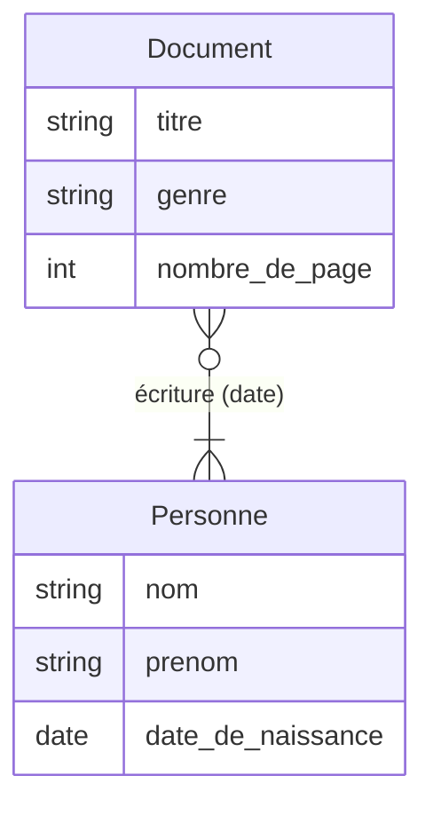
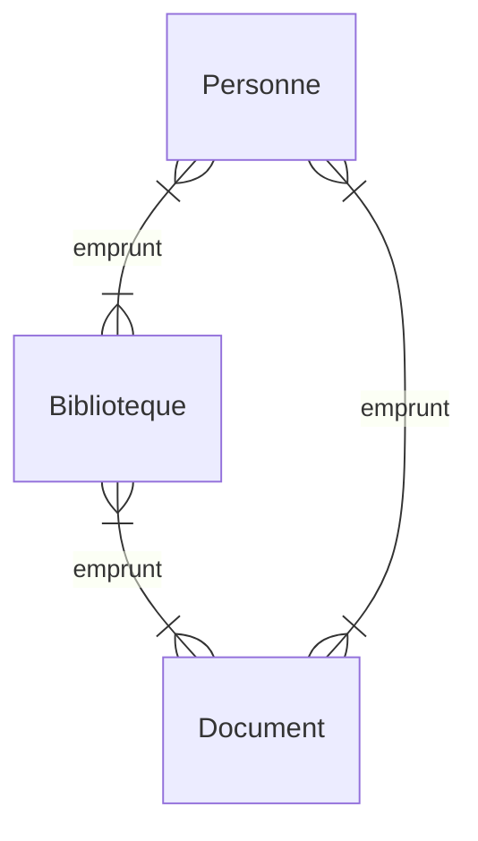
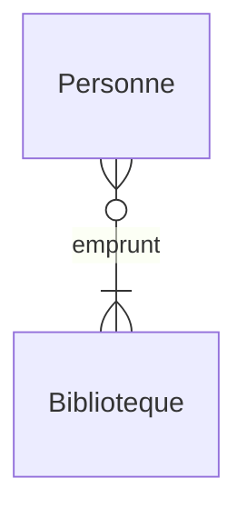
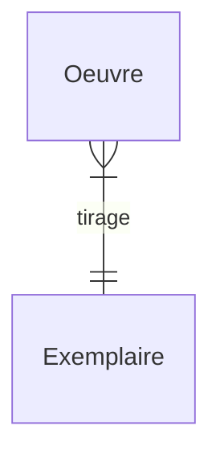
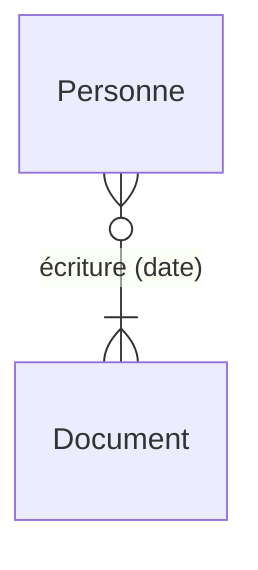
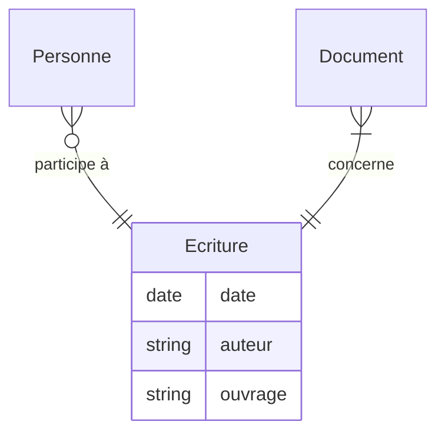
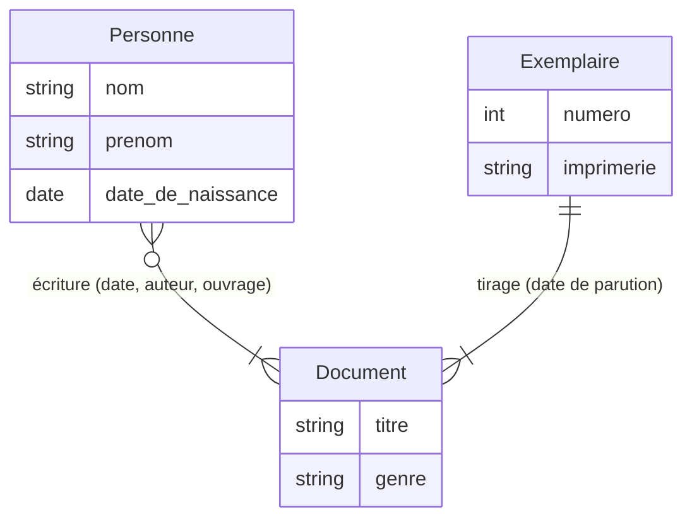

Chapitre 9 : Bases de données
===
# 1. Concepts élémentaires
## 1.1. Introduction aux bases de données

---
### 1.1.1. Introduction
De nombreuses applications informatiques manipulent de grandes quantités de données qui doivent être organisées et stockées de sorte qu'il est possible de les traiter efficacement pour :
- en ajouter
- en retirer
- en extraire de l'information

Ce traitement doit pouvoir se faire de manière concurrente tout en préservant l'intégrité des données.

---
### 1.1.2. Système de gestion de bases de données (SGBG) et paradigme logique
Préserver l'intégrité des données est une tâche complexe dans un contexte d'accès concurrents donc le traitement des données sera confié à un outil appelé `SGBD` dont le rôle est de recevoir les requêtes des utilisateurs :
- modification des données
- extraction d'information à partir de ces données

Et de les traduire en des opérations effectuées sur la base de données. C'est au SGBD de garantir la cohérence des données au fur et à mesure des opérations réalisées. Les requêtes prennent en général la forme d'une description du résultat attendu sans indication sur la manière de calculer. C'est le SGBD qui implémente la recherche du résultat.

C'est le principe du `paradigme logique` : un programme est une description des propriétés que doit satisfaire le résultat. Un résultat est un jeu de paramètres qui satisfait les propriétés. Il n'y a pas aucune indication sur la manière de calculer les résultats.

Pour que cela fonctionne, la plupart des SGBD s'appuient sur un modèle introduit dans les années 1970, appelé `modèle relationnel`.

---
### 1.1.3. Le modèle relationnel
- Le `modèle relationnel` est un modèle mathématique basé sur la théorie des ensembles et la logique des prédicats et qui présente les bases de données comme des objets qui définissent des relations entre des blocs d'information. C'est un modèle abstrait qui s'exprime indépendamment des implémentations possibles et qui couvre donc de nombreux SGBD.
- Dans ce modèle, une base de données est vue comme un ensemble de relations. Ces relations sont aussi appelées tables car on peut les représenter par des tableaux à double entrée dont les colonnes correspondent à un type d'information particulier. Ces colonnes sont appelées les attributs de la relation.

 **Exemple :**
 Dans une système d'information d'une bibliothèque, on peut avoir une table `Document` dont les attributs sont :
 - le titre
 - l'auteur
 - le genre
 - la date de parution
 - le nombre de pages
 - etc

- Chaque attribut est associé à un domaine qui correspond à l'ensemble des valeurs possibles par l'attribut. Ce domaine permet de choisir un type pour implémenter concrètement la base de données.

 Étant donné une relation $\mathrm{R}$ dont les attributs sont $\mathrm{A}_1\dots \mathrm{A}_n$ associés aux domaines $\mathrm{D}_1\dots \mathrm{D}_n$, on appelle `schéma relationnel` de $\mathrm{R}$ l'association des attributs et des domaines notée $\mathrm{R}(\mathrm{A}_1:\mathrm{D}_1,\dots,\mathrm{A}_n:\mathrm{D}_n)$.

 **Exemple :**
 Pour la table `Document` :
 - le titre et l'auteur sont des *données textuelles*
 - le genre est trié d'une *énumération finie* (roman, poésie, théâtre ...)
 - la date de parution est une *date*
 - le nombre de pages est un *entier*

 d'où le schéma relationnel :
 ```
 Document(titre:texte, auteur:texte, genre:enum(roman...), date_de_parution:date, nombre_de_pages:entier)
 ```

 Le domaine "texte" peut être par exemple associé au type string des chaînes de caractères et le domaine entier au type int.

- Les lignes d'une relation de schéma $\mathrm{R}(\mathrm{A}_1:\mathrm{D}_1,\dots,\mathrm{A}_n:\mathrm{D}_n)$ correspondent aux éléments de la relation $\mathrm{R}$, qui est un sous-ensemble de $\mathrm{D}_1\times\dots\times\mathrm{D}_n$. On appelle donc ces éléments des `tuples` ou des `enregistrements`.

 **Exemple :**
 Pour la table `Document` :

 | titre | auteur | genre | date de parution | nombre de pages |
 |:-:|:-:|:-:|:-:|:-:|
 | La cousine Bette | Honoré de Balzac | Roman | 1848 | *240* |
 | De la guerre | Carl von Clausewitz | Traité | 1832 | *240* |
 | Cyrano de Bergerac | Edmond Rostand | Théâtre | 1897 | 280 |

 **Remarque :**
 Certains enregistrements peuvent coïncider pour certains attributs et on veut une manière efficace de les distinguer
 - On appelle `clé candidate` un ensemble minimal (pour l'inclusion) d'attributs permettent de caractériser de manière unique chaque enregistrement, i.e. tel qu'il n'existe pas deux enregistrements qui coïncident sur tous les attributs de la clé.

 **Exemple :**
 Pour la table Document, {titre, auteur} devrait convenir.

 Il peut y avoir plusieurs clés candidates et on doit en choisir une, appelée `clé primaire`. On souligne dans le schéma relationnel les attributs de la clé primaire pour les repérer efficacement

 **Remarque :**
 On choisit souvent d'ajouter un attribut entier pour numéroter les enregistrements, que l'on choisit comme clé primaire.
 - Dans une relation $\mathrm{R}$, on appelle `clé étrangère` un ensemble d'attributs qui constitue une clé candidate (souvent primaire) d'une autre relation.

 **Exemple :**
 Dans une table `Emprunts` décrivant les emprunts de la bibliothèque, on intègre la clé de la table `Document` pour identifier les documents empruntés.

---
### 1.1.4. Algèbre relationnelle
L'algèbre relationnelle est une théorie mathématique qui décrit les opérations que l'on peut réaliser sur une base de données du point de vue du modèle relationnel. Les propriétés qui découlent de cette théorie définissent un fondement rigoureux aux implémentations de SGBD en justifiant les optimisations des requêtes des utilisateurs. Cette théorie est `H.P` mais nous l'étudierons via le langage de requêtes `SQL` (Structured Query Language).

---
## 1.2. Le langage SQL : requête élémentaire

---
### 1.2.1. Gestion du contexte :
- choix de la base de donnée :
 ```SQL
 USE <nom_base>;
 ```
- obtention du schéma relationnel d'une table :
 ```SQL
 DESCRIBE <nom_table>;
 ```

**Exemple :**

```SQL
USE bibliotheque;
DESCRIBE Document;
```

Les opérations de création / suppression / modification de bases de données / de tables sont `H.P`.

---
### 1.2.2. Opération de projection
Pour visualiser le contenu d'une table, on utilise la requête :
```SQL
SELECT * FROM <nom_table>;
```
C'est un cas particulier de l'opération de projection qui permet de construire une table ne contenant les valeurs des tuples que pour certains attributs.

**Attention :**
La table construite par une requête est éphémère.

**Syntaxe :**
```SQL
SELECT <attribut_1>,...,<attribut_2> FROM <nom_table>;
```

**Exemple :**
```SQL
SELECT titre, date_de_parution FROM Document;
```

**Remarque :**
Cette requête peut créer une table contenant des doublons qui sont conservés par défaut. On utilise le mot-clé `DISTINCT` pour éliminer ces doublons.

**Exemple :**
```SQL
SELECT DISTINCT titre, date_de_parution FROM Document;
```
Les enregistrements du résultat d'une projection sont a priori rangés dans le même ordre que dans la table initiale.

On peut choisir de les réordonner en utilisant le mot-clé `ORDER BY` suivi d'une liste d'attributs.

L'ordre associé à cette liste est l'ordre croissant lexicographique.

**Exemple :**
```SQL
SELECT * FROM Document;
ORDER BY auteur, date_de_parution;
```

Pour utiliser l'ordre décroissant selon l'un des attributs, on utilise le mot-clé `DESC` après le nom de l'attribut.

**Exemple :**
```SQL
SELECT * FROM Document;
ORDER BY  auteur, date_de_parution DESC;
```

**Attention :**
`DESC` ne porte que sur un seul attribut $\rightarrow$ le répéter si besoin.

Il est aussi possible de renommer les attributs du résultat d'une projection, ce qui peut être nécessaire dans des opérations plus complexes, faisant intervenir des sous-requête ou plusieurs tables. On utilise pour cela le mot-clé `AS`.

**Exemple :**
```SQL
SELECT titre, auteur, date_de_parution AS date
FROM Document;
```
On peut combiner tout cela :
```SQL
SELECT titre, date_de_parution AS date
FROM Document
ORDER BY date DESC, titre;
```

---
### 1.2.3. Opération de sélection
On peut ne conserver que les enregistrements qui satisfont une condition donnée via l'opération de sélection, introduite par le mot-clé `WHERE`.

**Exemple :**
```SQL
SELECT * FROM Document
WHERE auteur = 'Edouard Rostand';
```

Les opérateurs de comparaison au programme sont : =, <>, <, >, <=, >=

**Attention :**
Les enregistrements ne fournissent pas forcément une valeur pour chaque attribut. Les attributs sans valeur prennent la valeur spéciale NULL. On ne peut pas vérifier si un attribut a la valeur NULL avec les opérateurs ci-dessous : on utilise les opérateurs `IS NULL` et `IS NOT NULL`.

**Exemple :**
```SQL
SELECT * FROM Document
WHERE date_de_parution IS NULL;
```
(documents dont la date de parution est inconnue)

On peut combiner plusieurs conditions grâce aux connecteurs logiques : `AND`, `OR`, et `NOT`.

**Exemple :**
```SQL
SELECT * FROM Document
WHERE NOT (date_de_parution >= 2000 AND nombre_de_pages < 200);
```

**Remarque :**
On peut combiner sélection et projection.

On peut aussi fixer un nombre maximal d'enregistrements pour le résultat : le SGBD choisira les premiers qu'il traite jusqu'à éventuellement atteindre la borne. On utilise le mot-clé `LIMIT`.

**Exemple :** 10 ouvrages les plus récents :
```SQL
SELECT * FROM Document
ORDER BY date_de_parution DESC
LIMIT 100;
```

On peut ajouter un décalage lors de l'usage de `LIMIT` grâce au mot-clé `OFFSET`.

**Exemple :**
```SQL
SELECT DISTINCT auteur FROM Document
ORDER BY nombre_de_page DESC
LIMIT 5 OFFSET 10;
```
(dernier tiers du top 15 des auteurs ayant écrit les plus gros livres)

---
# 2. Conception de bases de données
## 2.1. Modèle entité-association

---
### Introduction
Le modèle entité-association est un modèle de la fin des années 1970 qui propose un formalisme pour décrire la structuration des données en fonction des liens qu'elles entretiennent. On lui associe une représentation graphique permettant d'identifier facilement les 2 concepts de base de ce modèle : les entités et les associations.

---
### 2.1.2. Entités
Une entité est un objet donné pour lequel on dispose de données que l'on souhaite traiter.

**Exemple :**
Moi, le livre de d'Edmond Rostand intitulé Cyrano de Bergerac.

Les informations associées à une entité sont ses `attributs`. On réunit un ensemble d'entités ayant des caractéristiques communes dans un type d'entité que l'on appelle aussi par abus `entités`.

Dans ce cadre, une entité concrète est appelée `instance` ou 'occurrence' de l'entité.

---
### 2.1.3. Associations :
Une association exprime un lien entre plusieurs entités.

**Exemple :**
Edmond Rostand *a écrit* le livre intitulé Cyrano de Bergerac.

Une association peut aussi avoir des attributs (exemple : date d'écriture) et on fait également l'abus de langage qui consiste à appeler association un type d'association.

**Représentation graphique :**
On représente deux types de blocs (les entités et les associations) et on lie les blocs d'entités via les blocs d'association qui expriment ces liens.



On distingue les associations binaires (i.e. qui tient 2 entités) des associations $n$-aires. On peut toujours se limiter aux associations binaires en remplaçant une associations $n$-aire par une nouvelle entité représentant l'association, liée aux $n$ entités par $n$ associations binaires.

**Exemple :**




---
### 2.1.4. Cardinalité d'une association
Le lien entre une entité et une association peut être étiqueté par un couple $p$, $q$ représentant les nombres minimum et maximum de fois que l'entité peut apparaître dans une association de ce type : $q=*$ s'il n'y a pas de borne supérieure.

**Exemple :**


- un document a nécessairement au moins 1 auteur, potentiellement plusieurs ;
- une personne peut avoir écrit 0 ou plusieurs documents.

On appelle cette association une association $*-*$ car elle peut lier plusieurs entités à plusieurs entiers.

D'autres types d'associations sont :
- les associations $1-*$ : elles lient une entité à plusieurs autres.

  **Exemple :**
  Une oeuvre peut être tirée à plusieurs exemplaires mais un exemplaire n'est un tirage que d'une seule oeuvre :

  ```mermaid
  erDiagram
    Exemplaire }|--|{ Reference : "est référencé par"
  ```

- les associations $1-1$ : elles lient une entité à une seule autre.

**Exemple :**
Chaque exemplaire d'une bibliothèque a une référence unique.

**Remarque :**
On peut souvent fusionner les entités impliquées dans 1 association $1-1$ sans introduire trop de redondance dans les données.

Une association $*-*$ peut être scindée en 2 associations $1-*$ via l'introduction d'une nouvelle entité représentant l'association.

**Exemple :**




**Remarque :**
Les attributs de la nouvelle entité doivent permettre d'identifier les entités impliquées dans l'association : on utilise des clés étrangères dans le modèle relationnel associé à ce modèle.

---
## 2.2. Passage du modèle entité-association au modèle relationnel

---
### 2.2.1. Idée
On associe une relation à chaque entité avec les mêmes attributs. Les associations expriment des liens entre les tables et introduisent donc des contraintes d'intégrité des données.

- La décomposition d'une association $n$-aire en associations binaires se traduit en la création d'une nouvelle entité donc d'une nouvelle association.
- La décomposition des associations binaires $*-*$ en 2 association $1-*$ se traduit aussi en la création d'une nouvelle table, dite `table de jonction`.
- Après cela, il ne reste plus qu'à traiter les associations $1-1$ et $1-*$.

---
### 2.2.2. Cas des associations $1-1$ et $1-*$
Ces types d'association impliquent que pour l'une des deux entités, chaque instance de l'entité ne peut être associée qu'à une unique instance de l'autre entité. Pour exprimer ce lien entre les tables correspondantes on ajoute une clé étrangère à la première table, faisant référence à l'unique enregistrement de la seconde table impliqué dans l'association. Les attributs de l'association seront aussi intégrés à la première table.

**Exemple :**


Modèle relationnel associé : on utilise des identifiants numériques pour les clés primaires
- Personne ($\underline{\text{id : entier}}$, nom : texte, prénom : texte, date de naissance : date)
- Document ($\underline{\text{id Doc : entier}}$, titre : texte, genre : ... ($\dots$))
- Exemplaire ($\underline{\text{numéro : entier}}$, imprimerie : texte, id Doc : entier, date d'impression : date)
- Écriture (date : date, id DOc : entier, id : entier)

(id Doc et id = clé étrangère)

---
# 3. Requêtes avancées
## 3.1. Opérations ensemblistes

---
### 3.1.1. Remarque
On s'intéresse à des opérations qui prennent plusieurs tables en argument et qui produisent une nouvelle table.

---
### 3.1.2. Produit cartésien
On construit le produit cartésien de deux relations vues comme des ensembles de tuples.

**Schéma relationnel :**
Si on a deux relations :
- $R(A_1: D_1, \ldots, A_n: D_n)$
- $R'(A_1': D_1', \ldots, A_n': D_n')$, 

Alors $(R \times R')(A_1: D_1, \ldots, A_n: D_n, A_1': D_1', \ldots, A_n': D_n')$ de clé primaire l'union des clés primaires de $R$ et $R'$.

**Réalisation SQL :**
On sépare les tables par des virgules dans la clause `FROM`.

**Exemple :**
```SQL
SELECT * FROM R, R';
```

**Remarque :**
On peut faire des produits $n$-aires :

```SQL
SELECT * FROM R1, R2, ..., Rn;
```

**Exemple :**
auteur, titre et date d'écriture dans la BDD vue en 2.2.2.

```SQL
SELECT nom, prenom, titre, date
FROM Personne, Document, Ecriture
WHERE Personne.id = Ecriture.id AND Document.idDoc = Ecriture.idDoc;
```

**Remarque :**
Il existe une construction appelée jointure qui est plus adaptée à ce type de requête (cf 3.2).

---
### 3.1.3. Définition (relations union-compatibles)
 Deux relations sont `union-compatibles` si elles ont le même nombre d'attributs et si les attributs de même position dans les deux relations ont le même domaine.

**Intuition :**
Même schéma au renommage des attributs et au choix de la clé primaire près.

---
### 3.1.4. Union
L'union de deux relations union-compatibles est une relation de même schéma que la première et dont les enregistrements sont ceux qui apparaissent dans au moins l'une des deux relations.

**Remarque :**
Cela signifie que si les noms d'attributs sont différents pour deux relations, alors on conserve ceux de la première. De plus, les doublons sont supprimés.

**Réalisation SQL :**
On utilise le mot clé `UNION` entre deux requêtes qui produisent les tables dont on veut faire l'union.

**Attention :**
Pas de `UNION` dans une clause `FROM`.

**Exemple :**
```SQL
SELECT ... UNION SELECT ...;
```

**Exemple :**
Dates qui sont des dates d'écriture ou d'impression de documents.

```SQL
SELECT date FROM Ecriture
UNION
SELECT date_d’impression FROM Exemplaire;
```

---
### 3.1.5. Intersection
L'intersection de deux relations union-compatibles est une relation de même schéma que la première dont les enregistrements sont les tuples qui apparaissent dans les deux relations.

**Réalisation SQL :**
On utilise le mot-clé `INTERSECT` de la même manière que `UNION`.

**Remarque :**
Certains SGBD (comme MySQL) n'implémentent pas cette opération. Dans ce cas, il faut encoder cette opération avec des requêtes. On peut par exemple utiliser un produit cartésien.

**Exemple :**
Prénom qui sont aussi des titres d'œuvres.

```SQL
SELECT prenom FROM Personne
INTERSECT
SELECT titre FROM Document;
```

```SQL
SELECT DISTINCT prenom FROM Personne, Document
WHERE prenom = titre;
```

**Remarque :**
La clause `WHERE` contient autant de tests d'égalité qu'il y a d'attributs dans le résultat.

---
### 3.1.6. Différence
La différence de deux relations union-compatibles est une relation de même schéma que la première relation dont les enregistrements sont les tuples qui apparaissent dans la première relation mais pas dans la seconde.

**Réalisation SQL :**
On utilise le mot-clé `EXCEPT` de la même manière que `UNION`.

**Remarque :**
Certains SGBD n'implémentent pas cette opération, d'autres utilisent le mot-clé `MINUS` (qui est `H.P.`).

On peut encoder l'opération à l'aide de requêtes imbriquées (cf 3.3).

**Exemple :**
Noms qui ne sont pas des prénoms

```SQL
SELECT nom FROM Personne
EXCEPT
SELECT prenom FROM Personne;
```

```SQL
SELECT nom FROM Personne AS P1
WHERE NOT EXISTS
(SELECT prenom FROM Personne AS P2
WHERE P1.nom = P1.prenom);
```

---
### 3.2. Jointures

---
### 3.2.1. Principe
Il s'agit d'établir un lien entre plusieurs tables sous certaines contraintes.

L'idée est la même que la création d'une table de jonction pour décomposer une association $*-*$ : un opérateur de jointure crée une nouvelle relation recollant les enregistrements de deux relations qui se correspondent. La correspondance entre deux enregistrements est exprimée par le satisfaction des contraintes passées en argument de l'opérateur.

Les contraintes sont dans la plupart des cas l'égalité de deux attributs, le plus souvent entre la clé primaire de l'une des tables et une clé étrangère y faisant référence dans la seconde table.

---
### 3.2.2. Jointure interne
La jointure interne est une opération prenant deux relations et une condition en argument et qui produit une relation dont le schéma est la concaténation des schémas des deux relations (comme pour le produit cartésien) et dont les enregistrements sont les concaténations des tuples des deux relations qui satisfont la condition.

**Réalisation SQL :**
```SQL
SELECT ... FROM R JOIN R2 ON C ...
```

La condition C s'écrit de la même manière que les conditions de la clause `WHERE`

**Exemple :**
On dispose des tables suivantes :
- Document(\underline{idDoc: entier}, titre: texte, auteur: texte, genre: enum(...))
- Personne(\underline{id: entier}, nom: texte, prénom: texte)
- Emprunt(\underline{id: entier, idDoc: entier}, dateEmprunt: date, dateRetour: date)

On souhaite récupérer les noms et prénoms des emprunteurs avec les dates de retour associées

```SQL
SELECT nom, prenom, dateRetour
FROM Personne JOIN Emprunt ON Personne.id = Emprunt.id;
```

On peut enchaîner les jointures (en pratique la jointure de deux tables sert d'argument à la jointure suivante). Il faut donc une condition par jointure.

Exemple : on veut les mêmes informations qu'avant et en plus le titre du document, et seulement pour les retour en retard.

```SQL
SELECT nom, prenom, dateRetour, titre
FROM Personne
JOIN Emprunt ON Personne.id = Emprunt.id
JOIN Document ON Document.idDoc = Emprunt.idDoc
WHERE dateRetour < [date_du_jour];
```

Pourquoi un opérateur de jointure alors qu'on peut l'implémenter avec un produit cartésien ?
- À priori, les SGBD peuvent optimiser les jointures alors qu'il faut construire tous les tuples du produit cartésien avant de faire la sélection.
- Une condition de jointure est une contrainte structurelle exprimant les associations entre plusieurs tables alors qu'une condition de sélection sert plutôt à filtrer les enregistrements pertinents pour la requête : la logique est différente.
- On gagne en lisibilité en séparant les deux types de condition et en séparant les conditions associées à chaque jointure.

**Remarque :**
La `jointure interne` est aussi simplement appelée `jointure` : c'est le type de jointure par défaut.

---
### 3.2.3.Jointure externe à gauche
Une `jointure externe à gauche` fonctionne comme une jointure interne, mais les enregistrements de la première relation pour lesquels il n'existe aucun enregistrement dans la seconde relation tel que leur concaténation satisfait la condition de jointure sont conservés. Pour respecter le schéma du résultat (qui est la concaténation des schémas des deux tables), on associe à ces enregistrements la valeur `NULL` pour chaque attribut qui provient de la seconde table.

**Réalisation SQL :**
Comme pour la jointure interne en remplaçant `JOIN` par `LEFT JOIN`.

**Exemple :**
Noms, prénoms des emprunteurs associés aux dates de retour, s'il y en a :

```SQL
SELECT nom, prenom, dateRetour
FROM Personne LEFT JOIN Emprunt ON Personne.id = Emprunt.id;
```

- Personne :
 |idAlice|Alice|Dupond|
 |:-:|:-:|:-:|
 |idBob|Bob|Dupont|

- Emprunt :
 |idAlice|2022-05-04|idDoc1|
 |:-:|:-:|:-:|
 |idAlice|2022-05-05|idDoc2|

- Résultat :
 |Alice|Dupond|2022-05-04|
 |:-:|:-:|:-:|
 |Alice|Dupond|2022-05-05|
 |Bob|Dupont|NULL|

**Remarque :**
Il existe d'autres types de jointure (`H.P.`) :
- Externe à droite (`RIGHT JOIN`)
- Naturelle (`NATURAL JOIN`)
- Totale (`TOTAL JOIN`)